# 3 in 1 Breakout Board

## Introduction
---

The Arduino 3 in 1 Breakout board is a programmable masterboard based on ATMEGA328P, it is loaded with the dual drive servo connections, the dual drive motor connections and 8-way connections for sensors; all the sensor connections are in RJ11 type with fool-proof and anti-plug design; it is also loaded with Lego compatible ports on the shells which make them possible to connect the modules with Lego bricks. 

## Pictures
---

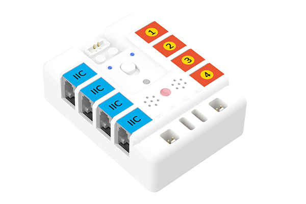

## Parameter
---

|  Item   | Parameter  |
| :----: | :----: |
| Name | 3 in 1 Breakout Board |
| Controller | arduino uno |
| Program method | arduino ide |
| Dimensions | 59.8mm × 81.9mm × 27.8mm |
| Weight | 70g |
| Power Supply | 9V |
| Working Voltage | 9V |

## Dimensions
---

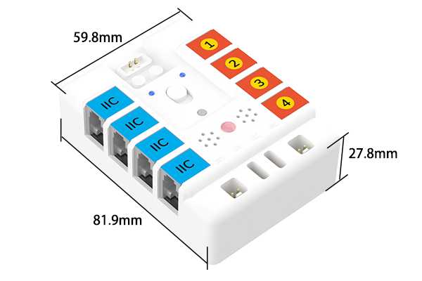

## Quick to Start
---
### Main Modules

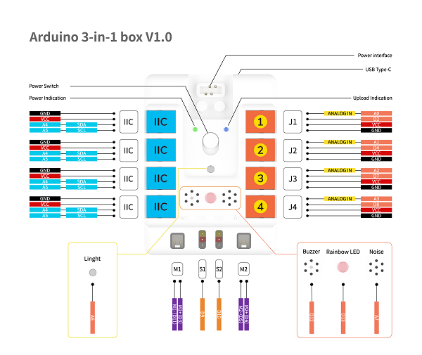

### Install the battery box

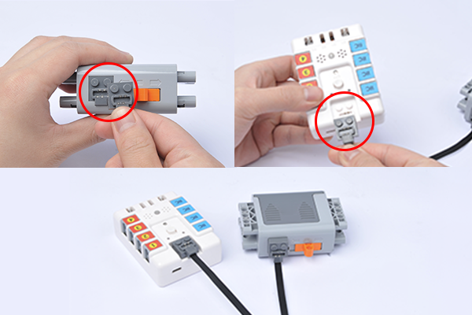

### Download and install Arduino IDE
Get the newest version of Arduino IDE from: [https://www.arduino.cc/en/Main/Software](https://www.arduino.cc/en/Main/Software) and install it. 

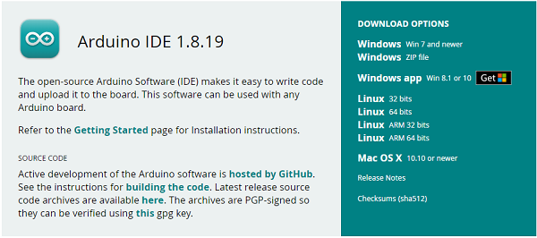

### Program
Download and unzip the file of 3 in  breakout board: (https://github.com/elecfreaks/learn-cn/raw/master/Arduino-3-in-1-box/Arduino-3-in-1-box.rar)

Open Arduino IDE, choose “tools"-"Development board-Arduino UNO".

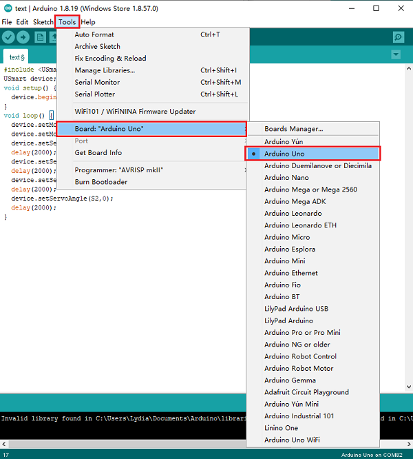

Connect the box with the computer through the USB cable. 

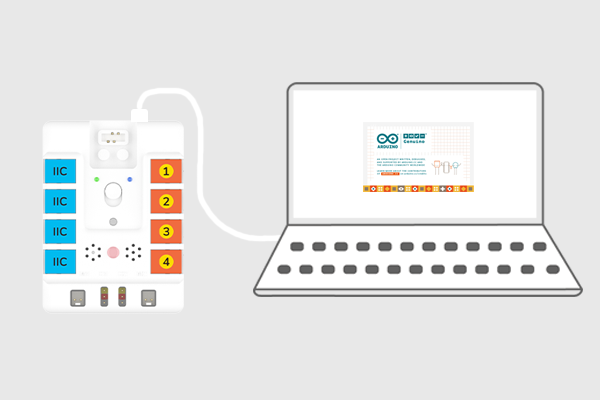

Click "tools", select from the "ports". 

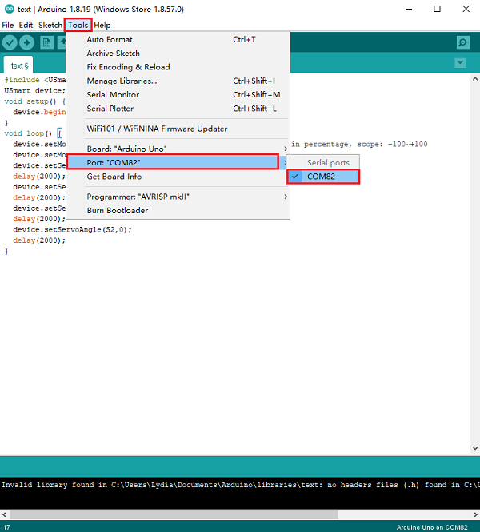

Click "project", select loading database to add the .ZIP file.

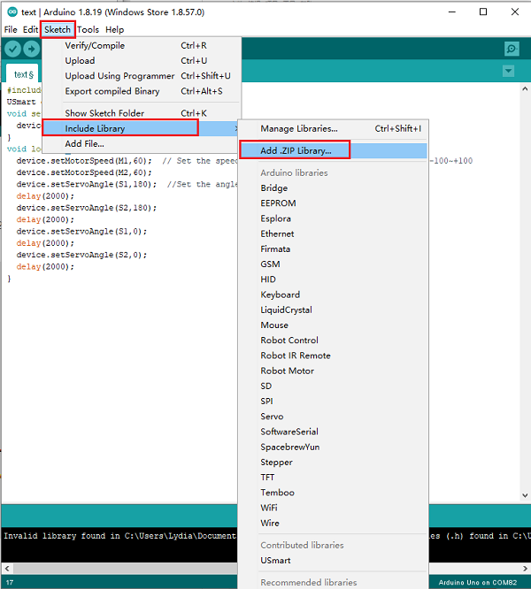

Open the file of Adafruit_NeoPixel, add the dependency libraries of the extensions of the 3 in 1 breakout board. 

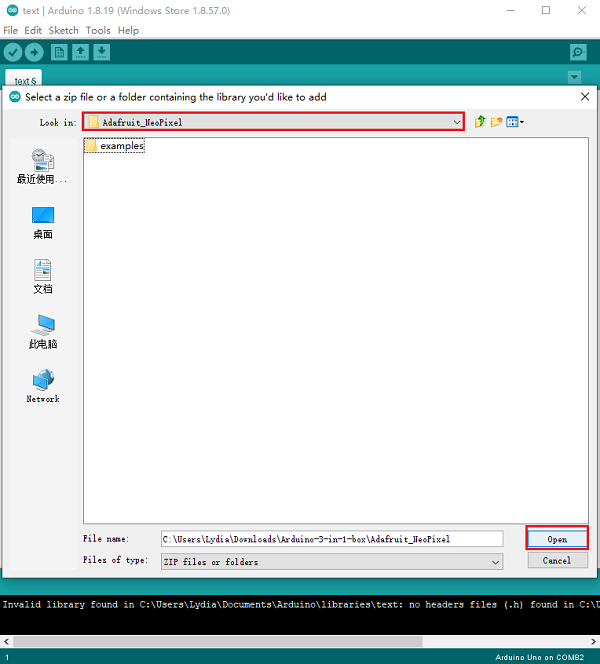

Open the file of USmart, add the extensions. 

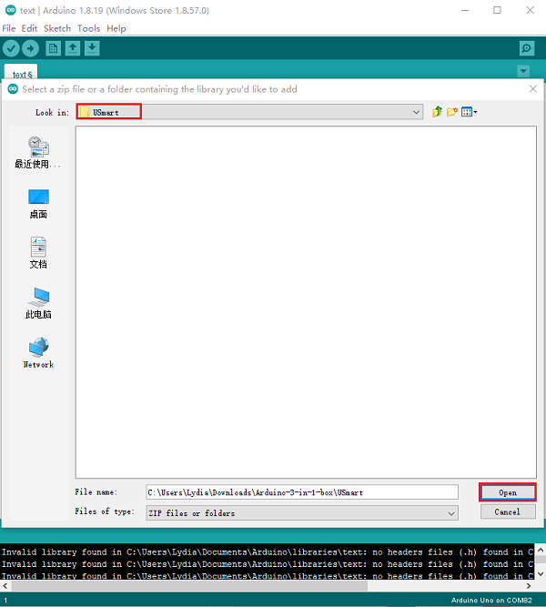

### Hardware Connection

 Connect the two motors and two servos to M1, M2, S1 and S2 on the breakout board. 

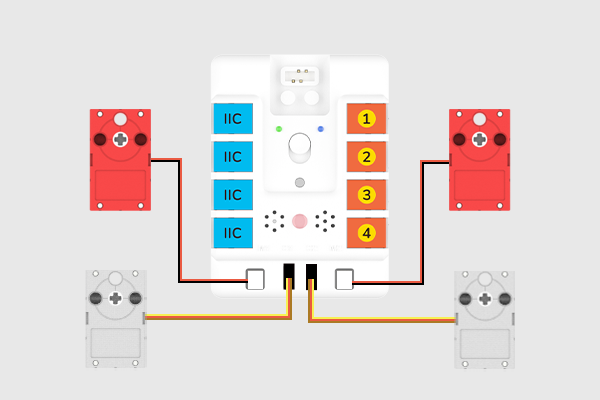

### Program

Cotrol the servos and motors through the breakout board. 
```
#include <USmart.h>
USmart device;
void setup() {
  device.begin();   //initialize the buzzer, motor and light. 
}
void loop() {
  device.setMotorSpeed(M1,60);  // Set the speed of motor, speed in percentage, scope: -100~+100
  device.setMotorSpeed(M2,60);
  device.setServoAngle(S1,180);  //Set the angles of servos 
  delay(2000);
  device.setServoAngle(S2,180);
  delay(2000);
  device.setServoAngle(S1,0);
  delay(2000);
  device.setServoAngle(S2,0);
  delay(2000);
}
```
Click file to save it. 

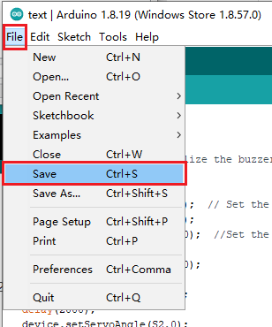

Select the save route, give it a name and save it. 

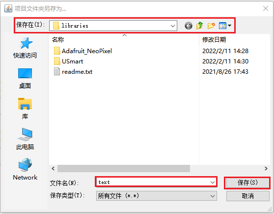


Click the save button, upload the program to the breakout board. 

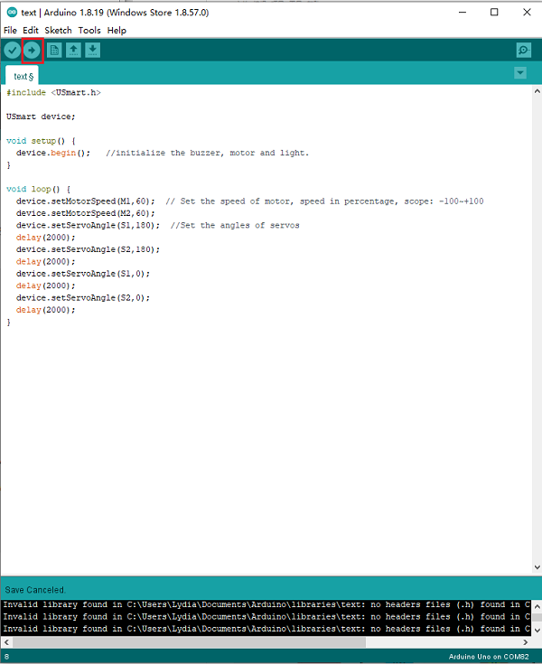

## Result
---
After powering on, the two motors start driving and the two servos drive to the degrees as we've programmed. 


