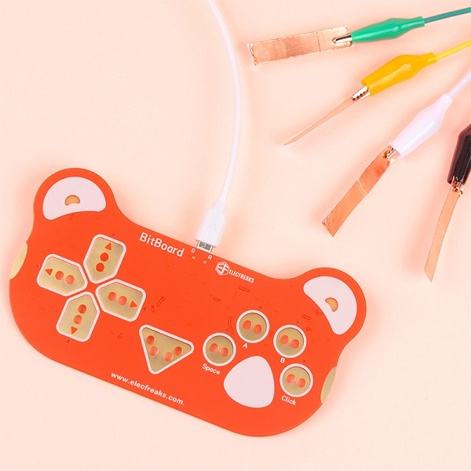
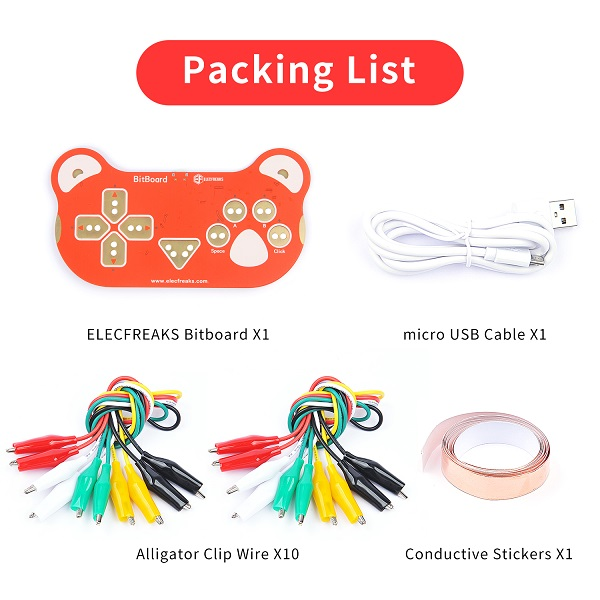
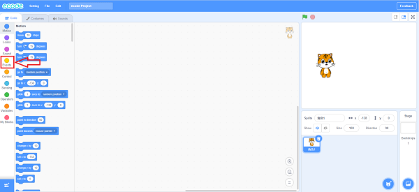
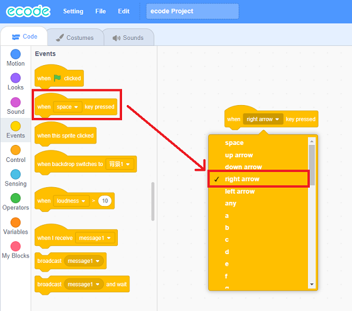
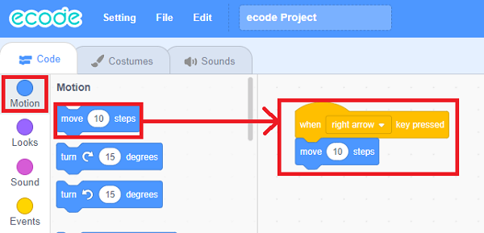
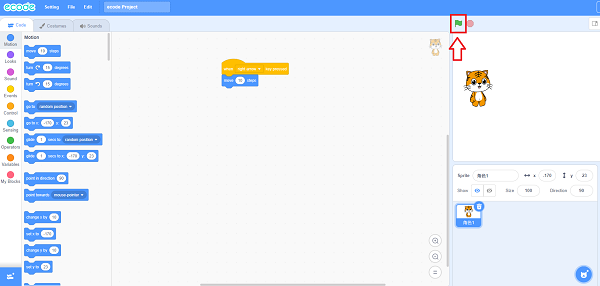
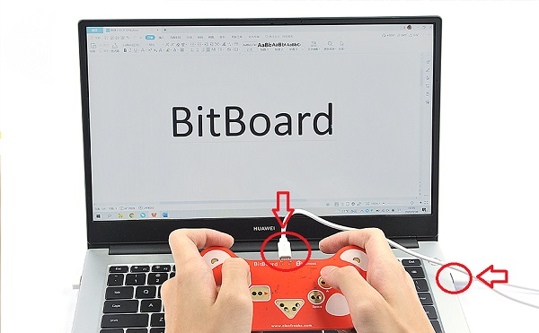
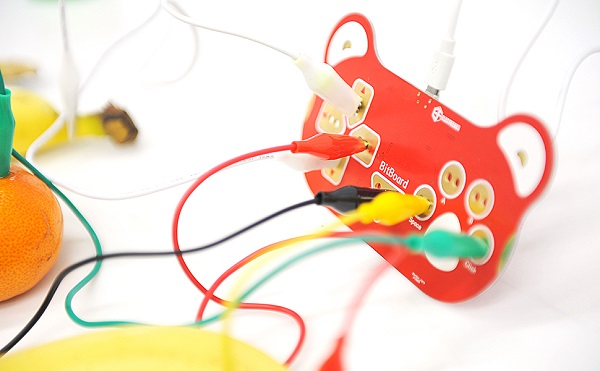
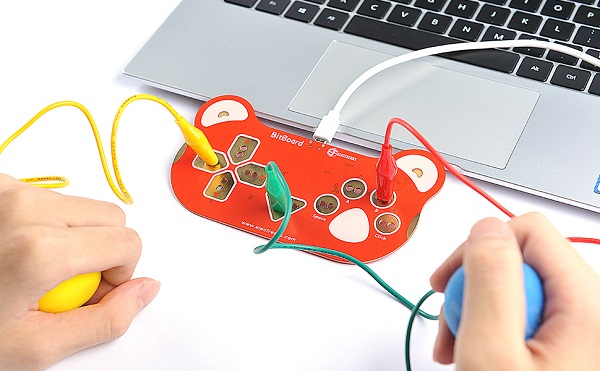

# Bitboard Kit

## Introduction
---

Change everything into a "keyboard"! The Bitboard helps to learn the electric circuits, create music and games, and it makes everything to be your creating tools!

## Products link
---

[ Bitboard Kit](https://shop.elecfreaks.com/products/elecfreaks-bitboard-kit?_pos=1&_sid=6f2c1bffb&_ss=r)

## Picture
---

## Parameter
---

|  Item   | Data  |
| :----: | :----: |
| Product Name | Bitboard |
| Rated voltage | 5V |
| Rated current | 15mA |
| Power supply interface | Micro-USB |
| Number of contacts | 8 |
| Programming method | [ecode](https://www.ecode.cn/creative/), [Scratch](https://scratch.mit.edu/projects/editor) |
| Size Approximately | 140mm X 76mm |
| Net weight | 31g |

## Components List
---

|  Item   | Quantity  |
| :----: | :----: |
| Bitboard | 1 |
| alligator clip cable | 10 |
| USB cable | 1 |
| Conductive stickers | 1 |

## Quick Start
---

### Programming
1.Go to [https://www.ecode.cn/creative/](https://www.ecode.cn/creative/), and click "Events".

2.Choose `when space key pressed`blcok, then click `right arrow`

3.Click "Motion" and choose `move 10 steps` block.

4.After programming, click the green flag to run it.

## Operation steps
---
1.Connect the Bitboard with the computer through the USB cable. 

2.Connect the buttons and GND ports on the Bitboard with the conductots through the alligator clips.

4.Hold the conductors of the buttons `→` and GND to complete the closed-loop circuit with your hands. 

## Result
---

Hold the conductors of the buttons `→` and GND to complete the closed-loop circuit with your hands, you can see the tiger on the stage(in ecode) moving to the right side. 

