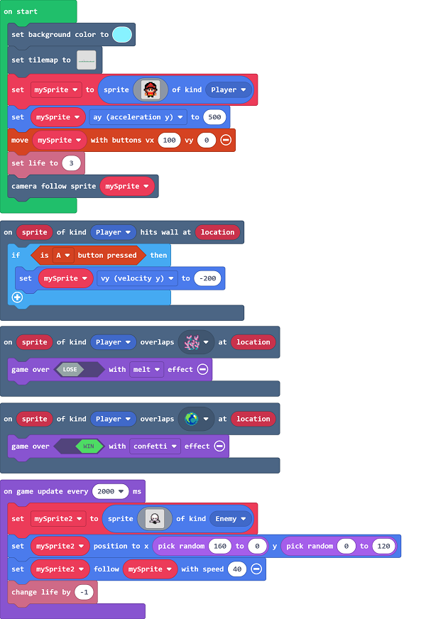

# Case 03: Dodge Monsters 

## Purpose
---
Create a game to make the player be chased by monsters. 

## Materials Required 

---

1 x [RETRO Arcade for Education](https://www.elecfreaks.com/retro-arcade-for-education.html)

## Software

---

[MicroSoft MakeCode](https://arcade.makecode.com/)

## Program

---

- Set the game over if the sprite reaches onto the plants and the the sprite wins if it reaches the jewel. On the way of progressing, a monster comes out each two seconds to hit  the sprite, the life score starts from 3 and it decreases by 1 if the sprite gets hit by the monster and the game is over if the score decreases to 0. 

### Program
- Link: [https://makecode.com/_U3K4CcfxeUAR](https://makecode.com/_U3K4CcfxeUAR)

- You may download it directly below:

<iframe style="position:absolute;top:0;left:0;width:100%;height:100%;" src="https://arcade.makecode.com/---codeembed#pub:_U3K4CcfxeUAR" allowfullscreen="allowfullscreen" frameborder="0" sandbox="allow-scripts allow-same-origin"></iframe>

---

## Downloading Program 

After programming, connect the computer with the Retro via the USB cable.

- 

- Choose hardware "F4".

  

  
- Click the reset button on the Retro and go to the downloading page. 

  
  
  
- Match the devices and get connected with "Arcade (app)".

  
  
- Click downloading to compile the program into the Retro. 

  

## Conclusion
---
- Set the background and the movement of the sprite, when it falls into the traps the game is over and it wins when arriving at the jewels.  A monster comes out each two seconds to hit  the sprite, the life score starts from 3 and it decreases by 1 if the sprite gets hit by the monster and the game is over if the score decreases to 0. 

