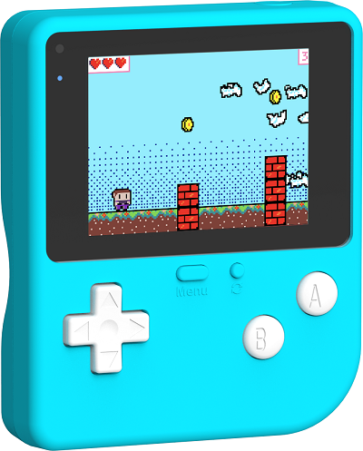
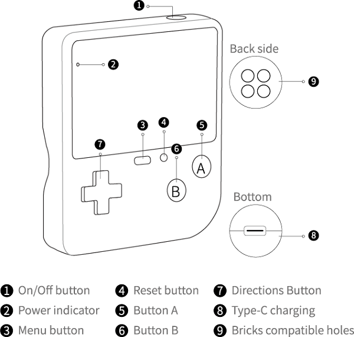
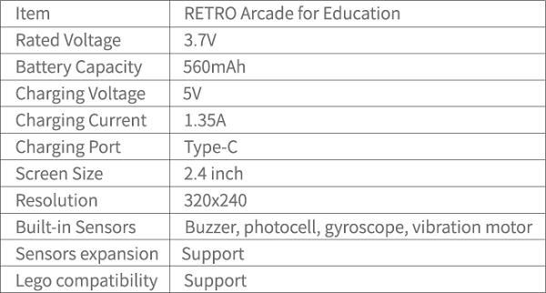

# RETRO Arcade for Education

## Introduction
---
- The RETRO Arcade for Education is the first arcade device in a big screen with a high resolution. The colorful shells and silicon buttons are designed for the small palms of the kids, it's of good slip resistance and gives them comfort handling feeling. The big color screen has a high resolution of 320 * 240, which is four times than that of the same industry. And it surprises you more with the bountiful built-in sensors. 
-  It helps kids to create the games via graphical programming in a fun and easy way, it allows for a self-defined game role, multiple game sceneries and plots design.

## Purchasing 
---

- 1 x [RETRO Arcade for Education](https://www.elecfreaks.com/retro-arcade-for-education.html)

## Instructions

### On/Off Button

- Click once to start it and double click to power off. 

### Parameter

### Power Indicator

## Program Platform
---
[MicroSoft MakeCode](https://arcade.makecode.com/)

