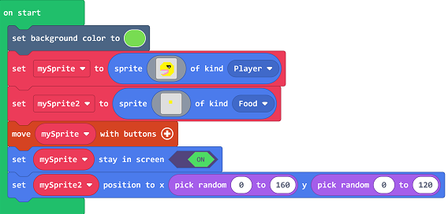
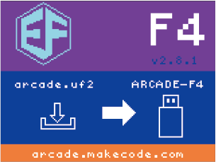
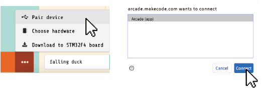

# Case 02: Coins Hunter 

## Purpose
---
- Create a game of coins hunter. 

## Materials Required 
---

- 1 x [RETRO Arcade for Education](https://www.elecfreaks.com/retro-arcade-for-education.html)

## Software

---

[MicroSoft MakeCode](https://arcade.makecode.com/)

## Program

---

- Set the background color to green and create mySpirite, set the type as player, create another mySprite2 and set the type as Food. Control the movement with buttons and set it stay in screen in on status, then set mySpirite2 displays at a random place. 

- While the player overlaps with the food, set the food display at another random place, start the countdown in 3(s) and the score adds 1.

### Program
- Link: [https://makecode.com/_H8tLp7FY8a8i](https://makecode.com/_H8tLp7FY8a8i)

 

- You may download it directly below:

<iframe style="position:absolute;top:0;left:0;width:100%;height:100%;" src="https://arcade.makecode.com/---codeembed#pub:_esMgCi9RYh0F" allowfullscreen="allowfullscreen" frameborder="0" sandbox="allow-scripts allow-same-origin"></iframe>

---

## Downloading Program 

After programming, connect the computer with the Retro via the USB cable.

- 

- Choose hardware "F4".

  

  
- Click the reset button on the Retro and go to the downloading page. 

  
  
  
- Match the devices and get connected with "Arcade (app)".

  
  
- Click downloading to compile the program into the Retro. 

  

## Conclusion
---
- Control the movement of the hunter in the screen, while it reaches one coin, the score adds 1, after that it starts countdown 3 seconds, the game is over if the time runs out, or it reaches another loop if the hunter gets another coin. 

