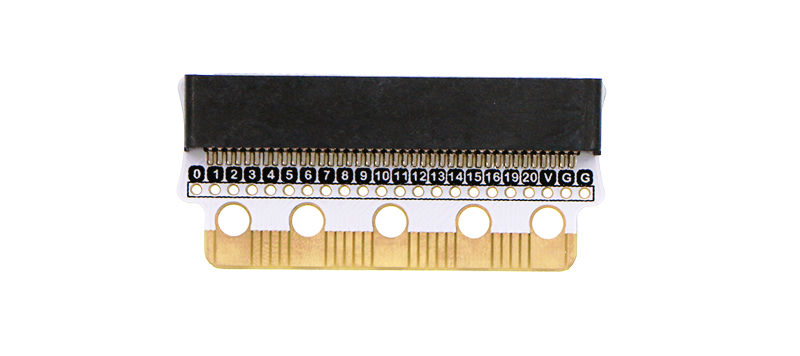
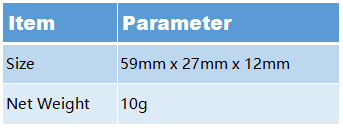

# Edge:bit

## Introduction
---

Edge:bit is a breakout board for protecting your micro:bit golden finger. The special designed golden finger brings more convenience to micro:bit extension. But, at the same time, it is easily abraised or scratched by aligator clip. Edge:bit can provide an all-around protection for your micro:bit, which makes your micro:bit life span become much longer.

## Features
---

- Perfect match the size of micro:bit golden finger and seamlessly connect various accessories. 
- Adopt human mechanical structure design in the plug end, which gives more comfortable grab experience. 
- Protect micro:bit from any scratches of alligator clips and prolongs connector's life span. 
- After being soldered with pins, it becomes a good breadboard adapter. 

## Technical Parameter
---

