# Joystick:bit V2(EF08231)

## Introduction
---
Joystick:bit V2 is a game board based on micro:bit. It contains a 4-direction joystick and 4 undefined buttons. At the same time, it enhances the game experience with its on-board buzzer and vibration motor. Joystick:bit V2 can also be used as a remote control with a good apperance and comfortable feels.

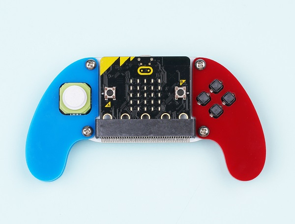

***Note：*** There are two versions of Joystick bit V2

### Joystick bit V2：

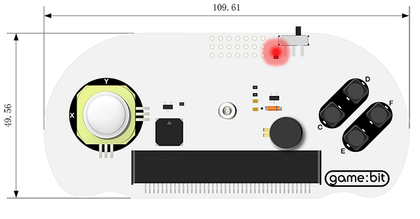

### Joystick bit V2 Plus: 

### Products Link

[Joystick bit V2](https://shop.elecfreaks.com/products/elecfreaks-micro-bit-joystick-bit-v2-kit?_pos=1&_sid=d4f46b0e5&_ss=r)

## Characteristic:
---
- Language: Javascript / Makecode / Microsoft Touch Develop / Python.

- Load with buzzer. 

- Support vibration feedback. 

- Compatible with the MakeCode packages .

- Power off automacticly after unplugging the micro:bit. 

## Outlook and dimension

---

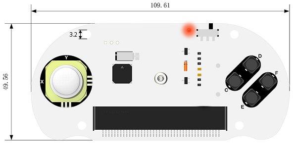

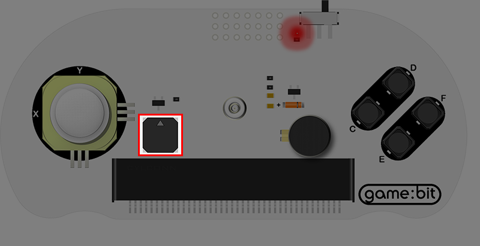

## Main parts introduction
---

### Handle

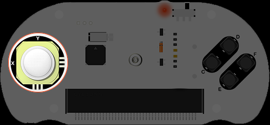

 X and Y connect to the P1 and P2 port on the micro:bit accordingly.
 
 
 
 The coordinate information of X&Y

### Buzzer

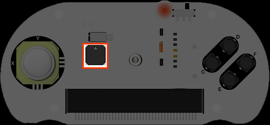

The buzzer connects to the P0 port on the micro:bit.

### Vibration Motor

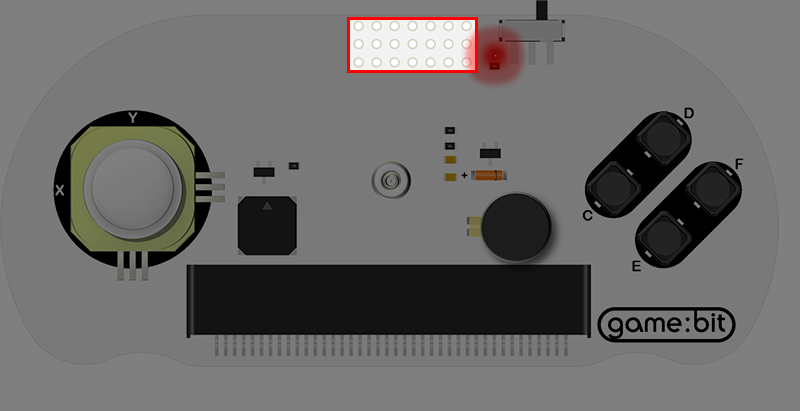

It connects to the P16 port on the micro:bit

### Buttons

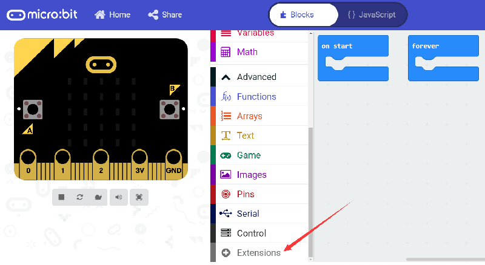

 C、D、E&F connect to the P12、P13、P14 and P15 ports on the micro:bit accordingly.

### Installment

Install two pieces AAA batteries and insert the micro:bit. 

Add “joystick:bit” package.

Go to MakeCode and create a new project, then click "Extensions".

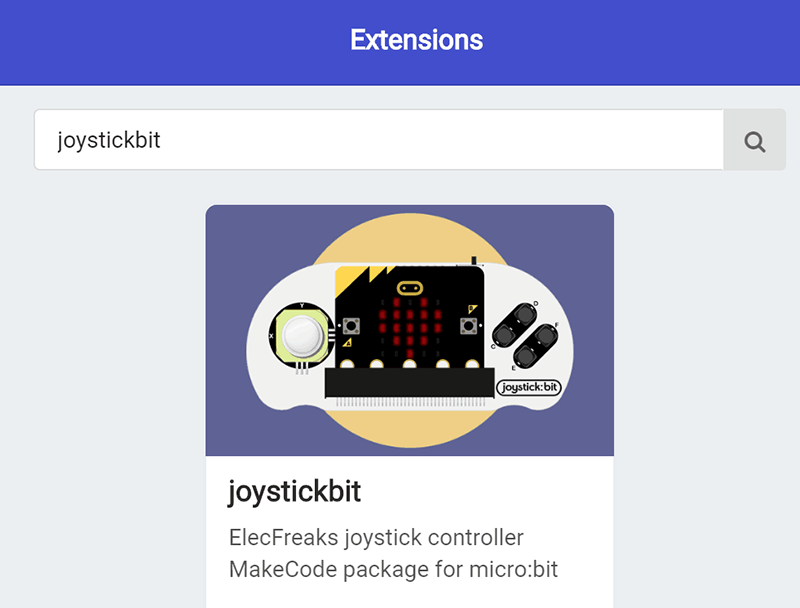

Search with “ joystickbit” to add it. 

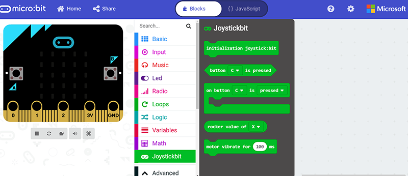

## Programming
---

Once you press the buttons on the joystick:bit, it comes about vibration feedback with buttons sign showing.

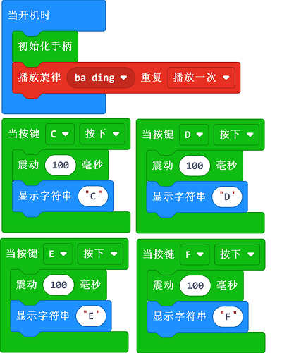

Link:  [https://makecode.microbit.org/_YUaM2rdcFFYx](https://makecode.microbit.org/_YUaM2rdcFFYx)

You may also download it directly below:

<iframe style="position:absolute;top:0;left:0;width:100%;height:100%;" src="https://makecode.microbit.org/#pub:_YUaM2rdcFFYx" frameborder="0" sandbox="allow-popups allow-forms allow-scripts allow-same-origin"></iframe>

## Result
---
After downloading, turn on the power switch and you will hear the system tone.

Push any one button on the Joysitick bit, it vibrates once.

## Project 1: Electronic organ
---

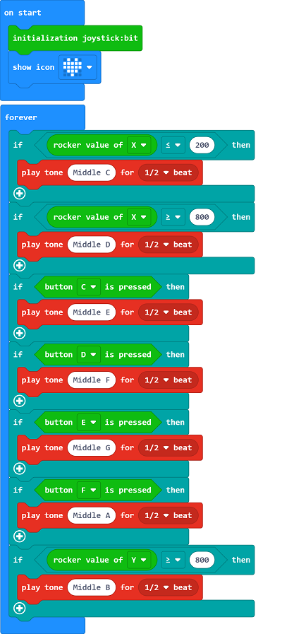

Link:  [https://makecode.microbit.org/_DHgcRfb6oJp5](https://makecode.microbit.org/_DHgcRfb6oJp5)

You may also download it directly below:

<iframe style="position:absolute;top:0;left:0;width:100%;height:100%;" src="https://makecode.microbit.org/#pub:_DHgcRfb6oJp5" frameborder="0" sandbox="allow-popups allow-forms allow-scripts allow-same-origin"></iframe>

## Result
---
It plays tones through the handle and the buttons.

## Project 2: Direction indicator
---

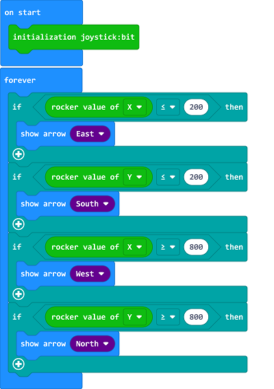

Link:  [https://makecode.microbit.org/_YVdggwifHWEm](https://makecode.microbit.org/_YVdggwifHWEm)

You may also download it directly below:

<iframe style="position:absolute;top:0;left:0;width:100%;height:100%;" src="https://makecode.microbit.org/#pub:_YVdggwifHWEm" frameborder="0" sandbox="allow-popups allow-forms allow-scripts allow-same-origin"></iframe>

## Result
---
The direction of the arrow on the micro:bit is controlled by the handle.

## Project 3: LED Controller
---

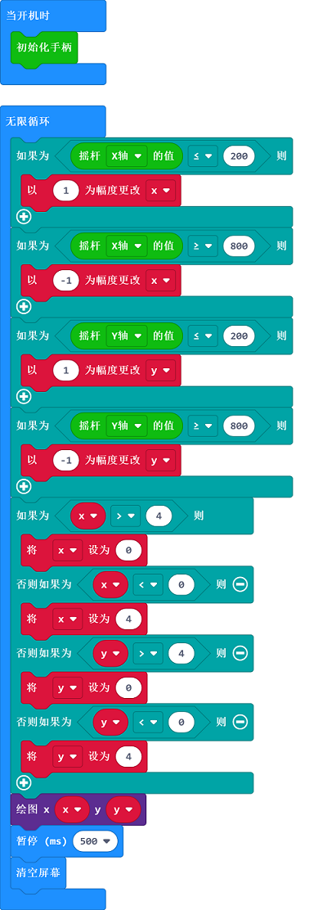

Link: [https://makecode.microbit.org/_KPMW36Pq0aLm](https://makecode.microbit.org/_KPMW36Pq0aLm)

You may also download it directly below:

<iframe style="position:absolute;top:0;left:0;width:100%;height:100%;" src="https://makecode.microbit.org/#pub:_KPMW36Pq0aLm" frameborder="0" sandbox="allow-popups allow-forms allow-scripts allow-same-origin"></iframe>

## Result 
---
The on/ff status for each LED on the micro:bit is controlled by the handle.

## Below are cases of remote control:
---
[Remote control cutebot ](https://www.elecfreaks.com/learn-cn/microbitKit/smart_cutebot/cutebot_case13.html)

[Remote control TPBot](https://www.elecfreaks.com/learn-cn/microbitKit/TPbot_tianpeng/TPBot_tianpeng_case_14.html)

## More Info
---

More info pls visit: http://www.elecfreaks.com
