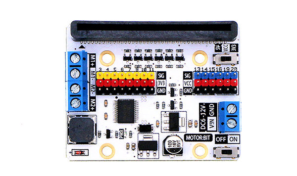
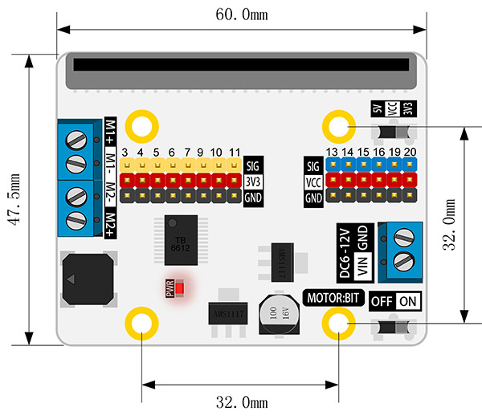
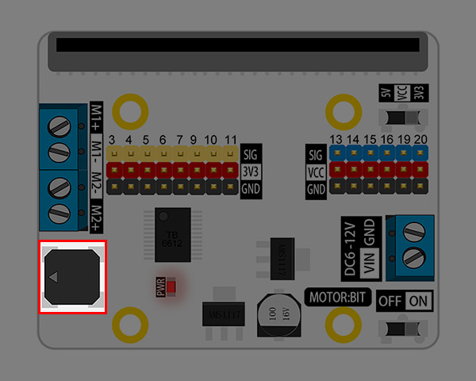
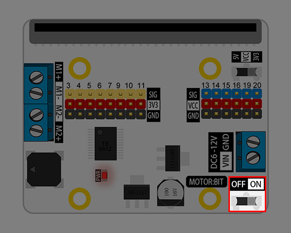
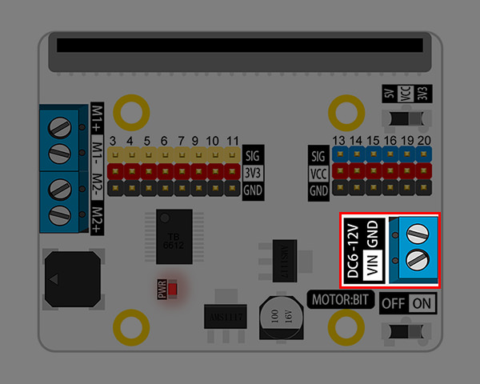
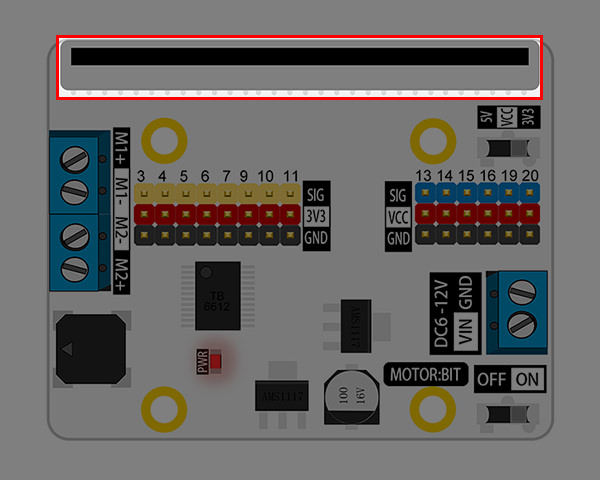
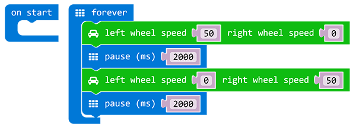

# Motor:bit

## Introduction
---

Motor:bit is a motor driving board based on micro:bit. It has integrated a TB6612 motor driving chip, which is used to drive two motors with maximun 1.2A DC single channel current. It has also integrated 12 GVS ports(for connecting OCTOPUS series of electric bricks) and 1 IIC communication port. These ports allow you to extend with various sensors and electric modules. On the board, P3-P7, P9-P10 are IO ports for directly driving 3.3V devices; P13-P16, P19-P20(IIC port) support 3.3V/5V voltage switch. Sliding the voltage switch onboard, it is available to drive 3.3V or 5V devices. Besides, you can play music with the buzzer on motor:bit. Motor:bit is totally designed for DIYers. You can use it to create your own smart car or more funny projects.

## Features
---
- Support 2 DC motors and the max driving current of each single channel is 1.2A.
- Extend 14-channel IO ports and lead out it by GVS pins. Among it, 6 ports support 3V/5V voltage switch. 
- With 1 passive buzzer on board. 

## Parameter
---

## Dimension  
---

## Definition of Pins
---

## Introduction of Major Components
---

### M1-M2 Motor Connector

M1 and M2 can separately connect a DC motor with max current of 1.2A. 

### Passive Buzzer 

Once a passive buzzer is connected to the P0 port on micro:bit, it can play music. 

### Power Switch 

Slide the switch to ON, power is connected; slide the switch to OFF, power is disconnected. 

### Power Connector 

Power connector is available to connect with 6-12V DC power. 

### VCC Voltage Switch 

Slide the switch to 5V, then VCC supply 5V power; slide the switch to 3.3V, then it provide 3.3V power. This switch is valid to 6 IO ports only: P13, P14, P15, P16, P19, P20. 

### G-VCC-S Standard GVS Port

It contains 4 (P13-P16) GPIO ports and 1 IIC communication connector (P19-P20). You can connect 3.3V/5V devices to it according to the voltage change of VCC.

### G-3V3-S Standard GVS Port

You can connect 8 devices working under 3.3V power supply. Among it, P3, P4, P10 can be used as analogue signal input connectors. 

### micro:bit Golden Finger Socket

You can plug your micro:bit into this socket.

## Quick Start
---

### Hardware Assembly
  
Connect two TT motors to micro:bit as the picture showed below. 

### Programming  
   
Click **Add Package** in the code drawer of [makecode](https://makecode.microbit.org/), then search for the key word `motorbit` in the dialogue box and click on the searching result to download this package. 

Write your code to make two TT motors rotate in turns. 

Click the link here to see the whole program: [https://makecode.microbit.org/_LsPT31WPH1JD](https://makecode.microbit.org/_LsPT31WPH1JD)

You can also download it from the page below:

<iframe style="position:absolute;top:0;left:0;width:100%;height:100%;" src="https://makecode.microbit.org/#pub:_LsPT31WPH1JD" frameborder="0" sandbox="allow-popups allow-forms allow-scripts allow-same-origin"></iframe>

## FAQ  
---  

