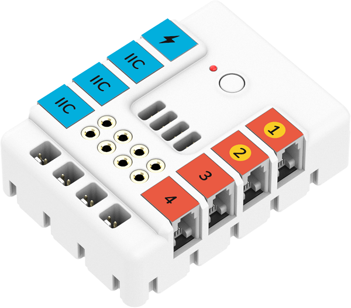
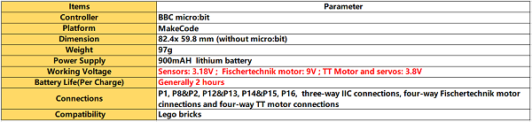
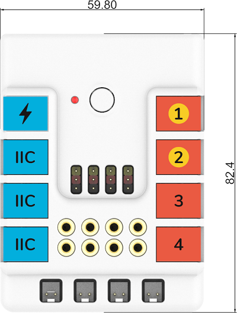
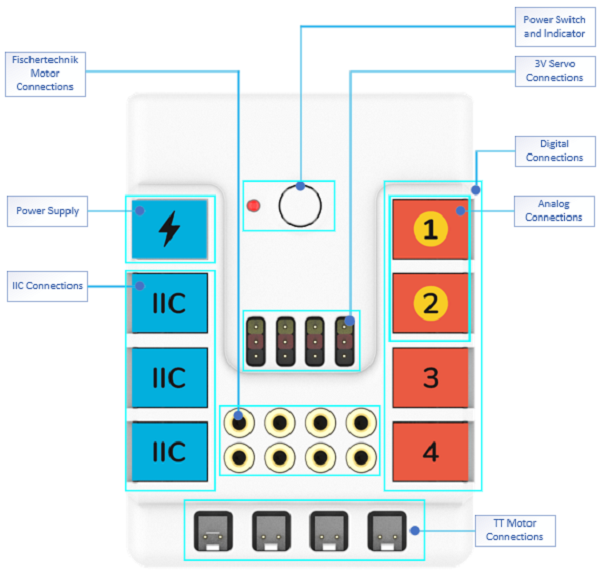
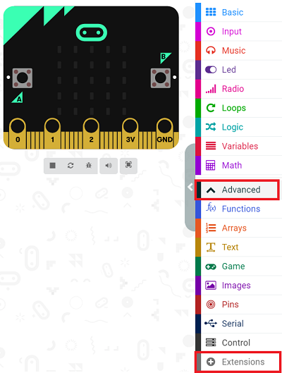
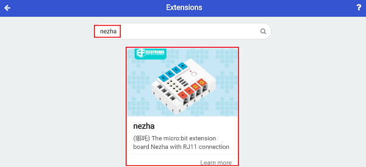
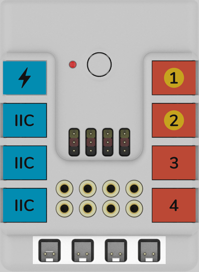
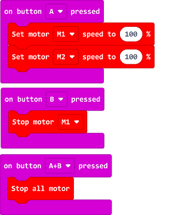
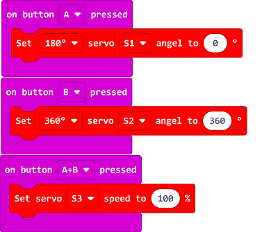
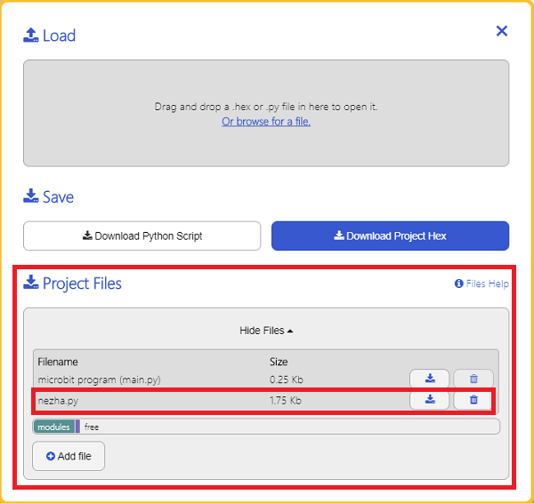

# Nezha Expansion Board(EF05043)

## Introduction
---
Nezha is an expanstion board for micro:bit with multuple functions available. It equips with four servos connections, four motors connections and seven sensors connections. All of the connections are required with RJ11 connectors that are fool-proofing and easy to plug. It is also compatible to Lego and Fischertechnik bricks and is available to get them connected with the electric modules,  thus it allows students to easily create their own amazing micro:bit projects. 



## Characteristics 
---
- RJ11 connections,  easy to plug. 
## Specification
---




## Outlook and Dimensions 
---





## Main Parts Introduction
---



## Add Package
---

Click "Advanced" in the MakeCode drawer to see more choices.



We need to add a package for programming. Click "Extensions" in the bottom of the drawer and search with "nezha" in the dialogue box to download it. 



***Note:*** If you met a tip indicating that the codebase will be deleted due to incompatibility, you may continue as the tips say or build a new project in the menu. 

## Ways of Operation
---
### TT Motor



### Code as below:





### Link
Link: [https://makecode.microbit.org/_8g40hhK9rLvW](https://makecode.microbit.org/_8g40hhK9rLvW)

You may also download it directly below:

<div style="position:relative;height:0;padding-bottom:70%;overflow:hidden;"><iframe style="position:absolute;top:0;left:0;width:100%;height:100%;" src="https://makecode.microbit.org/#pub:_8g40hhK9rLvW" frameborder="0" sandbox="allow-popups allow-forms allow-scripts allow-same-origin"></iframe></div>  

### Result
Press button A to drive both motors; press button B to stop the motor connecting to M1; press both A&B to stop both motors. 


### Servo


### Code as below:





### Link
Link: [https://makecode.microbit.org/_L8rfzu3ELEyg](https://makecode.microbit.org/_L8rfzu3ELEyg)

You may also download it directly below:

<div style="position:relative;height:0;padding-bottom:70%;overflow:hidden;"><iframe style="position:absolute;top:0;left:0;width:100%;height:100%;" src="https://makecode.microbit.org/#pub:_L8rfzu3ELEyg" frameborder="0" sandbox="allow-popups allow-forms allow-scripts allow-same-origin"></iframe></div>  

### Result
Press button A to drive the 180° servo to 0°; press button B to drive the 360° servo to 360°; press button A&B to continuously drive the servo at the speed of  100%.

## Python Programming
---

### Step 1

Download the package and unzip it: [PlanetX_MicroPython](https://github.com/lionyhw/PlanetX_MicroPython/archive/master.zip)

Go to  [Python editor](https://python.microbit.org/v/2.0)


We need to add nezha.py for programming. Click "Load/Save" and then click "Show Files (1)" to see more choices, click "Add file" to add nezha.py from the unzipped package of PlanetX_MicroPython. 




### Step 2
### Reference
```
from microbit import *
from nezha import *

nezha = NEZHA()
nezha.set_motors(1, 100)
while True:
    nezha.set_servo(1, 90)
    sleep(1000)
    nezha.set_servo(1, 0)
    sleep(1000)


```


### Result
- The motor connecting to M1 drives at the speed of 100%; The servo connecting to S1 drives to 90° and pause one second, then it drives to 0° and pause another second, and it continuously drives in this pace.

## Relevant File

---

## Technique File

---
