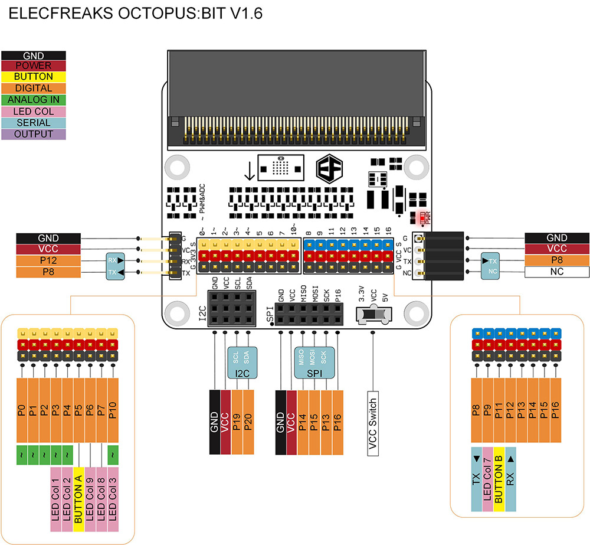
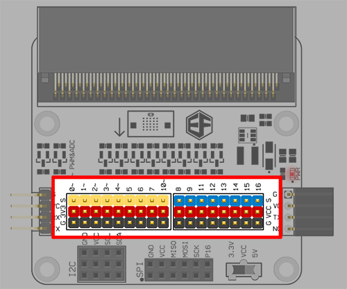
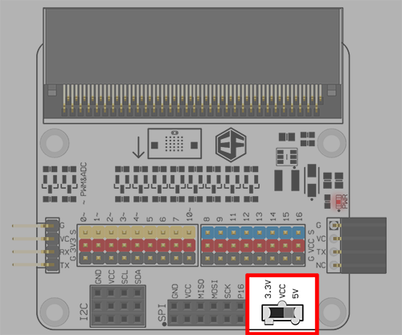
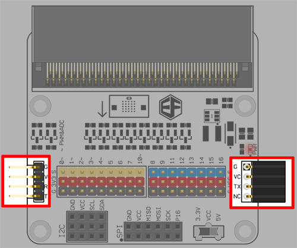
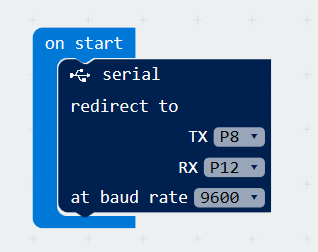
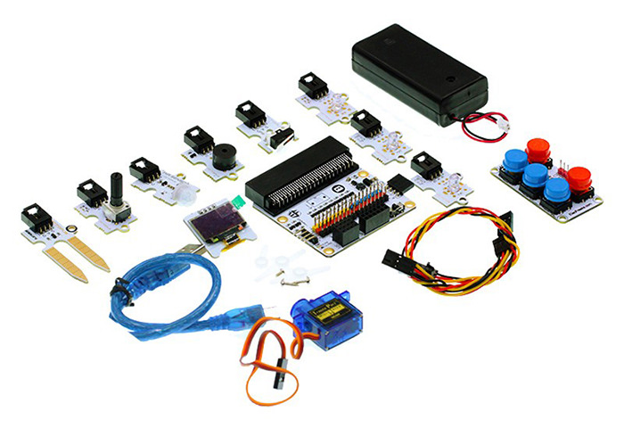

# Octopus:bit(EF03405)

## Introduction
---

ELECFREAKS Octopus:bit is a kind of breakout boards for micro:bit. It can lead out GPIO port, serial port, IIC port, and SPI port on the micro:bit board. The biggest feature of Octopus:bit is that it can switch electric level for some GPIO ports, which makes micro:bit available to be adapted to 5V sensors.

## Shipping List
---

1 x ELECFREAKS Octopus:bit

## Hardware
---

### Features

- Input voltage: 3.3V（powered by the edge connector of micro:bit）
- Extend all of GPIO ports(P0~P16, P19~P20).
- Beneath each I/O port, there are pins for VCC and GND. These pins are differentiated by different colors, which enable you to connect your extension module easily. The spread of pins is fully compatible with Octopus series' products.  
- With a voltage boosting module, you can shift the working voltage of P8, P9, P11~P16 between 3.3V and 5V through the voltage switch. 
- Lead out serial port, I2C port and SPI port, among which I2C can connect 3 channels of I2C devices and SPI can connect 2 channels of SPI devices. 
- Available for direct serial port communication between two breakout boards. 

### Application

It is suitable for all conditions that require micro:bit GPIO such as programming education, smart device creation, and so on.  

### Pins & Connectors

## More Details
---
 
#### Standard GVS Port 

Among the standard GVS ports, the working voltage of the yellow part（P0~P7， P10）is 3.3V, while the working voltage of the blue part（P8, P9, P11~P16）can be shifted between 3.3V and 5V through a voltage switch. 
Beneath each I/O port, there are pins for VCC and GND. These pins are differentiated by different colors, which enable you to connect your extension module easily. The spread of pins is fully compatible with Octopus series' products.

#### Voltage Switch 

Sliding this switch, we can change the voltage of the blue IO ports（P8, P9, P11~P16）between 3.3V and 5V.

You can see its working range in the below: 

#### Serial Port

The working voltage of serial port is available to be shifted between 3.3V and 5V through the voltage switch. 
Connect TX to P8，RX to P12. The left pins are bidirectional serial port, which can run both input and output. The right female header is a one-way output serial port. 

**Note** : To use this port, we have to initialize it according to the program in the below:   

  

## Dimension     
---  

  

## Software  
---  

### Example 1 Music Broadcast  

#### Hardware Connection   
Connect passive buzzer module to PO.

#### Code Example    

  

You can download the whole program from the link here: [https://makecode.microbit.org/_fAmC3WERHdR2](https://makecode.microbit.org/_fAmC3WERHdR2)  

Download the whole program into your micro:bit, the buzzer will play Happy Birthday again and again in round.    

## Relative Components
---

### BBC micro:bit

### Octopus Bricks Series

### ElecFreaks Micro:bit Tinker Kit

