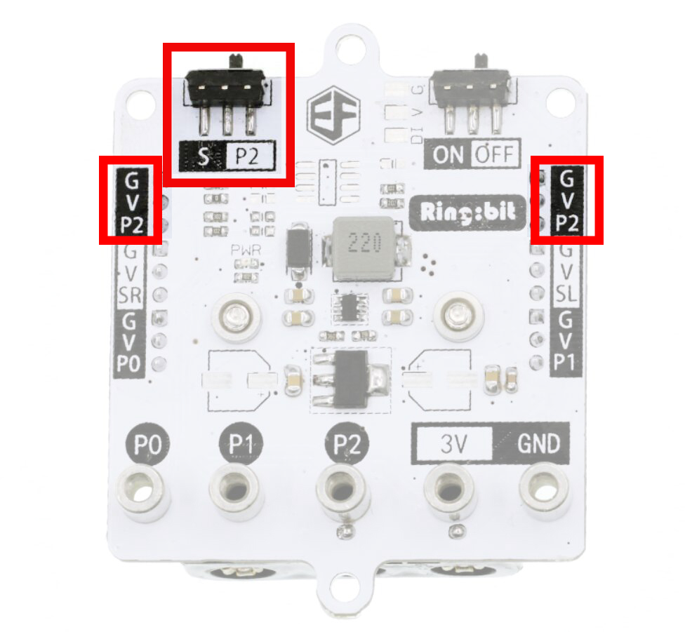
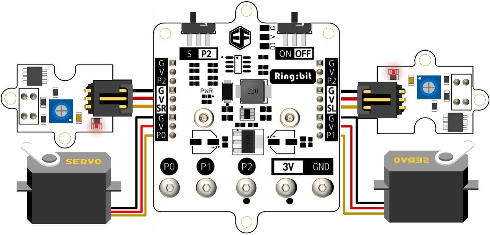
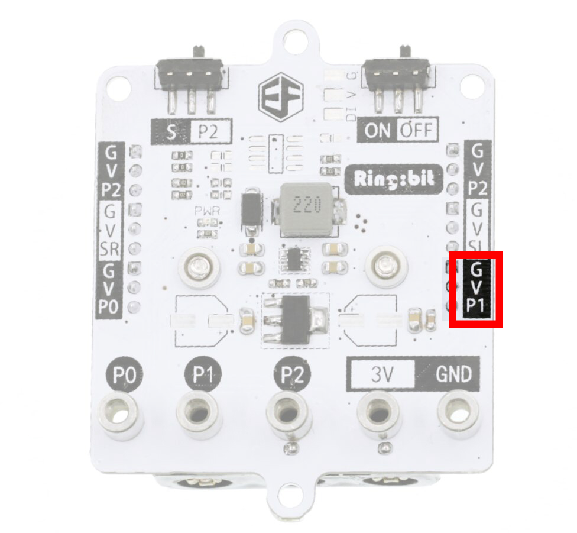
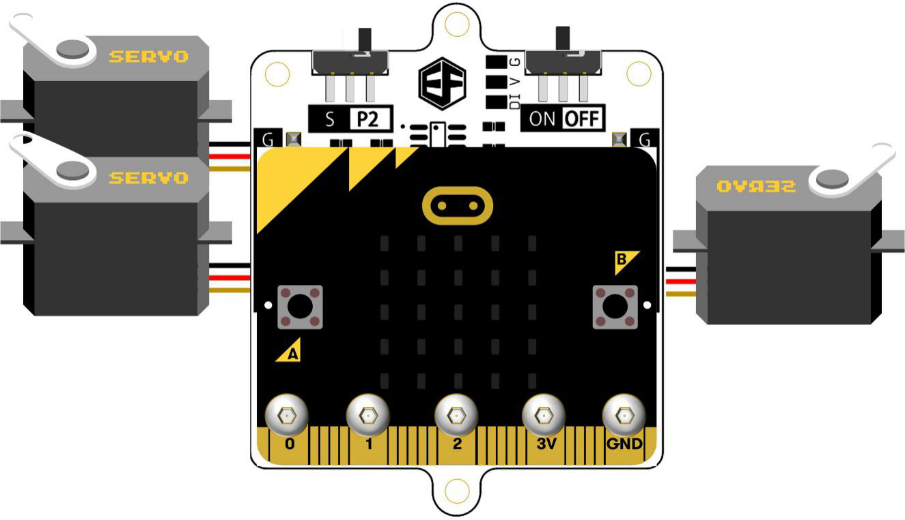
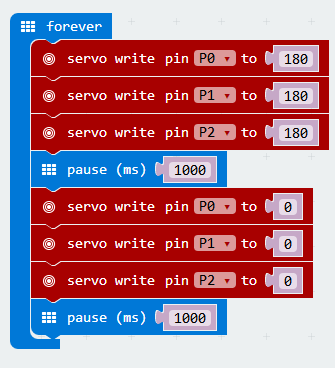

# Ring:bit v1.0(EF03423)

## Introduction  
---  

Ring:bit is a simple module based on micro:bit. It can lead out 3 IO connectors, power connectors, ground connectors on the micro:bit board. On this module, we have transformed P0/P1/P2 into general connectors for GVS electric bricks. Among them, we have extended P2 to a GVS connector with multiple usages. There is a slide switch on the board. Slide the switch to “S”, then you can connect SR and SL2(digital signal modules) at the same time. Slide to “P2”, you can connect digital module or simulating module but only one of them. This module adopts 3 No. 7 batteries for power supply. It is very simple, easy and practical to use. With this module, you can drive all kinds of GVS modules like servos, line-hunting modules and LED modules.

  

## Hardware  
---  

### Features

- Develop Envirnment: Code Kingdoms Java script, Microsoft Blocks，Microsoft Touch Develop，Python
- Support GVS connectors
- With a switch, one IO connector can be repeatedly used for double channels.
- Small size with multiple development for DIY.
- Input Voltage：DC 3.9V-4.5V
- Dimension：65.00mm X 51.70mm
- Weight：27g

### Application

- Support Bluetooth 4.0 device (based on micro:bit)
- Support 3 PIN GVS connector. Compatible with ElecFreaks octopus electric brick series. 
- Simultaneously drive 2 or 3 servos which are used to make a simple smart car. 
- Micro:bit maker teaching and education. 

### Connectors

## More Details about Some Connectors  
---  

### Function Selection Switch

Switch for S and P2 connector selection. Shift to “S” means SR in P2 connected to SL. At this time, you can connect two GVS modules to connector G-V-SR and G-V-SL separately. Shift to “P2” means use the connector of P2 only.

### G-V-S P2 connector

Only when function selection switch has shifted to P2，these two connectors can be used. It is compatible with partial products of Octopus Bricks series

### G-V-S SR/SL Connector  

Only when function selection switch has shifted to S, we can use the connector. It is compatible with partial products of Octopus Bricks series

### Code Example  

Electric circuit for mini elephant car line-hunting:

Fix micro:bit board:

### G-V-S P0 Connector    

P0 connector can be used as digital IO connector, analog IO connector or PWM output signal connector.    
  

### G-V-S P1 Connector    

P1 connector can be used as digital IO connector, analog IO connecotr or PWM output signal connector.   
  

### Dimension  
  

## Software    
---  

Fix micro:bit board and servo.  
    
      

**Code Example：**  

   

The three servos rotate clockwise first, anti-clockwise after 1 second, then clockwise again in the next 1 second. Repeat this movement forever.
