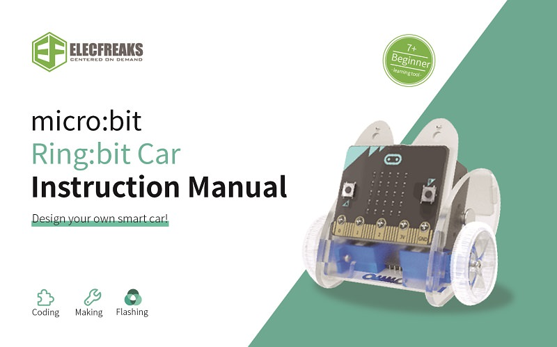
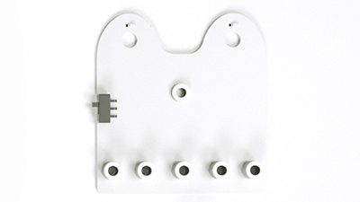
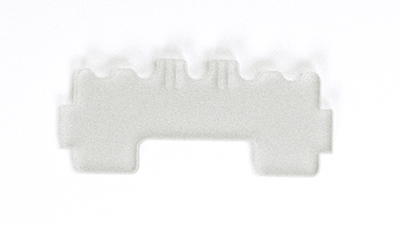
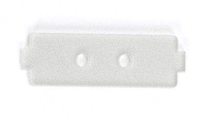
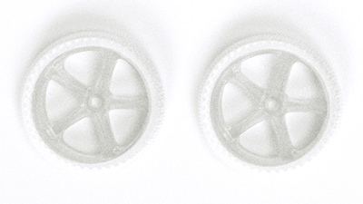
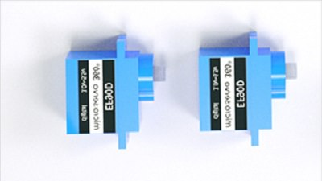
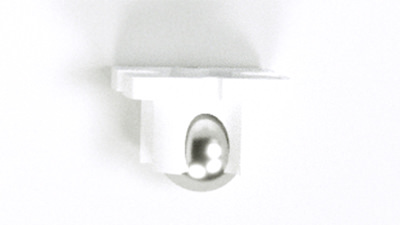
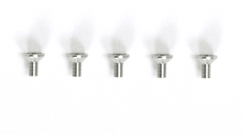
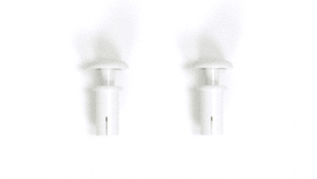
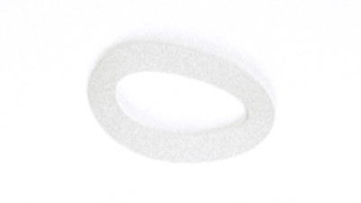

# Ring:bit v2.0(EF03423)

## Introduction of Ring:bit car 2
---

The ELECFREAKS Ring:bit Car is a small DIY smart car driven by the BBC micro:bit and the ELECFREAKS Ring:bit. The Ring:bit extends the micro:bit's 3 GPIO ports and allow for different sensors and components to be easily attached to the micro:bit. A basic Ring:bit Car can be easily programmed to run autonomously, with a remote control, and even create rainbow beacons of light. Just add one of the many extensions available and your Ring:bit Car can do even more things like line and light following, obstacle avoiding, drawing and more!

***Please note that the Ring:bit car version 2 has been upgraded. It is diffrent from the Ring:bit car version***

1. All related documents refers to the Ring:bit car version 
2. Information of the Ring:bit car version 1

## Components list ##
---

|Components|Numbers|Pictures|
|:-:|:-:|:-:|
|micro:bit|Optional||
|Ring:bit Expansion Board|1||
|Ring:bit Car Expansion Board|1||
|Ring:bit Car Front Board|1||
|Ring:bit Car Back Board|1||
|Ring:bit Car Base Board|1||
|Ring:bit Car Side Board|2||
|Ring:bit Car Wheel|2||
|Binding Post|1||
|360° Servo|2||
|Castor Wheel|1||
|Screw|5||
|Tapping Screw|5||
|Rivet|2||
|Screwdriver|1||
|Rubber Band|1||

