# Robit

## Introduction
---

Robit is a motherboard of smart car based on micro:bit. It is compatible with MBOT. Except for the integration of the simple and convinient RJ25 connector，motor connector and sensor on MBOT, we have extended 4 DC motor connectors, 2 stepping motor connectors(same with 4 DC motor connectors), 8 PWM signal output connectors on this board. You can use it to drive PWM signal driving devices like servo. It has 8 G-5V-S digital signal connectors(for connecting with OCTOPUS electric bricks). Robit can realize all current basic functions of MBOT. Besides, you can extend its usage with more sensors, motors, servos, stepping motors and so on. 

## Features  
---

- Compatible with MBOT chassis and sensors. 
- Support 4 channels of DC motor and 2 channels of stepping motors.
- With 8 PWM signal output connectors.
- With 8 G-5V-S digital signal connectors(for OCTOPUS electric brick). 
- With 4 G-5V-S analog signal connectors(for OCTOPUS electric brick).
- Integrate frequently used modules like buzzer, light sensor, rainbow LED, infrared send and receive.

## Parameter  
---

Project | Parameter 
:-: | :-: 
DC Power Input Voltage | DC 3.7-6V
Li-battery Input Voltage | DC 3.7-4.2V
USB Recharging Current | 500mA
Extendable Analog IO Ports | 4
Extendable Digital IO Ports | 10
Max Stepping Motor Driven Quantity | 8
DC Motor | 4 Channels
Stepping Motor | 2 Channels
Programmable LED Beads | 2 
Passive Buzzer | Support
Photocell Sensor | Support
Infrared Receive | Support
Infrared Send | Support
Dimension | 90mm X 74mm
Net Weight | 46g

### Dimension

## Pins & Connectors
---

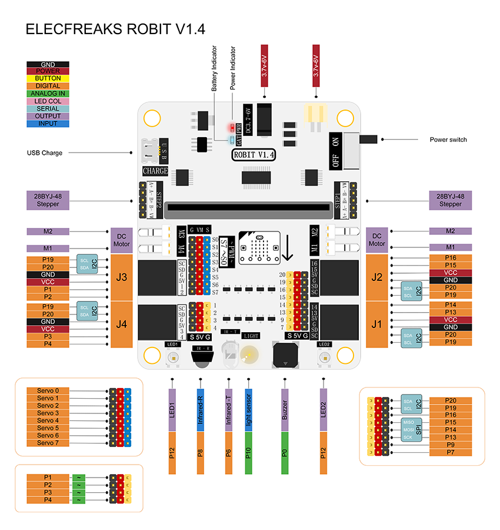

## Introduction of Major Components   
---

### RJ25 Connector

Robit has 4 RJ25 connectors. Each RJ25 connector has 6 touch points. These points respond to power, 2 IO ports and IIC ports separately. It is compatible with some sensors on MBOT.  

RJ25 Connector | Match Pins on micro:bit
:-: | :-:
J1 | SCL(P19)/SDA(P20)/GND/5V/P13/P14   
J2 | SCL(P19)/SDA(P20)/GND/5V/P15/P16  
J3 | SCL(P19)/SDA(P20)/GND/5V/P1/P2 (It supports 5V analog input sensor. )  
J4 | SCL(P19)/SDA(P20)/GND/5V/P3/P4 (It supports 5V analog input sensor.)   

### GVS Standard Electric Brick Connector  

Except leading out to RJ25 connector, the IO port on micro:bit also lead out with the format of GVS. It is support 5V components. Besides, P1/P2/P3/P4 support 5V analog input sensors.   

### GVS Standard Servo Connector: S0~S7  

You can connect 8 servos at most. This connector leads out from the chip PCA9685 and extends from the IIC connector on micro:bit instead of normal I/O ports. 

### DC Motor Connector: M1~M4

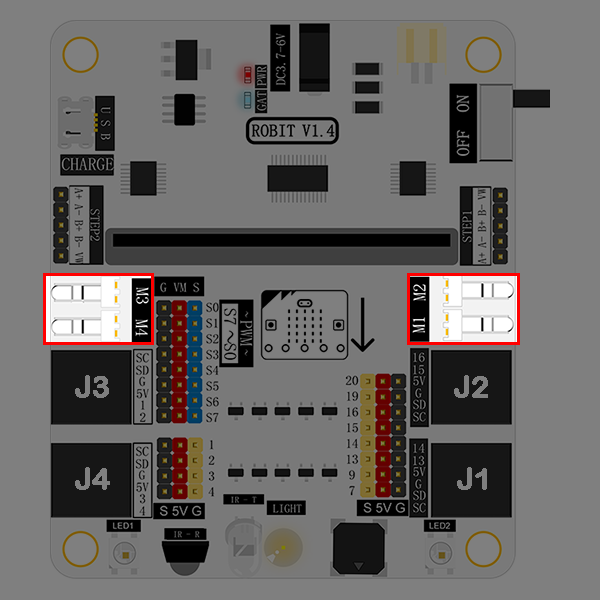

It allows you to connect 4 DC motors (max) at the same time. This connector leads out from the chip PCA9685 and extends from the IIC connector on micro:bit instead of normal I/O ports.  

### Stepping Motor Connector: STEP1 & STEP2 

It enables you to connect 2 stepping motors(28BYJ-48-5V) at most. 

### Buzzer

The buzzer is connected to the P0 port on micro:bit.

### Light Sensor 
  
  

The light sensor onboard is connected to the P10 port on micro:bit.  

### Infrared Emitting Diode

  

This infrared emitting diode is connected to the P6 port on micro:bit.  

### Infrared Receiving Diode

  

This infrared receiving diode is connected to the P8 port on micro:bit.

### Rainbow LED

Two rainbow LED beads are connected to the P12 port on micro:bit.

### DC Power Connector  

  

DC power connector supports 3.7V~4.2V DC power. It is usually connected to a battery holder with 4 AAA batteries.  

### Li-battery Connector  

  

Li-battery connector supports 3.7V~4.2V li-battery.  

### Li-battery Indicator  

  

This indicator tells you battery power information. It is in blinking status. Blink once means 1 grid of power. And the full power has 4 grids. That means it will blink 4 times when the battery power is full. 

### USB Connector  

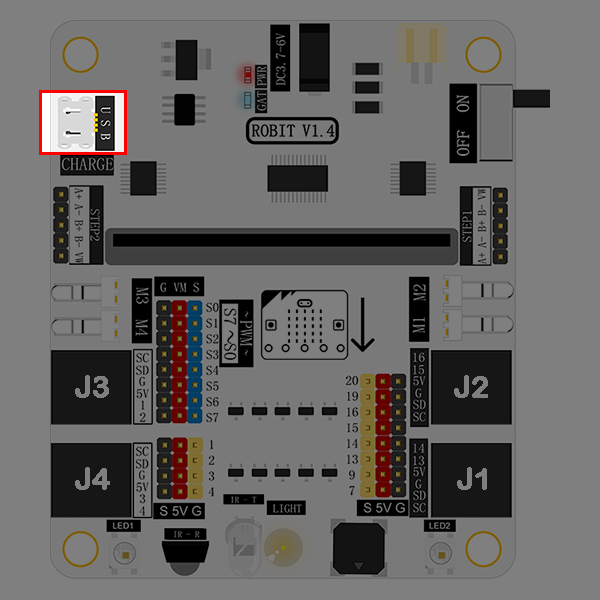  

This connector is only used to charge li-battery. It doesn't support data transmit and its charging current is 500mA.  

## Quick Start   
---

### Hardware Connection  

Fix robit onto mbot car.  
Connect left motor to M1 port, and right motor to M2 port. 
Once completed, it looks like the following picture showed.
  

### Programming  

Click to open [makecode](https://makecode.microbit.org/), search the key word `robit` and add robit package.

Write your code to make the car forever move forth and back for 3 seconds respectively. Here's the code:

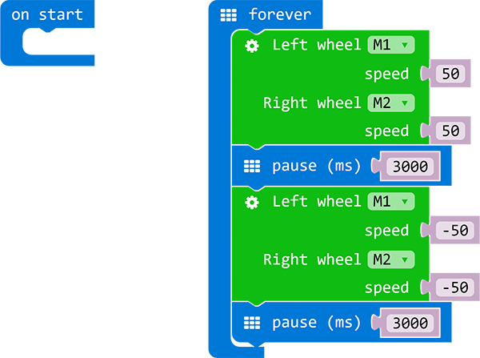

You can see the whole program from the link here: [https://makecode.microbit.org/_aXVAyx3dm585](https://makecode.microbit.org/_aXVAyx3dm585)

Also, you can download the code directly from the page below: 

<iframe style="position:absolute;top:0;left:0;width:100%;height:100%;" src="https://makecode.microbit.org/#pub:_aXVAyx3dm585" frameborder="0" sandbox="allow-popups allow-forms allow-scripts allow-same-origin"></iframe>

### Result  

We can see our robit car moves forward for 3 seconds, and then backward 3 seconds. This round trip movement is repeated forever.  

---

## case 01 Ultrasonic Distance Measurement 

### Our Goal
---

- Get to know ultrasonic wave and how to use it to measure distance. 
- Achieve distance measurement with the ultrasonic module on mBot(controlled by robit). 

### Material Needed
---

- 1 x Robit
- 1 x Mbot Car

### Background Knowledge
---

#### What is ultrasonic wave?

[Ultrasonic Wave](https://en.wikipedia.org/wiki/Ultrasound) (or ultrasound) is a kind of sound wave with frequencies beyond 20,000 Hertz. It has good direction sense and strong penetration ability. It can easily acquire comparatively centrallized sound power, and spread to far distance underwater. We can use it to measure distance, test speed, rinse, weld, break stones, kill bacteria and disinfect, etc.. Ultrasonic is named because its lower frequency limit is greater than the upper limit of human hearing .  

#### Distance Measure Principle 

When the transmitter emit ultrasonic wave in a certain direction, it starts time record simultaneously. The wave spreading in the air will be reflected back when encountering a barrier. Once the receiver has received the returned wave, it will stop time record immediately. You can calculate the distance according to the time when the reflected ultrasonic wave is received by the receiver. It is similar to the radar ranging principle.   

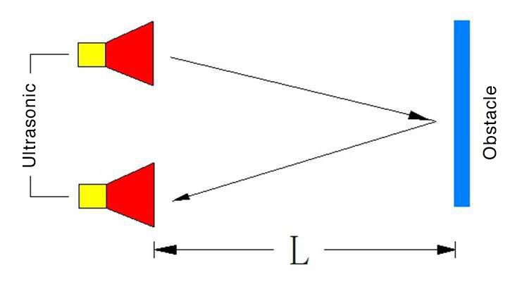

### Hardware Assembly
---

Connect ultrasonic module to J1 port on Robit with RJ25 wire, just as the following picture showed. 

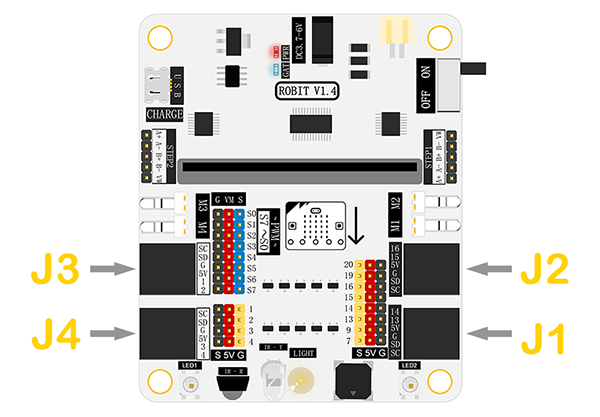

### Software
---

[Microsoft Makecode](https://makecode.microbit.org/#)

### Study Case
---

#### Step 1

Click **Advanced** in the code drawer to see more code options. 

In order to program for the ultrasonic module, we have to add a package. Find **Add Package** at the bottom of code drawer, and click on it. This will pop up a dialogue box. Search for **Robit**, and then click to download this package. 

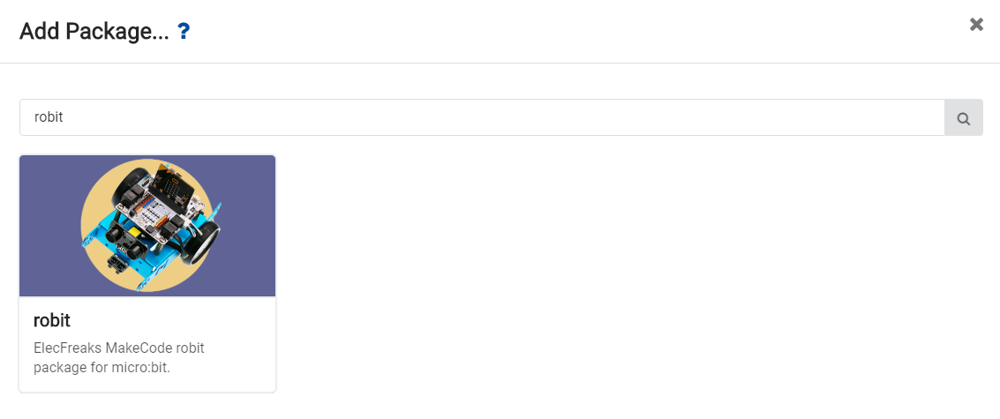

**Note:** 
If you get a hint  that some packages will be deleted due to the problem of incompatibility, you can either follow the prompts, or create a new project in the project menue.

#### Step 2

Drag out a **forever** brick from **Basic**, and embed it into brick **show number**.

Drag out the brick **ultrasonic pin** from Robit, and choose J1(P13,P14). This statement will read the return parameter of the ultrasonic module.

#### Programming 

Please refer to the link here: [https://makecode.microbit.org/_3ktFD2gabF7J](https://makecode.microbit.org/_3ktFD2gabF7J) .

Or, you can download directly from the page below. 

<iframe style="position:absolute;top:0;left:0;width:100%;height:100%;" src="https://makecode.microbit.org/#pub:_3ktFD2gabF7J" frameborder="0" sandbox="allow-popups allow-forms allow-scripts allow-same-origin"></iframe>
  

**Note:** The maximun measureable distance of ultrasonic module is about 400 cm. 

#### Result

Ultrasonic module will measure return distance in real time and display it on micro：bit 5x5 LED grid. The unit of distance is centimeter(CM).

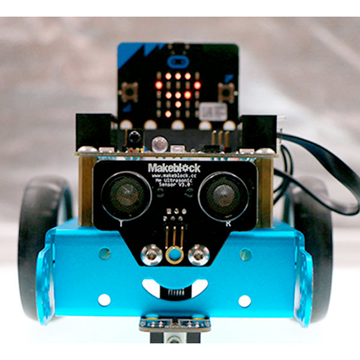

### Think
---

How many situations are there when the distance measured by ultrasonic module is 0 ?

---

## case 02 Ultrasonic Obstacle Avoidance

### Our Goal 
---

Make mBot car (controlled by robit) avoid obstacle. 

### Material Needed
---

- 1 x Robit
- 1 x Mbot Car

### Introduction
---

In our last chapter Ultrasonic Distance Measurement, we have realized measuring distance in real time with ultrasonic module. In this chapter, we are going to use it to make mBot car avoid obstacles. 

### Hardware Assembly
---

Connect the left motor to port M1 and the right motor to port M2. Same to the last chapter, the ultrasonic module shall be connected to J1 port. 

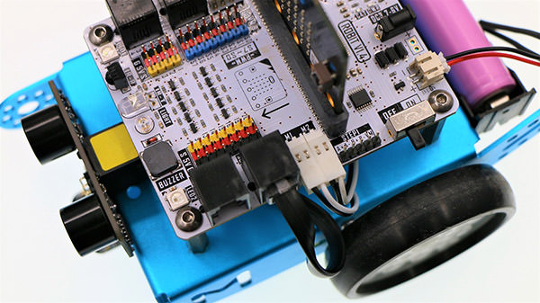

### Software
---

[Microsoft Makecode](https://makecode.microbit.org/#)

### Programming
---

#### Step 1

Click **Advanced** in the code drawer to see more code options. 

To program for the ultrasonic module, we have to add a package. Find **Add Package** in the bottom of code drawer, and click it. This will pop up a dialogue box. Search **Robit** and then click it to download this package.

**Note:** 
If you get a hint  that some packages will be deleted due to the problem of incompatibility, you can either follow the prompts, or create a new project in the project menue.

#### Step 2

At the beginning of our program, we have defined an variable--away, which is used to represent the measured distance from the obstacle and set this distance to be 0. 

Assign the speed of both M1 and M2 to be 20. 

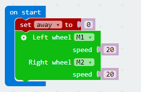

#### Step 3

Create a forever loop so that it can read the reflected ultrasonic data from J1 port in real time and assign values to away. 

##### Stop to Prevent Collision

When the measured distance (away) is smaller than 8cm, stop the car. After 300ms, set a negative number to M1 and M2 respectively to realize reversing, and delay time for 600ms. 

##### Steer to Avoid Obstacle

When the measured distance(away) is smaller than 15cm, a random number within 0 to 100 is generated. 

When the random number is smaller than 50, the motor speed of M1 is negative, the left wheel runs oppositely to complete a left turn.  

When the random number is beyond 50, the motor speed of M2 is negative, the right wheel runs oppositely to complete a left turn. 

When the measured distance(away) is beyond 10cm and not equal to 0, set the speed of M1 and M2 to be 20, then the car will move forward.  

#### Programming

You can refer to the program from the link here: [https://makecode.microbit.org/_X2g8PfeebXqv](https://makecode.microbit.org/_X2g8PfeebXqv) .

Or, you can download the program directly from the page below. 

<iframe style="position:absolute;top:0;left:0;width:100%;height:100%;" src="https://makecode.microbit.org/#pub:_X2g8PfeebXqv" frameborder="0" sandbox="allow-popups allow-forms allow-scripts allow-same-origin"></iframe>
  

**Note:** Setting the speed too low will cause the motor to operate abnormally.  

#### Result

The mBot car automatically turns when it detects that there is an obstacle at the distance of 20cm. And if it is too close to the obstacle after turning, it will automatically reverse the car.

### Think 
---

Why we have to judge if the distance is 0 during the procedure of stop to prevent collision?

### FAQ
---

**Why it can't realize obstacle avoidance after the 5x5 dot screen is turned on?**

Because the LED dot metrix will greatly decrease the running speed of the program, which will make obstacle detect become more slowly. 

---

## case 03 Never Fallen Car

### Our Goal   
---  

- Get to know line tracking module.   
- Realize edge detection with the line tracking module on mBot car.   

### Material Needed  
---  

- 1 x Robit
- 1 x Mbot Car  

### Background Knowledge  
---  

#### Principle of Line Tracking   

- This line tracking module has an infrared sensor, which consists of a **transmitter** and a **receiver**. The transmitter emits infrared light, while the receiver collects the inrared light reflected by the ground.  
- When encountering black ground or other objects that absorb infrared, the receiver can't receive infrared light, thus line tracking module will return 1.   

### Hardware Assembly    
---  

Like the previous chapter, connect motors to port M1 and M2.  
Using RJ25 wire to connect line tracking module to port J2 on Robit just as pictures below.  

  

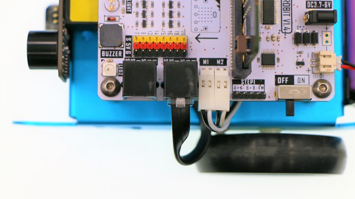  

  

### Software  
---  

[Microsoft Makecode](https://makecode.microbit.org/#)  

### Programming    
---  

#### Step 1  

Click **Advanced** in the code drawer of Makecode to see more options.   

  

To program for line tracking module, we have to add a package. Find **Add Package** at the bottom of code drawer and click it. This will pop up a dialogue box. Search **Robit**, and then click to download this package.    

  

**Note:**  
If you get a hint that some packages will be deleted due to the problem of incompatibility, you can either follow the prompts, or create a new project in the project menue.  

#### Step 2  

The initial line tracking module port at the beginning of our program is J2(P15,P16). Set the motor speed of M1 and M2 to be 15. 

  

Set the return value of the left and right infrared sensor to be variables: left and right. These variables can read the return parameters of the infrared sensors.  

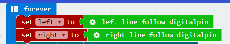  

If one of these infrared sensors doesn't receive any feedback(detected edges), the motor speed is negative, and the car will reverse. 
Randomly generate a number from 0 to 100. If it is below 50, the motor M1 stops to complete a right turn. If it is beyond 50, the motor M2 stops to complete a left turn.  

  

If both infrared sensors don't detect edges, set the motor speed to be 15 and the car continue to move forward.  

  

### Programming  
---  

You can refer to the whole program from the link here:[https://makecode.microbit.org/_1mCg9TgVxJ5K](https://makecode.microbit.org/_1mCg9TgVxJ5K)  

Or you can download it directly from the page below.   

<iframe style="position:absolute;top:0;left:0;width:100%;height:100%;" src="https://makecode.microbit.org/#pub:_1mCg9TgVxJ5K" frameborder="0" sandbox="allow-popups allow-forms allow-scripts allow-same-origin"></iframe>
  

**Note:** Objects that can absorb infrared light are considered as black lines.

### Result  
---

Once detected table edges, mBot will move backward to prevent falling down.   

  

---

## case 04 Line Tracking 

### Our Goal   
---  

- Make mBot car(controlled by Robit) run around with its line tracking module.   

### Material Needed  
---  

- 1 x Robit
- 1 x Mbot Car   

### Hardware Assembly  
---  

Like the previous chapter, connect motors to port M1 and M2. 
Using RJ25 wire to connect the line tracking module to port J2 on Robit just as pictures below.

  

  

  

### Software
---

[Microsoft Makecode](https://makecode.microbit.org/#)

### Programming  
---

#### Step 1

Click **Advanced** in the code drawer of Makecode to see more options. 

To program for line tracking module, we have to add a package. Find **Add Package** at the bottom of code drawer and click it. This will pop up a dialogue box. Search **Robit**, and then click to download this package.

**Note:**
If you get a hint that some packages will be deleted due to the problem of incompatibility, you can either follow the prompts, or create a new project in the project menue.

#### Step 2

The initial line tracking module port at the beginning of our program is J2(P15,P16). Set the motor speed of M1 and M2 to be 15.

Set the return value of the left and right infrared sensor to be variables: left and right. These variables can read the return parameters of the infrared sensors.

If the right infrared sensor has detected derailment from the black line, set the speed of left wheel to be 5 and the speed of right wheel to be 25, making the car turn left. And then create a loop to check if the car has returned to the black line. If not, then continue to turn left until return to the black line.

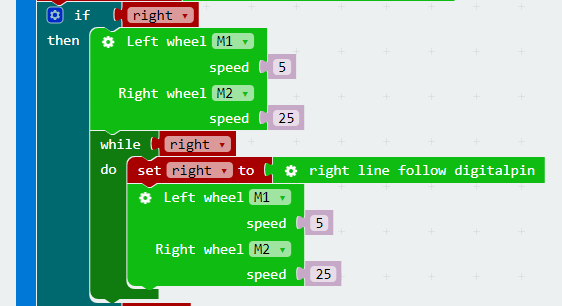

If the left infrared sensor has detected derailment from the black line, then the car will turn right to return to the black line. 

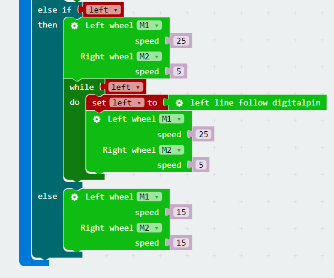

#### Programming 

You can refer to the whole program from the link here: [https://makecode.microbit.org/_9WECsHJmpDxM](https://makecode.microbit.org/_9WECsHJmpDxM).

Or you can directly download from the page below. 

<iframe style="position:absolute;top:0;left:0;width:100%;height:100%;" src="https://makecode.microbit.org/#pub:_9WECsHJmpDxM" frameborder="0" sandbox="allow-popups allow-forms allow-scripts allow-same-origin"></iframe>
  

**Note:** Objects that can absorb infrared light are considered as black lines.

### Result  
---   

The mBot car will move forward along the planned black line.

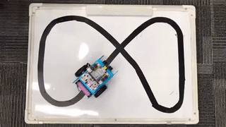

---

## case 05 Reversing Alarm

### Our Goal  
---

- Make mBot car realize the function of reversing alarm. 

### Material Needed
---

- 1 x Robit
- 1 x Mbot Car

### Background Knowledge
---

#### Buzzer

- Buzzer is a sound component that consists of a vibrator and a resonantor. According to the control method, the buzzer can be further divided into active type and passive type.

- Working Principle of Active Buzzer:
Inside the buzzer, it has integrated an oscillating system and amplified sampling circuit. When DC current pass through the buzzer, the resonantor will generate an acoustic signal.

- Here's the flow chart of active buzzer working principle:

- Working Principle of Passive Buzzer:
Convert the square wave input into sound signal output via the resonantor. 

- Here's the flow chart of passive buzzer working principle:

**Note:** In this experiment, what we have used is passive buzzer. 

#### Introduction

- In the chapter of [Ultrasonic Obstacle Avoidance](/Robit_Case_02/), we have realized to detecting abstocles with ultrasonic module. In this chapter, we are going to use ultrasonic module and buzzer to make mBot car realize reversing alarm function. 

### Assembly
---

Connect the left motor to M1 and the right motor to M2. 

Plug in ultrasonic module to J1. In this project, our goal is to realize reversing alarm function. Therefore, the ultrasonic module needs to be installed at the tail of the mBot car. 

The buzzer is marked in the picture below. It is connected to P0 port on micro:bit. 

### Software
---

[Microsoft Makecode](https://makecode.microbit.org/#)

### Programming
---

#### Step 1

Click **Advanced** in the code drawer of Makecode to see more options. 

To program for the ultrasonic module, we have to add a package. Find **Add Package** in the bottom of code drawer and click it. This will pop up a dialogue box. Search "Robit" in the box and click on it to download this package. 

**Note:**
If you get a hint that some packages will be deleted due to the problem of incompatibility, you can either follow the prompts, or create a new project in the project menue.

#### Step 2

At the beginning of our program, we set the frequency of buzzer to be 400Hz and the motor speed to be -30.

#### Step 3

Create a forever loop and store the returned data of the ultrasonic module into variable away. 

If the distance between the car and the wall is 10cm or less, the buzzer alarms and the motors stop at the same time. 

If the distance is less than 50cm but beyond 10cm, the buzzer alarms in 1/2 beat and set the motor speed to be -15. 

If the distance is beyond 50cm, the buzzer alarm in 4 beats and set the motor speed to be -30. 

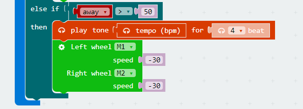

### Program
---

You can see the whole program from the link here: [https://makecode.microbit.org/_gFiciE4PLF37](https://makecode.microbit.org/_gFiciE4PLF37)

Or you can download it from the page below:

<iframe style="position:absolute;top:0;left:0;width:100%;height:100%;" src="https://makecode.microbit.org/#pub:_gFiciE4PLF37" frameborder="0" sandbox="allow-popups allow-forms allow-scripts allow-same-origin"></iframe>
  

---
**Note:** Setting the motor speed too low will cause the motor to operate abnormally.

### Result
---

When the distance between mBot car and the wall is beyond 50cm, the buzzer will alarm in 4 beats and the motors will run in full speed. 

When the distance is less than 50cm but beyond 10cm, the buzzer will alarm in 1/2 beat and the motors will run in half speed. 

When the distance is less than 10cm, the buzzer will keep alarming and the motor will stop running. 

### Think 
---

Why we have to judge if the distance is 0 during parking? 

### FAQ
---

**Q:** Why it can't avoid obstacles after turning on micro:bit 5x5 dot screen?

**A:** The LED dot matrix display will seriously slow down the running speed of the program, causing the car to detect obstacles more slowly. To make the program run smoothly, it is recommended to disable the 5x5 display.  

