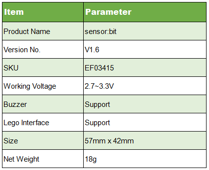
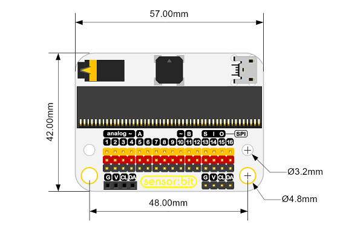
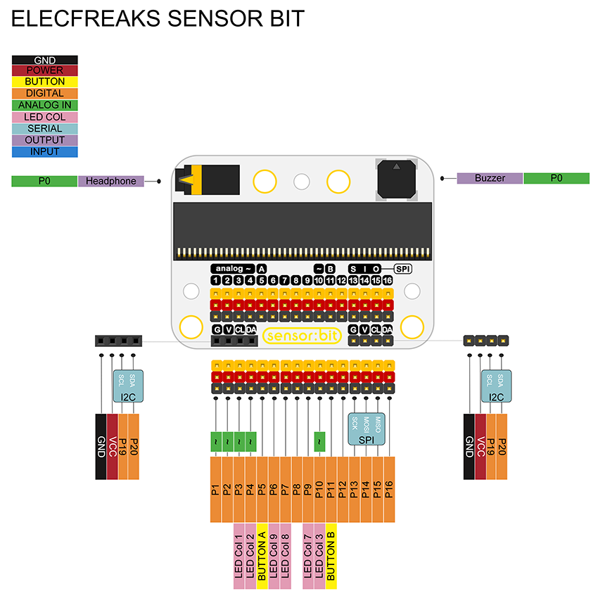
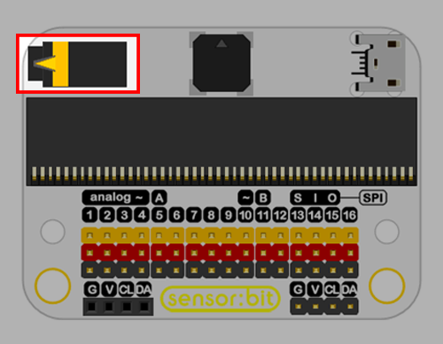
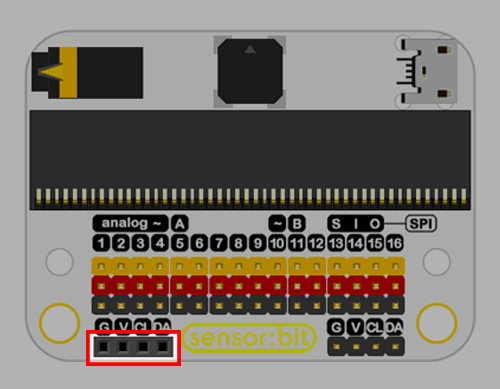

# Sensor:bit

## Introduction
---

Sensor:bit is a breakout board based on micro:bit. It has extended all available IO ports on micro:bit, and lead out them in the form of GVS. With this board, we can extend various 3V electric brick modules like LED light, photocell, etc.. On the board, it has integrated a buzzer and an audio jack, which allows us to hear music from the buzzer or with our headphone.

## Features
---

- Extend most IO ports by GVS terminal. 
- Independently lead out IIC interface. Enable to plug in IIC components like OLED, BME280, etc..
- Integrated a buzzer and an audio jack. 
- Support Lego interface. 
- Mark out each IO port with silk printing. 

## Parameters
---

### Dimension

## Definition of Pins 
---

## Introduction of Major Components
---

### Audio Jack

Headphone is controlled by P0 port. Plug in your headphone, the buzzer will disconnect automatically. 

### Buzzer

The buzzer is controlled by P0 port. Plug in your headphone, the buzzer will disconnect automatically. 

### 16 Channel Standard GVS Port

This is a standard GVS interface with 16 channels. It can extend 3V electric brick module. 

### I2C Port

This is a group of I2C female header, which can connect with OLED module directly.  

This is a group of I2C male header.

### USB Power Connection

This a USB connection for power-supply.

## Quick Start
---

### Hardware Assembly 

Plug your micro:bit into sensor:bit.

### Software

Navigate to the programming interface of Makecode online editor. Write your code to make the buzzer on sensor:bit play music. 

You can see the whole program from the link here: [https://makecode.microbit.org/_3At2iE5Ue3XK](https://makecode.microbit.org/_3At2iE5Ue3XK)

Or you can download it from the page below: 

<iframe style="position:absolute;top:0;left:0;width:100%;height:100%;" src="https://makecode.microbit.org/#pub:_3At2iE5Ue3XK" frameborder="0" sandbox="allow-popups allow-forms allow-scripts allow-same-origin"></iframe>

### Result

Press button A on micro:bit, the buzzer starts to play music. Plug in your headphone to sensor:bit, the buzzer stops playing music, and you can hear the music with your headphone.

## FAQ
---

