# Wukong Breakout Board

## Introduction

Wukong is a high integrated breakout board with multiple functions based on micro:bit, which has a similar size with the micro:bit with buzzer, servo and motor drivers on board.

With a built-in 400mAh Li-ion battery pack and the on-board power controlling system, it supports fast charge with only 20 minutes for full filling that can operate for more than 40 minutes a time.

The base board designs with standard 7x5 square bricks that can adapt perfectly to Lego.

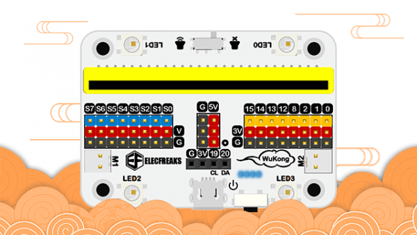

## Characteristics 


Tiny shape with high integration
Standard Lego bricks connection
Most of the IO ports led out in GVS form
Standalone IIC pots, available for OLED and BME280.
Integrated buzzer and switch
Integrated motor-drive circuit
Integrated servo-drive circuit
Support 5V sensors
Built-in 400mAh Li-ion battery pack, on-board power controlling system, four LEDs indicate the power storage
Support fast charge

##  Parameter

- - - - -

| Parameter | Details | **Instruction** | **Note** |
|:-:|:-:|:-:|:-:|
|Item No.|EF08207|SKU|-|
| Size |40.00 X 58.12 X 24.53 mm|Including Lego baseboard without micro:bit|Manual measurement, size in kind prevail|
| Weight |41.6g|Including Lego baseboard and the battery|Manual measurement, weight in kind prevail|
| Power Switch |Click once to turn on, double-click to turn off|Four LEDs indicate the power storage, support fast charge|Power supply by the USB connection on board is supported|
| Battery |400mAh Li-ion battery pack|20 minutes for completing the charge that can operate for more than 40 minutes a time|Anti-explosion|
| Working Voltage |3.7v~5v|Li-ion battery pack 3.7v，USB 5v|-|
| Working Temperature |-20℃~60℃|Charge temperature 0℃~40℃|-|
| Motor Drive |Dual (M1，M2)|Motor drive circuit onboard |3.7V|
| Servo Drive |Eight ways servo connection (S0~S7)|Servo drive circuit onboard|-|
|  IO Port Lead Out   |     P0、P1、P2、P8、P12、P13、P14、P15、IIC     |                    Support 3V&5V modules                     |                           GVS                            |
|     Rainbow LED     |             LED0、LED1、LED2、LED3              |               Available for Neopixel database                |              Connect to micro:bit P16 port               |
|       Buzzer        |      Passive buzzer with a switch on board      |                 Available for music database                 |               Connect to micro:bit P0 port               |
| LED        | 8 LEDs can be programmed on the base side | Light on, twinkle, breathing light  | The LED twinkles when power on |
| Base board | Standard 7*5 baseboard                    | The battery is placed in the middle | -                              |


## Outlook and Dimensions


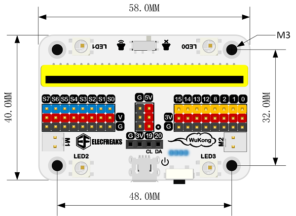


##  Main modules 


### Power supply, USB power connection and power storage indicating LED

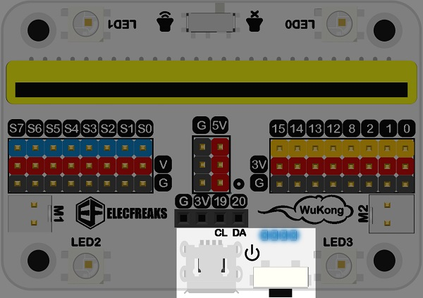

### micro:bit adapter

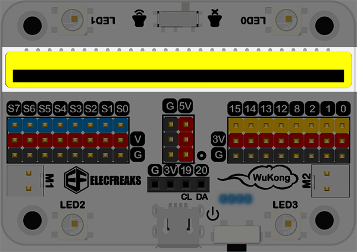

### Motor-drive connection

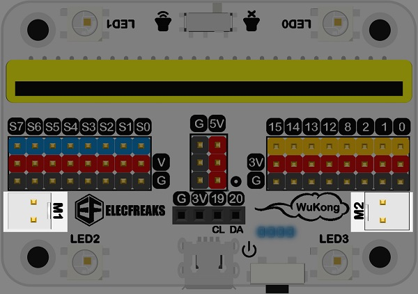

### Servo-drive connection

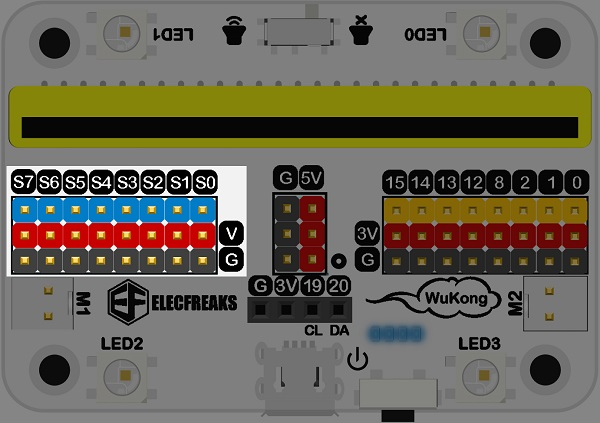

### 8 ways standard GVS connection and 5v connection

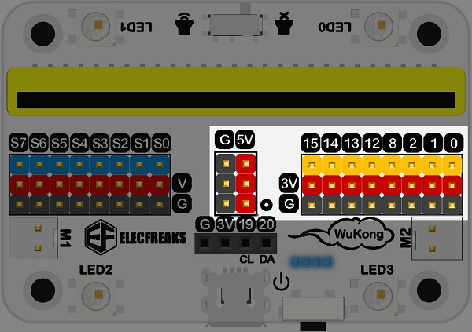

### I2C female header conncetion

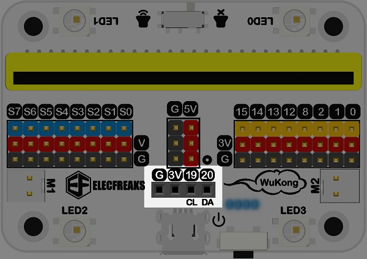

### 4 Rainbow LEDs

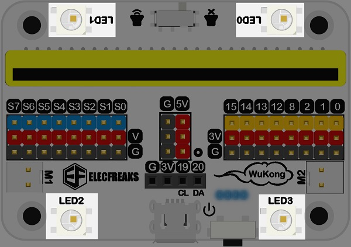

### Buzzer(reverse side) and switch

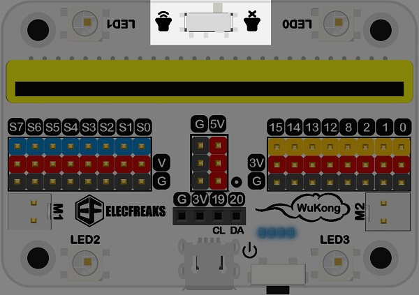

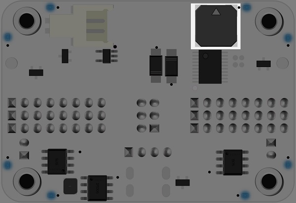

### 8 LEDs(reverse side)

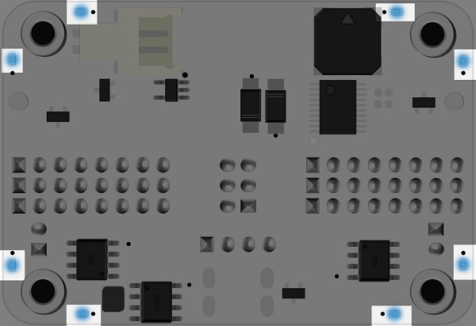

### Battery connection(reverse side)

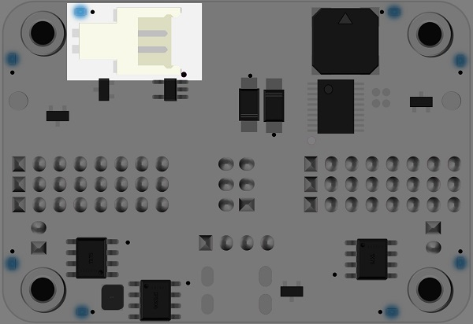

### Fixed holes M3 for Lego (reverse side)

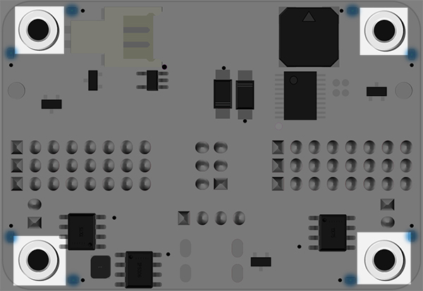

## Quick Start

### Hardware Connection

Insert the micro:bit into the adapter(The logo side of the micro:bit stands towards the side for buzzer switch ).
Click once to power on.

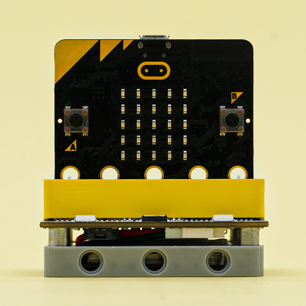

### Software Programming

[MicroSoft makecode online programming: makecode.microbit.org](https://www.elecfreaks.com/learn-en/microbitExtensionModule/makecode.microbit.org)


### Add Package

Click `Extensions` in the drawer of `Advanced` to see bricks menu.


Search `wukong` in the box and click it to add package.
Completed.

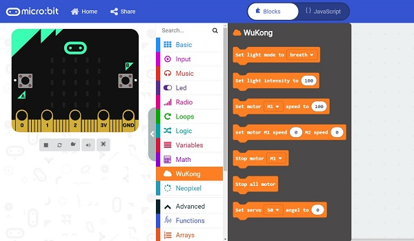

## User Guide


### Ways to power on&charge

Original power switch, click to power on and the indicator LED lights on.
Double click to power off and the indicator LED lights off.
Connect the USB cable to the on-board connection. The normal lighting-on LEDs indicate the state of charge, if the left LEDs lights on in turn, it indicates the charge of the battery.


### Breathing LEDs

There are 8 blue breathing LEDs whose power on/off status and brightness can be controlled on the baseboard.

Links: https://makecode.microbit.org/_4ub57g5FuJ1v

You can also download it below:

<div style="position:relative;height:0;padding-bottom:70%;overflow:hidden;"><iframe style="position:absolute;top:0;left:0;width:100%;height:100%;" src="https://makecode.microbit.org/#pub:_4ub57g5FuJ1v" frameborder="0" sandbox="allow-popups allow-forms allow-scripts allow-same-origin"></iframe></div>  

### Motor

There are two kinds of motor driving connections named M1 and M2 that can connect most motors in the market.


Links:https://makecode.microbit.org/_78keCLdmU1Ez

You can also download it below:

<div style="position:relative;height:0;padding-bottom:70%;overflow:hidden;"><iframe style="position:absolute;top:0;left:0;width:100%;height:100%;" src="https://makecode.microbit.org/#pub:_78keCLdmU1Ez" frameborder="0" sandbox="allow-popups allow-forms allow-scripts allow-same-origin"></iframe></div>  

### Buzzer

There is an on-board buzzer that is connected to the P0 port of the micro:bit, it can be programmed by the `Music` brick and can be powered on/off with the on-board buzzer switch.


Link: [https://makecode.microbit.org/_JmM5btU4dHUb](https://makecode.microbit.org/_JmM5btU4dHUb)

You can also download it below:

<div style="position:relative;height:0;padding-bottom:70%;overflow:hidden;"><iframe style="position:absolute;top:0;left:0;width:100%;height:100%;" src="https://makecode.microbit.org/#pub:_JmM5btU4dHUb" frameborder="0" sandbox="allow-popups allow-forms allow-scripts allow-same-origin"></iframe></div>  

### Rainbow LEDs

There are 4 Rainbow LEDs named LED0、LED1、LED2、LED3 that are connected to P16 port of the micro:bit and they can be programmed by the `Neopixel` brick.


Link：[https://makecode.microbit.org/_61T2w6cqTib0](https://makecode.microbit.org/_61T2w6cqTib0)

You can also download it below:

<div style="position:relative;height:0;padding-bottom:70%;overflow:hidden;"><iframe style="position:absolute;top:0;left:0;width:100%;height:100%;" src="https://makecode.microbit.org/#pub:_61T2w6cqTib0" frameborder="0" sandbox="allow-popups allow-forms allow-scripts allow-same-origin"></iframe></div>  

### Servo

Connect the servos to their driving connections S0~S7, they can be programmed by the servo bricks in Wukong expansions.
180° servos can be set from 0°~180°.
Set 0° as the maximum speed of positive rotation, 180° as the maximum speed of negative rotation and 90° as stop for 360° servos , 0°~90° and 90°~180° are the scape for adjusting the speed.


Links: https://makecode.microbit.org/_6Pw63w49u5qq

You can also download it below:

<div style="position:relative;height:0;padding-bottom:70%;overflow:hidden;"><iframe style="position:absolute;top:0;left:0;width:100%;height:100%;" src="https://makecode.microbit.org/#pub:_6Pw63w49u5qq" frameborder="0" sandbox="allow-popups allow-forms allow-scripts allow-same-origin"></iframe></div>  

### 5V Power Supply Pins

There are 3 pairs on-board 5V power supply connections that can drive sensors or servos in 5V , it only requires to connect the connections for 5V modules to 5V power supply, and to connect the signal cables to the signal connections for servos or sensors.

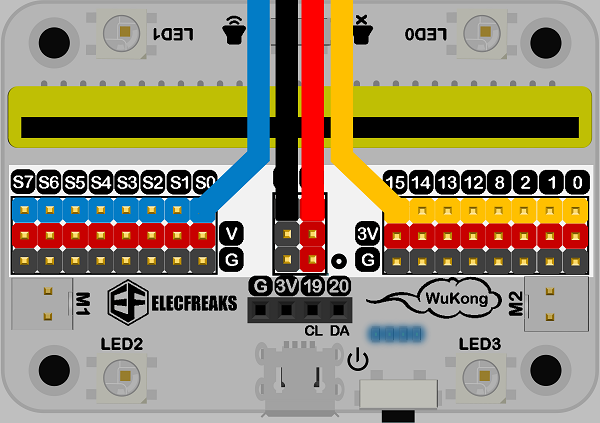

## Software Programming（Python editor）

[Python editor:https://python.microbit.org/v/2.0](https://python.microbit.org/v/2.0)

### Add Python File

Download to unzip it: [EF_Produce_MicroPython-master](https://github.com/lionyhw/EF_Produce_MicroPython/archive/master.zip)
Go to  [Python editor](https://python.microbit.org/v/2.0)https://python.microbit.org/v/2.0)


We need to add Wukong.py for programming.Click "Load/Save" and then click "Show Files (1)" to see more choices.


click "Add file" to add Wukong.py from the unzipped package of EF_Produce_MicroPython-master. 


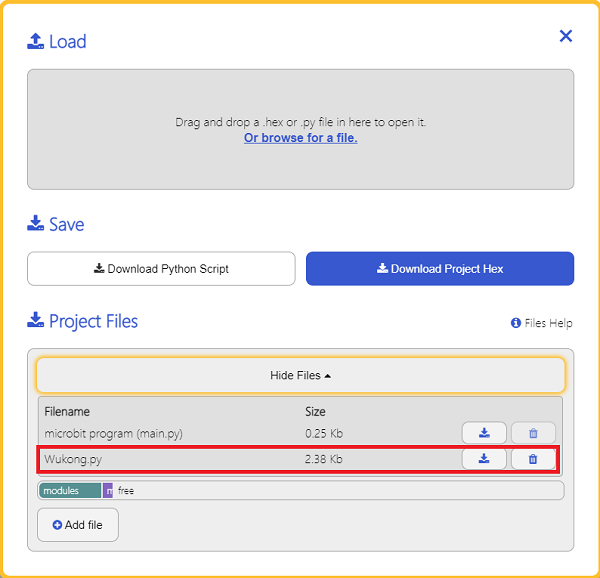

## User Guide

### Light up the breathing LEDs

There are 8 blue LEDs on the base part of the Wukong breakout board, their on/off status and light level could be controlled. 

Turn to the breathing LED mode.(Write "False" to replace "true" in "set_light_breath(True)" to  turn off the breathing LED )

```
from microbit import *
from Wukong import *
wk = WUKONG()
wk.set_light_breath(True)
```

- Adjust the light intensity of the breathing LEDs
```
from microbit import *
from Wukong import *
wk = WUKONG()
wk.set_light(100)
```

### Drive the Motor

There are two driving motor ports in M1 & M2 that are able to connect with most motors in the market. 

The motor drives clockwise for 2 seconds and then drives anticlockwise for another 2 seconds.
```
from microbit import *
from Wukong import *
wk = WUKONG()
while True:
    wk.set_motors(1, 100)
    wk.set_motors(2, 100)
    sleep(2000)
    wk.set_motors(1, -100)
    wk.set_motors(2, -100)
    sleep(2000)
```


### Drive the Servo

Connect servos to S0~S7, and drive them with the blocks in Wukong breakout board extension. 
Set 0~180 degrees for servos in 180 degrees. 
For 360 degrees servos, set 0 degree as the highest speed of driving anticlockwise, set 180 degrees as the highest speed of driving clockwise and 90 degrees to stop driving. Set the degrees ranged from  0~90 and 90~180 as the speed of the servos for driving anticlockwise and clockwise. 

```
from microbit import *
from Wukong import *

wk = WUKONG()
while True:
    wk.set_servo(0, 0)
    sleep(2000)
    wk.set_servo(0, 180)
    sleep(2000)


```
