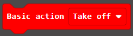
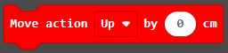
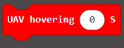

# Add Package for micro:bit Drone:bit

## 添加扩展

如果想使用micro:bit Drone:bit的扩展积木块，则需要添加新的扩展包。

通过以下步骤添加扩展积木块。
---
在MakeCode的代码抽屉中点击“高级”，查看更多代码选项。

为了Drone:bit编程，我们需要添加一个扩展库。在代码抽屉底部找到“扩展”，并点击它。这时会弹出一个对话框，搜索”https://github.com/elecfreaks/pxt-Dronebit“，然后点击下载这个代码库。

*注意：*如果你得到一个提示说一些代码库因为不兼容的原因将被删除，你可以根据提示继续操作，或者在项目菜单栏里面新建一个项目。

## 程序积木块

- - - - -
此积木块可以切换无人机为主控模式或者遥控模式。

- - - - -
使用此积木块可以控制无人机的动力。

- - - - -
使用此积木块可以控制无人机起飞或者降落。

注意：起飞后默认离地高度为1.2m。
- - - - -
使用此积木块可以控制无人机向上、向下、向前、向后、向左、向右移动。

- - - - -
使用此积木块可以控制无人机向左、向右旋转。

- - - - -
使用此积木块可以控制无人机在空中悬停指定时间。

注意：当无人机启动之后，请勿使用`基础`中的`暂停`积木块，这样会使无人机的程序出现BUG，如果在无人机运行的过程中需要停止运动，请使用`悬停`积木块。
- - - - -
使用此积木块可以获取无人机当前的电池电压值或者当前高度。

- - - - -
使用`紧急指令`积木块会使无人机立即停止所用动作，如果当前无人机正在飞行，则会直接摔落。

## 常见问题
---
注意：使用无人机时需要比较复杂的地面环境，方便无人机进行定位。如果是纯色地面，无人机会出现定位不准确的情况。
