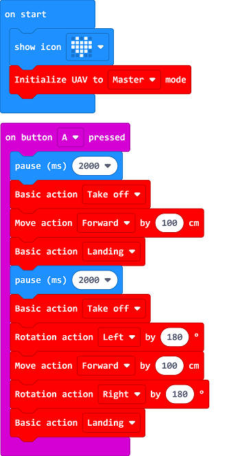

# 定点往返

##  简介
---
 
- 通过编程使micro:bit Drone:bit飞行到前方的指定地点，然后再返回出发点。

## 购买链接
---
- 1 x [Drone:bit]()

## 产品图片
---

## 软件编程
---
在MakeCode的代码抽屉中点击“高级”，查看更多代码选项。

为了Drone:bit编程，我们需要添加一个扩展库。在代码抽屉底部找到“扩展”，并点击它。这时会弹出一个对话框，搜索”https://github.com/elecfreaks/pxt-Dronebit“，然后点击下载这个代码库。

*注意：*如果你得到一个提示说一些代码库因为不兼容的原因将被删除，你可以根据提示继续操作，或者在项目菜单栏里面新建一个项目。

## 程序
---

*注意：*如图，可以在按键A被按下（触发起飞信号）和飞机起飞指令中间加入一定时间的延迟，保证人员有足够的时间拉开距离，防止被无人机的螺旋桨刮伤。

请参考程序连接：[https://makecode.microbit.org/_7zU0qEMPVcqT](https://makecode.microbit.org/_7zU0qEMPVcqT)

<iframe style="position:absolute;top:0;left:0;width:100%;height:100%;" src="https://makecode.microbit.org/---codeembed#pub:_7zU0qEMPVcqT" allowfullscreen="allowfullscreen" frameborder="0" sandbox="allow-scripts allow-same-origin"></iframe>

## 结果
---
- micro:bit Drone:bit起飞后，向前飞行100cm、然后降落，完成降落动作后重新起飞，先向左调转机头朝向180度，向前飞行100cm，再向右调转机头朝向180度，最后降落。

