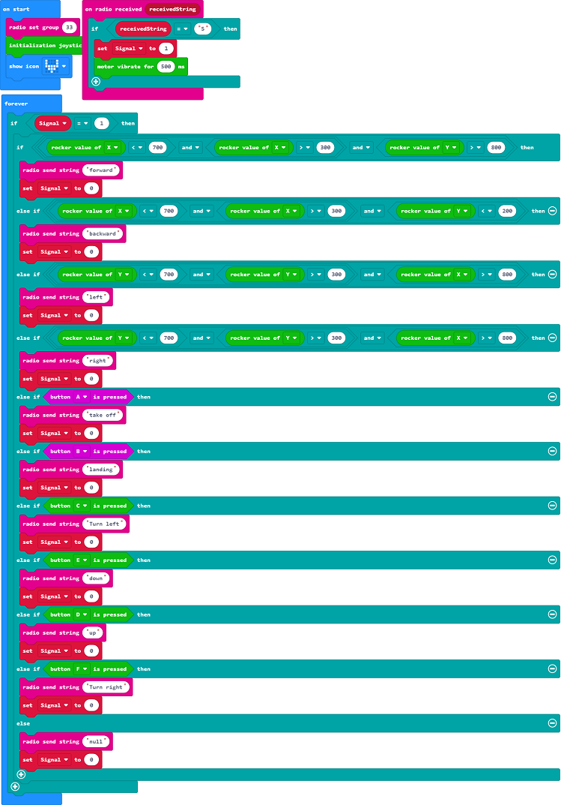

# 手柄遥控

##  简介
---
 
- 使用Joystick:bit V2控制无人机飞行。

## 购买链接
---
- 1 x [Drone:bit]()
- 1 x [Joystick:bit V2](https://www.elecfreaks.com/joystick-bit-2-kit-for-micro-bit.html)

## 产品图片
---

## 软件编程
---
在MakeCode的代码抽屉中点击“高级”，查看更多代码选项。

为了Drone:bit编程，我们需要添加一个扩展库。在代码抽屉底部找到“扩展”，并点击它。这时会弹出一个对话框，搜索”https://github.com/elecfreaks/pxt-Dronebit“，然后点击下载这个代码库。

*注意：*如果你得到一个提示说一些代码库因为不兼容的原因将被删除，你可以根据提示继续操作，或者在项目菜单栏里面新建一个项目。

## 程序
---
### 遥控端：

请参考程序连接：[https://makecode.microbit.org/_9WA7g9Rm5cyu](https://makecode.microbit.org/_9WA7g9Rm5cyu)

<iframe style="position:absolute;top:0;left:0;width:100%;height:100%;" src="https://makecode.microbit.org/---codeembed#pub:_9WA7g9Rm5cyu" allowfullscreen="allowfullscreen" frameborder="0" sandbox="allow-scripts allow-same-origin"></iframe>

### 无人机端：

请参考程序连接：[https://makecode.microbit.org/_05Hc6fTUcRTr](https://makecode.microbit.org/_05Hc6fTUcRTr)

<iframe style="position:absolute;top:0;left:0;width:100%;height:100%;" src="https://makecode.microbit.org/---codeembed#pub:_05Hc6fTUcRTr" allowfullscreen="allowfullscreen" frameborder="0" sandbox="allow-scripts allow-same-origin"></iframe>

## 结果
---
- 先打开手柄遥控电源，再打开无人机电源，等手柄震动后，即可发送指令。
- 每次发送完一个指令之后，等待手柄震动即可发送下一个指令，否则指令无效。
- 可以通过摇杆控制无人机前后左右运动。
- 按下按键A使无人机起飞，按下按键B使无人机降落。
- 按下按键C控制无人机左转90度，按下按键F控制无人机右转90度。
- 按下按键D控制无人机升高，按下按键E控制无人机降低高度。

