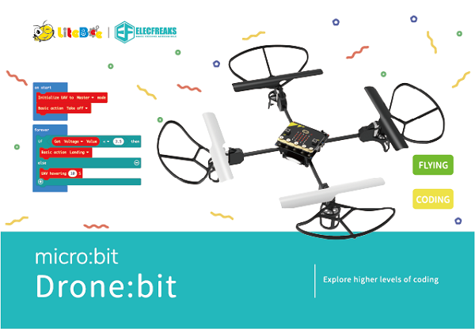
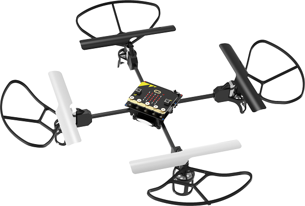
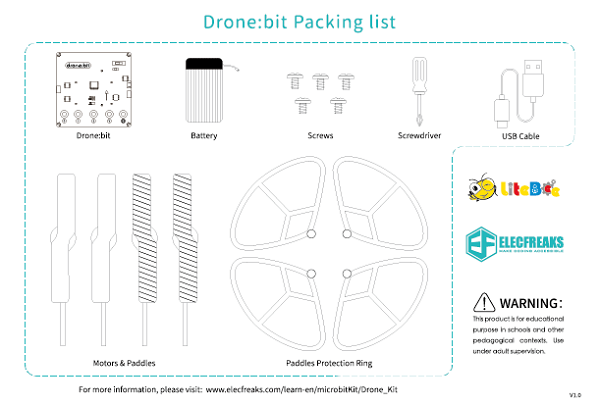
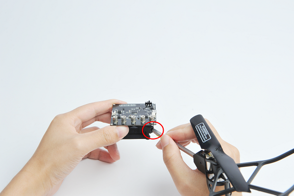
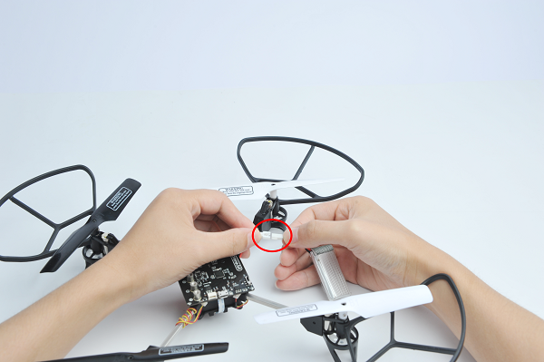

# Drone:bit简介

## 简介
---
 
- micro:bit Drone:bit STEAM学习套装将全球最火的少儿编程开源硬件micro:bit 与无人机结合在一起，为青少年工程师们提供搭建、编程、飞行和空中探索的强大功能。在你的帮助下，它可以在教室内实现定高悬停、定点飞行、曲线飞行、翻滚等一系列飞行动作，成为你的第一款专业级无人机！
- Drone:bit，带你探索新高度！

## 产品图片
---

## Drone:bit的突破
---
- 光流定位，TOF定高
    它是一款具备室内定点悬停功能的专业级无人机，内置高精度光流传感器与TOF传感器，帮助你实现更加精准的定位与悬停。

- DIY乐趣
    自己动手装配，享受DIY的乐趣。

- 用编程实现无限创作
    简单易用的图形化编程和Python编程，实现复杂的飞行路径、飞行姿态、翻滚等设计，更多创作等你探索。

- 安全飞行
    封闭保护罩设计为你使用专业级无人机保驾护航。

## 技术参数
---

|Item|micro:bit drone:bit kit |
|:-:|:-:|
|Rated Voltage|3.7V |
|Battery Capacity|800mAh|
|Charging Voltage|5V|
|Charging Current|0.8A|
|Power Protection|Over Charge/Discharge Protection|
|Propeller Guards|Support|
|LED|5 PCS (one for power indicator, four for status indicator)|
|Waypoints|Optical Flow|
|Fixing Altitude|Barometer + TOF|
|micro:bit Programming|Support|
|2.4G Remote Control Mode|Support|
|Flying Time|6min|

##  购买链接
---

- 1 x [Drone:bit]()

##  产品清单
---

## 安装说明
---
安装前应该注意四个螺旋桨的方向与位置

将机臂插入对应的接口

连接对应的电机接口

连接电源线。

将电池塞入电池仓。

安装micro:bit

##  自检提示
---
当开启电源时，Drone:bit会进入自检模式，首先两颗蓝色的LED灯会闪烁，然后两颗红色LED灯闪烁，最后根据自检情况来亮灯。

- 四颗灯轮流闪烁：没有连上micro:bit或者没连上遥控
- 四颗灯常亮：连上正常工作
- 前后两颗灯快速闪烁：低电
- 只闪红灯：自检不通过

## 常见问题
---
注意：使用无人机时需要比较复杂的地面环境，方便无人机进行定位。如果是纯色地面，无人机会出现定位不准确的情况。

## 相关阅读  
---

