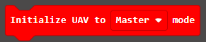
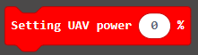

# Add Extensions for micro:bit Drone:bit Kit

## Add extensions

The micro:bit Drone:bit extension requires to be added for operation. 

Steps
---
Click "Advanced" in the MakeCode drawer to see more choices. 

For programming, we need to add a package: click “Extensions” at the bottom of the MakeCode drawer and search with “https://github.com/elecfreaks/pxt-Dronebit” in the dialogue box to download it.

Notice: If you met a tip indicating that some codebases would be deleted due to incompatibility, you may continue as the tips say or create a new project in the menu.

## Blocks

- - - - -
Switch the drone in Master mode or Remote controlling mode via this block. 

- - - - -
The power setting block. 

- - - - -
To give commands of taking off or landing via this block. 

Notice: The default altitude after taking off is 1.2m(From drones to the groud).
- - - - -
To control the actions of up, forward, backward, turning left and right via this block. 

- - - - -
To give commands of rotating to the left and right. 

- - - - -
To give the commands of hovering for a given time. 

Notice: After powering, please do not use the "pause" block in the "basic" blocks, which would lead to a problem in the program if you insist to use. If you need to stop the moving of the drones, please use the "hovering"  block. 
- - - - -
This block tells the voltage value of the current batteries and the altitude. 

- - - - -
This block gives commands of stoping the drone immediately from all the tasks, if the drone is flying, it would fall to the ground directly after giving this command. 

## FAQ
---
Notice: For better locating of the drones, a complicated groud is prefered. If the groud is in single color, the drones might not locate them well. 
