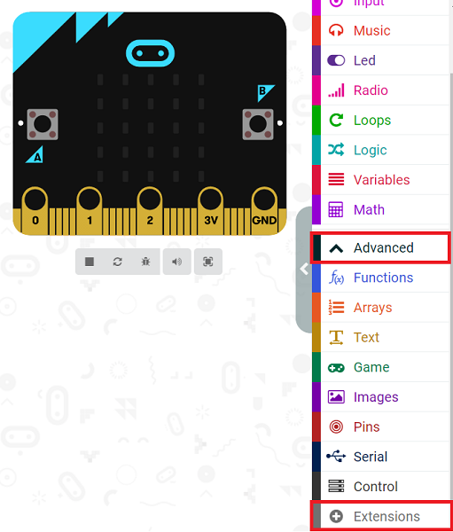
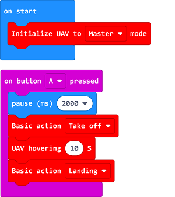

# Case 01: Hovering at A Defined Altitude

##  Introduction 
---

- Program to make the micro:bit Drone:bit Kit take off and hover for 10 seconds, then it lands to the ground. 

## Products Link
---
- 1 x [Drone:bit]()

## Picture
---

## Software Programming
---
Click "Advanced" in the MakeCode drawer to see more choices. 

For programming, we need to add a package: click “Extensions” at the bottom of the MakeCode drawer and search with “https://github.com/elecfreaks/pxt-Dronebit” in the dialogue box to download it.

Notice: If you met a tip indicating that some codebases would be deleted due to incompatibility, you may continue as the tips say or create a new project in the menu.

## Program
---

Notice: It is suggested to pause for 2 seconds or longer after triggering the take-off command to make sure the operator run away from the drones in case of any hurting accidents.  

Link: [https://makecode.microbit.org/_cu82jPKtwa2E](https://makecode.microbit.org/_cu82jPKtwa2E)

You can also download it directly: 

<iframe style="position:absolute;top:0;left:0;width:100%;height:100%;" src="https://makecode.microbit.org/#pub:_cu82jPKtwa2E]" frameborder="0" sandbox="allow-popups allow-forms allow-scripts allow-same-origin"></iframe>
  

## Result
---
- The micro:bit Drone:bit Kit takes off and hovers for 10 seconds, then it lands to the ground. 

## FAQ
---
Notice: For better locating of the drones, a complicated groud is prefered. If the groud is in single color, the drones might not locate them well. 

