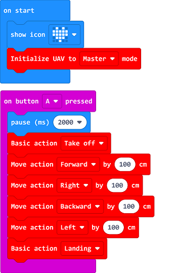

# Case 02: Fly Foursquare

##  Introduction 
---

- Program to take off the drone and fly foursquare, then it lands on the ground. 

## Products Link
---
- 1 x [Drone:bit]()

## Picture
---

## Software Programming

---

Click "Advanced" in the MakeCode drawer to see more choices. 

For programming, we need to add a package: click “Extensions” at the bottom of the MakeCode drawer and search with “https://github.com/elecfreaks/pxt-Dronebit” in the dialogue box to download it.

Notice: If you met a tip indicating that some codebases would be deleted due to incompatibility, you may continue as the tips say or create a new project in the menu.

## Program

---

Notice: It is suggested to pause for 2 seconds or longer after triggering the take-off command to make sure the operator run away from the drones in case of any hurting accidents.  

Link: [https://makecode.microbit.org/_fdy88DiaVX9X](https://makecode.microbit.org/_fdy88DiaVX9X)

<iframe style="position:absolute;top:0;left:0;width:100%;height:100%;" src="https://makecode.microbit.org/---codeembed#pub:_fdy88DiaVX9X" allowfullscreen="allowfullscreen" frameborder="0" sandbox="allow-scripts allow-same-origin"></iframe>

## Result
---
- After taking off, the drone flys forward for 100cm, then flys to the right for 100cm, and backward for another 100cm, then to left for 100cm and finally lands on the groud.

