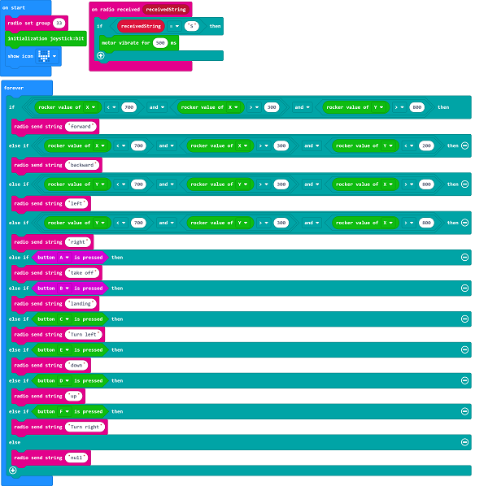
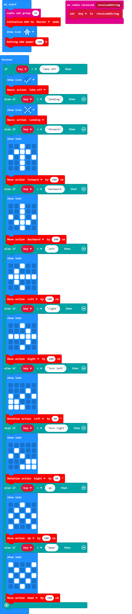

# Case 04: Remote Control with Joystick:bit V2

##  Introduction
---

- Control the drones with the Joystick:bit V2. 

## Products Link
---
- 1 x [Drone:bit]()
- 1 x [Joystick:bit V2](https://www.elecfreaks.com/joystick-bit-2-kit-for-micro-bit.html)

## Picture
---

## Software Programming

---

Click "Advanced" in the MakeCode drawer to see more choices. 

For programming, we need to add a package: click “Extensions” at the bottom of the MakeCode drawer and search with “https://github.com/elecfreaks/pxt-Dronebit” in the dialogue box to download it.

Notice: If you met a tip indicating that some codebases would be deleted due to incompatibility, you may continue as the tips say or create a new project in the menu.

## Program

---
### The Remote Control Part:

Link: [https://makecode.microbit.org/_9WA7g9Rm5cyu](https://makecode.microbit.org/_9WA7g9Rm5cyu)

You can also download it directly: 

<iframe style="position:absolute;top:0;left:0;width:100%;height:100%;" src="https://makecode.microbit.org/#pub:_9WA7g9Rm5cyu]" frameborder="0" sandbox="allow-popups allow-forms allow-scripts allow-same-origin"></iframe>
  

### The Drones Part:

Link: [https://makecode.microbit.org/_05Hc6fTUcRTr](https://makecode.microbit.org/_05Hc6fTUcRTr)

You can also download it directly: 

<iframe style="position:absolute;top:0;left:0;width:100%;height:100%;" src="https://makecode.microbit.org/#pub:_05Hc6fTUcRTr]" frameborder="0" sandbox="allow-popups allow-forms allow-scripts allow-same-origin"></iframe>
  

## Result
---
- Turn on the Joystick:bit V2 and the drone, you can send commands via Joystick:bit V2 after its vibration. 
- Each command is only working after the Joystick:bit V2 gets vibrated.
- The flying directions could be controlled by the stick. 
- Press button to fly the drone and button B to give landing command. 
- Press button C to make the drone rotate left in 90 degrees and button F to rotate right in 90 degrees. 
- Press button D to add the altitude and E to lower it. 

