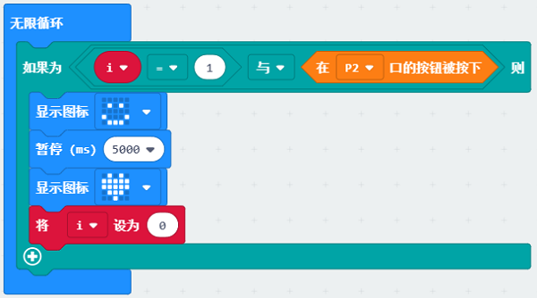
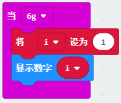

# Case 03: Coping with Stress

## Purpose
---

- To create a magic wand to show a smile face.

## Materials 
---

##  Products Link
---

[Magic Wand Kit](https://shop.elecfreaks.com/products/elecfreaks-micro-bit-magic-wand-kit-without-micro-bit-board?_pos=1&_sid=809c6b940&_ss=r)

## Background
---
Xiao En sends out the flying saucer and gets together with his partners, they feel depressed for their first war with the insects enemy. Xiao En finds out a way to rebuild their confidence and face the problems positively.

## Software

---

[SoftwareMakeCode](https://makecode.microbit.org/#)

## Programming

---

### Step 1

 Click "Advanced" in the MakeCode drawer to see more choices.

We need to add a package for programming, . Click "Extensions" in the bottom of the drawer and search with "magicwand" in the dialogue box to download it. (Kindly note this package is still in the verifying process and pls search with "https://github.com/elecfreaks/pxt-magicwand " before it's ready)

***Note:*** If you met a tip indicating that the codebase will be deleted due to incompatibility, you may continue as the tips say or build a new project in the menu. 

### Step 2

Choose the variables in the MakeCode drawer and write the letter "i" in the dialogue box to confirm it.

### Step 3
Drag the variable brick and set it as 0 into the on start brick.

### Step 4

Drag the if...else... brick into the forever brick to judge the value of the variable and the status of the button connecting to P2. While "1"=1 and the button connecting to P2 is pressed, it shows a smile face, then set to pause for 500ms and show an icon, at last set the variable as 0. 

### Step 5

Drag the while vibrating brick and set it as 6g, choose the show number brick to show the variable "i" and set it to 1. 

### Link: 

Link: [https://makecode.microbit.org/_hJwf5WgpT3JH](https://makecode.microbit.org/_hJwf5WgpT3JH)

You can also download it directly below:

<iframe style="position:absolute;top:0;left:0;width:100%;height:100%;" src="https://makecode.microbit.org/#pub:_hJwf5WgpT3JH]" frameborder="0" sandbox="allow-popups allow-forms allow-scripts allow-same-origin"></iframe>
  

### Result
---
- While shaking the magic wand, it suggests the consuming status of the magic power, then press the button to show a smile face.
## Exploration

---

## FAQ

---

## Relevant File   

---
