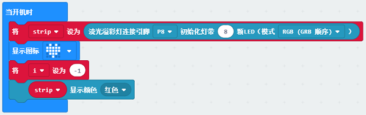
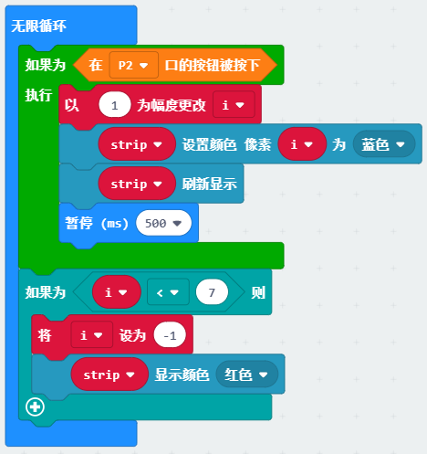

# Case 04：Recharge the Magic Wand

## Purpose
---

- To create a magic wand that can be rechargeable with the magic power.

## Materials 

---

##  Products Link
---

[Magic Wand Kit](https://shop.elecfreaks.com/products/elecfreaks-micro-bit-magic-wand-kit-without-micro-bit-board?_pos=1&_sid=809c6b940&_ss=r)

## Background

---
Xiao En has successfully cheered his team up, but the long battle with the insects and the calling-together of his partners have used up the power of the magic wand, now his wand lights on with a red light. They realize that they have forgotten to recharge the magic wand, thus, they decide to recharge the magic wand.

## Software

---

[SoftwareMakeCode](https://makecode.microbit.org/#)

## Programming

---

### Step 1

 Click "Advanced" in the MakeCode drawer to see more choices.

We need to add a package for programming, . Click "Extensions" in the bottom of the drawer and search with "magicwand" in the dialogue box to download it. (Kindly note this package is still in the verifying process and pls search with "https://github.com/elecfreaks/pxt-magicwand " before it's ready)

***Note:*** If you met a tip indicating that the codebase will be deleted due to incompatibility, you may continue as the tips say or build a new project in the menu. 

### Step 2

Choose the variables in the MakeCode drawer and write the letter "i" in the dialogue box to confirm it.

### Step 3
Initialize the RainbowLED strips to connect to P8 with 8 beads and set the variable to -1 in the on start brick.

### Step 4

Drag the if...else... brick into the forever brick to judge the status of the button connecting to P2, while the button being pressed, it circulates to execute the command: “i" = "i" +1, and set the pixel "i" as blue, refresh to show the strip and pause for 500ms; while the button not being pressed, judge if  “i"< 7 and set it as -1, then set the strip of the color as red. 

### Link

Link: [https://makecode.microbit.org/_0HMCE93zmJc8](https://makecode.microbit.org/_0HMCE93zmJc8)

You can also download it directly: 

<iframe style="position:absolute;top:0;left:0;width:100%;height:100%;" src="https://makecode.microbit.org/#pub:_0HMCE93zmJc8]" frameborder="0" sandbox="allow-popups allow-forms allow-scripts allow-same-origin"></iframe>
  

### Result
---
- After powering on the strip lights up in red, while pressing the button, it starts recharging power and the strip lights on one by one in blue. If you stop pressing the button before all of the beads on the strip turn to blue, it means you fail to recharge it.

## Exploration

---

## FAQ

---

## Relevant File   

---
