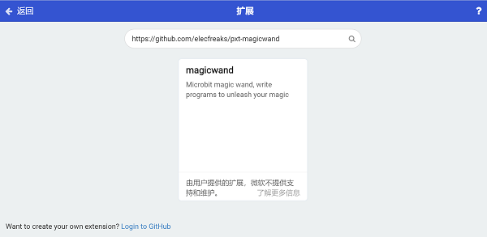
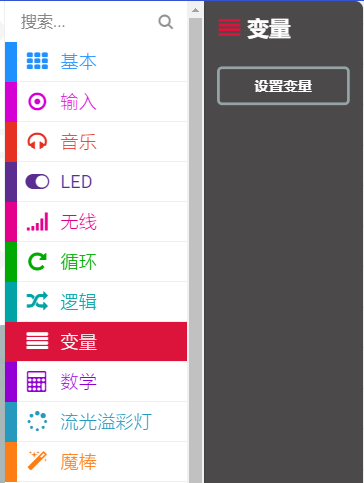
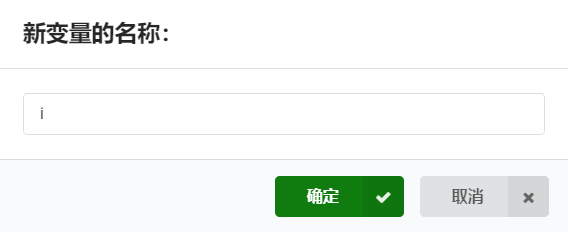
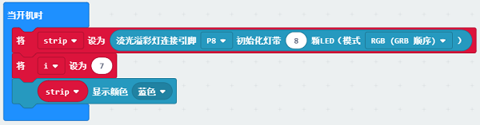
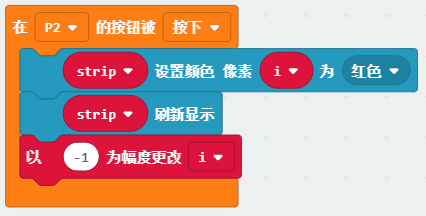

# Case 05: Magic Power Indicator

## Purpose

---

- To create a magic wand that can indicate the level of the magic power. 

## Materials 

---

##  Products Link
---

[Magic Wand Kit](https://www.elecfreaks.com/micro-bit-magic-wand-without-micro-bit.html)

## Background

---
After recharging the magic wand, this is the only equipment left in his team. Xiao En decides to make a power indicator to save the energy as much as he can. 

## Software

---

[SoftwareMakeCode](https://makecode.microbit.org/#)

## Programming

---

### Step 1

 Click "Advanced" in the MakeCode drawer to see more choices.

We need to add a package for programming, . Click "Extensions" in the bottom of the drawer and search with "magicwand" in the dialogue box to download it. (Kindly note this package is still in the verifying process and pls search with "https://github.com/elecfreaks/pxt-magicwand " before it's ready)

***Note:*** If you met a tip indicating that the codebase will be deleted due to incompatibility, you may continue as the tips say or build a new project in the menu. 

### Step 2

Choose the variables in the MakeCode drawer and write the letter "i" in the dialogue box to confirm it.

### Step 3
Initialize the RainbowLED strips to connect to P8 with 8 beads and set the variable to 7 and the strip in bule in the on start brick.

### Step 4

While button in P2 being pressed, programme to set the pixel "i" in red, refresh the strip and set "i"="i"-1.

### Link

Link: [https://makecode.microbit.org/_RyDVcfWyiFYU](https://makecode.microbit.org/_RyDVcfWyiFYU)

You can also download it directly: 

<iframe style="position:absolute;top:0;left:0;width:100%;height:100%;" src="https://makecode.microbit.org/#pub:_RyDVcfWyiFYU]" frameborder="0" sandbox="allow-popups allow-forms allow-scripts allow-same-origin"></iframe>
  

### Result
---
- After powering on, the strip light on in blue, while pressing the button, the last LED in blue turns to red. 

## Exploration

---

## FAQ

---

## Relevant File   

---
