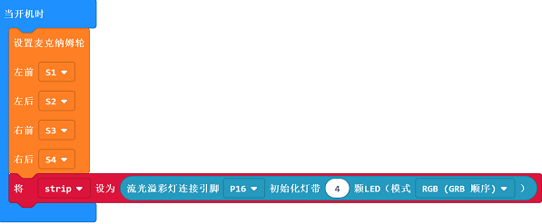
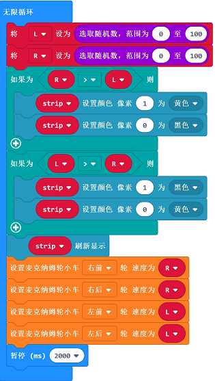

# Case 04: Turn Signals

## Purpose
---

- Programme to make Wonder Rugged Kit indicate the turning direction through turn signals. 

## Materials

------

- micro:bit Wonder Rugged Kit

## Background Knowledge

------

## Software

------

[MicroSoft makecode](https://makecode.microbit.org/#)

## Program

------

### Step 1

Click "Advanced" in the drawer of MakeCode to see more choices. 

For programming, we need to add a package. Click "Extensions" at the bottom of the drawer and then search "Wukong" in the dialogue box to download it. 

***Note:*** If you get a warning indicating some packages will be removed because of incompatibility issues, you can follow the prompts or create a new project in the menu.

### Step 2

Click `Wukong` to choose `mecanum ` block.

### Step 3

Drag `mecanum` into `on start`  block and set the connection for servos accordingly, then initialize the LEDs.

### Step 4

Set the variable `L` and `R` to a random number between 0~100 and judge their numerical value. If the value of R is more than that of the L, set LED as 0 in black and 1 in yellow; or set LED as 1 in black and 0 in yellow. Then refresh the LED. Next step is to assign the value of  variable `L` to the speed of the front&rear wheels on the left side and the value of variable `R` to the speed of the front&rear wheels on the right side, and pause 2000 ms. 

### Program

Links: [https://makecode.microbit.org/_4ya4KTUXz5zx](https://makecode.microbit.org/_4ya4KTUXz5zx)

You can also download it directly:

<iframe style="position:absolute;top:0;left:0;width:100%;height:100%;" src="https://makecode.microbit.org/#pub:_4ya4KTUXz5zx]" frameborder="0" sandbox="allow-popups allow-forms allow-scripts allow-same-origin"></iframe>
  

### Result

The car changes its direction each 2 seconds at random, the left signals will be on while turning left and right will be on while turning right. 

## Exploration

------

## FAQ

------

## Relevant Files

---
