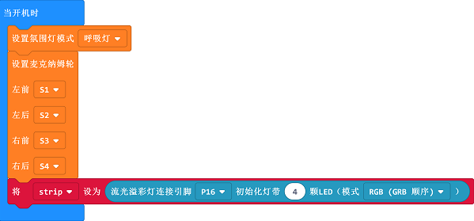

# Case 05: Colorful Car 

## Purpose
---

-  Build a colorful Wonder Rugged Kit with the rainbow LEDs. 

## Products Link

[Wonder Rugged Car Kit](https://shop.elecfreaks.com/products/elecfreaks-micro-bit-wonder-rugged-car-kit-without-micro-bit-board)

## Background Knowledge

------

## Software

------

[MicroSoft makecode](https://makecode.microbit.org/#)

## Program

------

### Step 1

Click "Advanced" in the drawer of MakeCode to see more choices. 

For programming, we need to add a package. Click "Extensions" at the bottom of the drawer and then search "Wukong" in the dialogue box to download it. 

***Note:*** If you get a warning indicating some packages will be removed because of incompatibility issues, you can follow the prompts or create a new project in the menu.

### Step 2

Click `Wukong` to choose `mecanum ` block.

### Step 3

Drag `mecanum` and  `set light mode`  into `on start`  block and set the connection for servos accordingly, set the light mode as breath and initialize the LEDs. 

### Step 4

Set the car to move forward with the variable `i` ascending by 5; set the LEDs to show rainbow with the parameter in `i`.

### Program

Links: [https://makecode.microbit.org/_icqM2MK7WEyM](https://makecode.microbit.org/_icqM2MK7WEyM)

You can also download it directly:

<iframe style="position:absolute;top:0;left:0;width:100%;height:100%;" src="https://makecode.microbit.org/#pub:_icqM2MK7WEyM]" frameborder="0" sandbox="allow-popups allow-forms allow-scripts allow-same-origin"></iframe>
  

### Result

The car moves forward after starting with the light mode in breath and rainbow LEDs changing color. 

## Exploration

------

## FAQ

------

## Relevant Files

---
