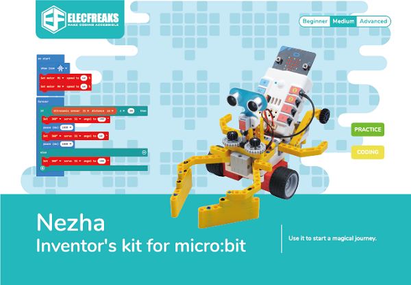

# Nezha Inventor Kit

## Introduction

Based on Planet X sensors, Nezha Inventor Kit is designed for BBC micro:bit. It contains multiple sensors and modules including LED, potentiometer, soil moisture sensor, sonar:bit, crash sensor, line-tracking sensor, etc., and also with over 400 pieces of bricks. We’ve built over 36 cases with this kit aiming to cultivate and inspire kids’ creativity and imagination.  

Make each kid be an inventor from Nezha Inventor Kit!

