# Case 01：The Mechanical Shrimp 

## Introduction
Build a mechanical shrimp with the [Nezha Inventor's Kit](https://shop.elecfreaks.com/products/elecfreaks-micro-bit-nezha-48-in-1-inventors-kit-without-micro-bit-board?_pos=2&_sid=ed1b6fbd2&_ss=r). 

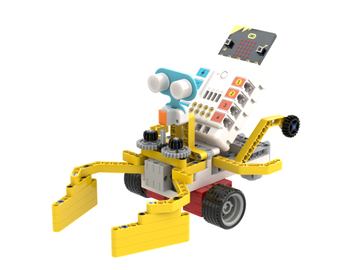

## Quick to Start

### Materials Required

[Nezha Inventor's Kit](https://shop.elecfreaks.com/products/elecfreaks-micro-bit-nezha-48-in-1-inventors-kit-without-micro-bit-board?_pos=2&_sid=ed1b6fbd2&_ss=r)

### Assembly

Components List

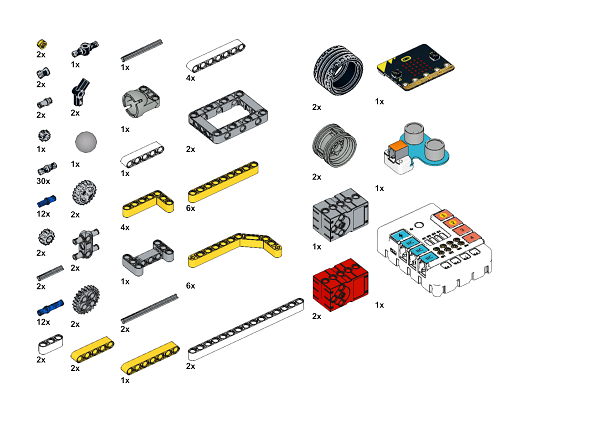

Build it as the assembly steps suggest: 

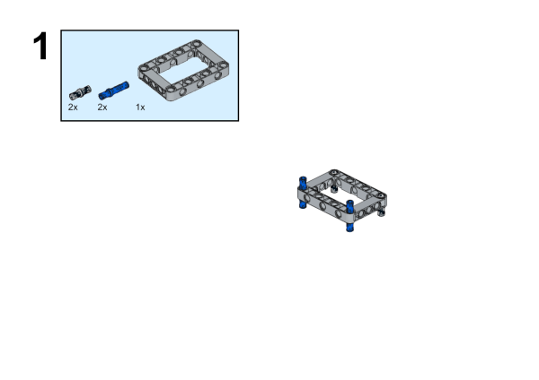

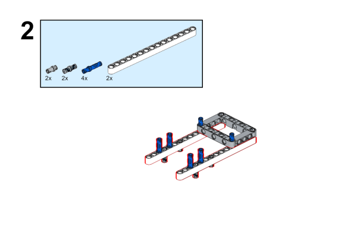

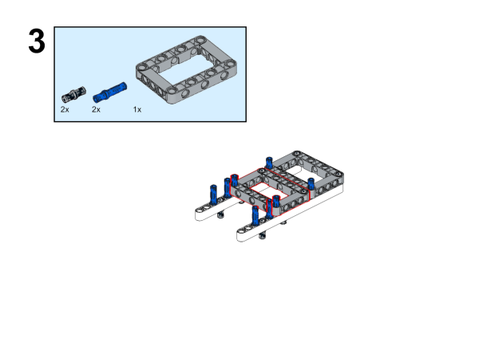

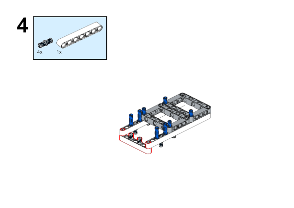

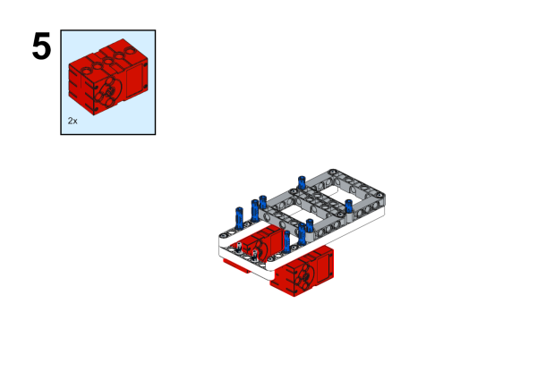

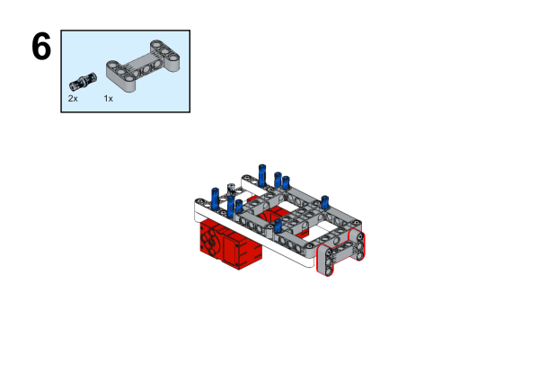

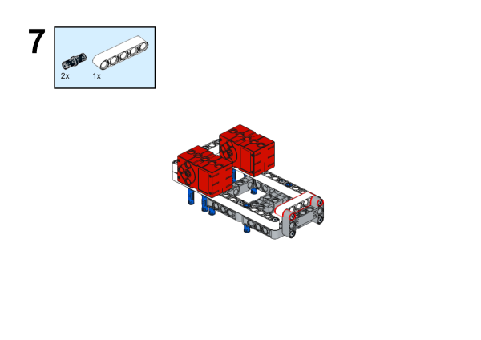

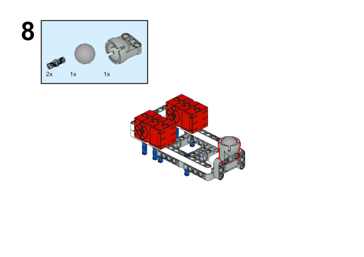

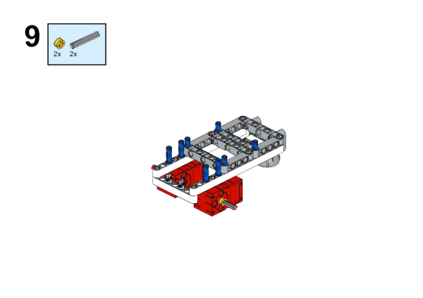

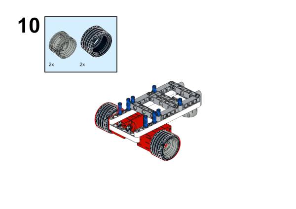

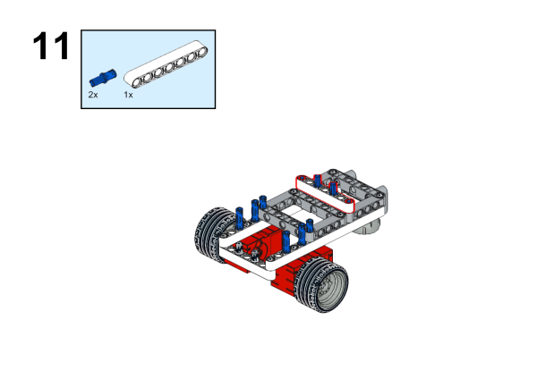

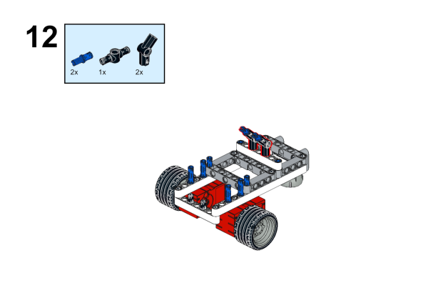

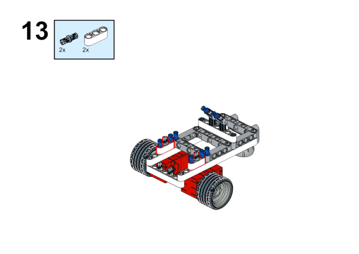

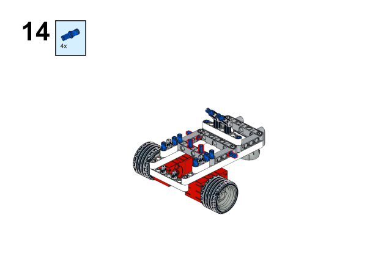

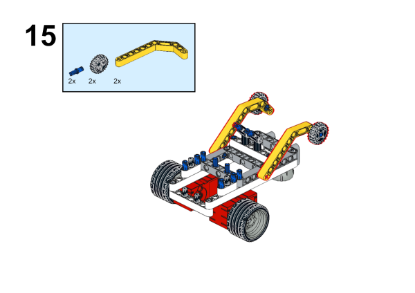

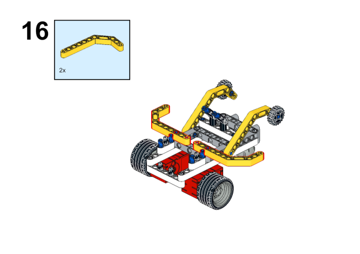

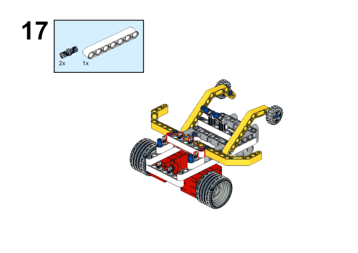

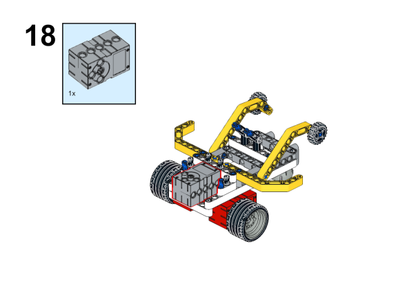

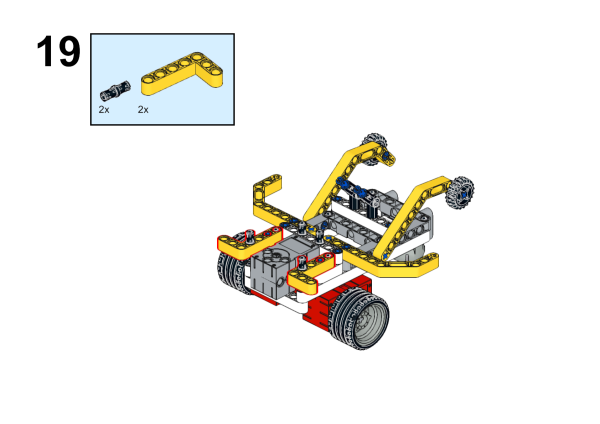

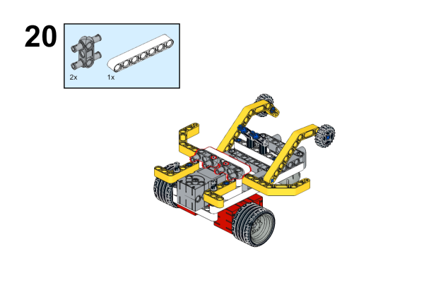

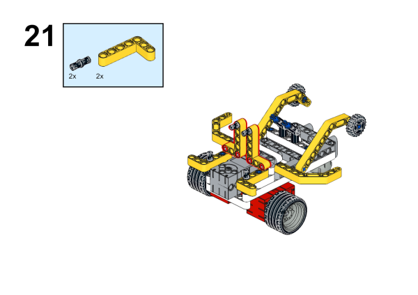

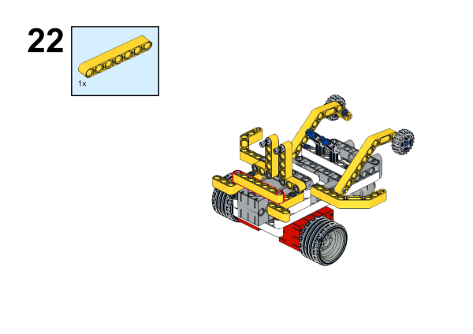

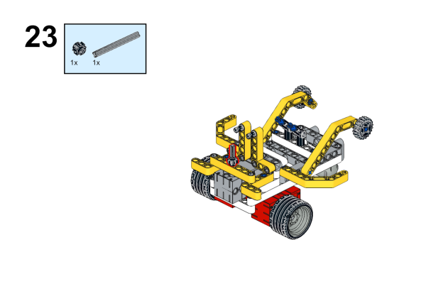

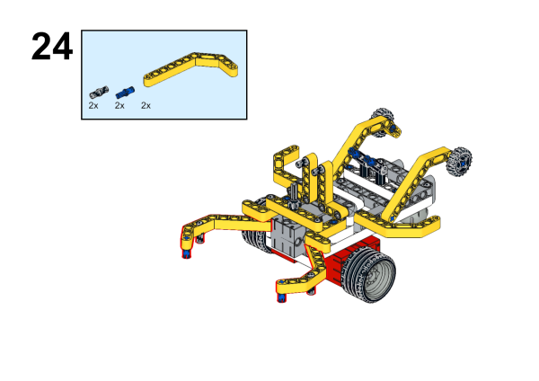

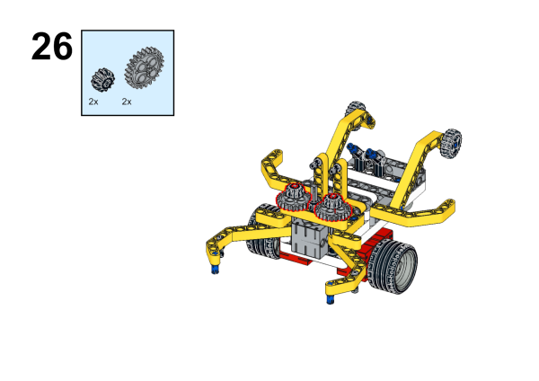

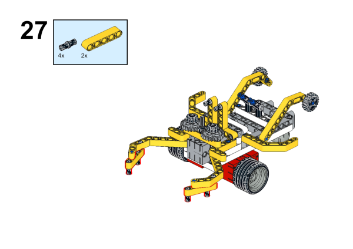

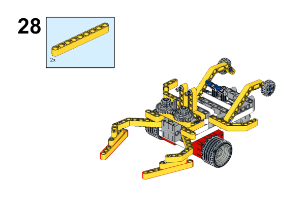

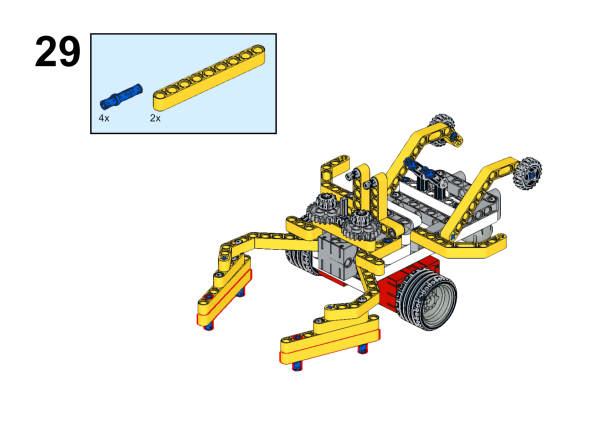

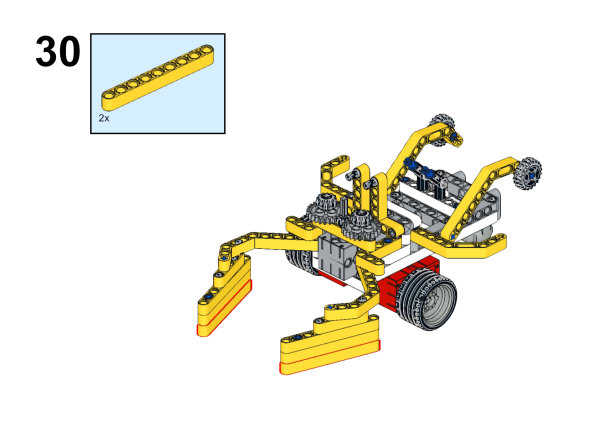

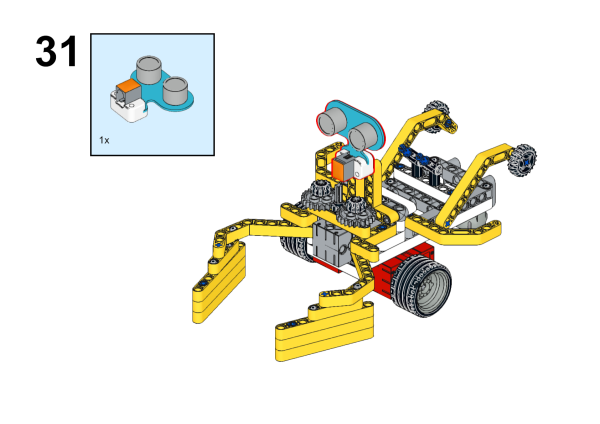

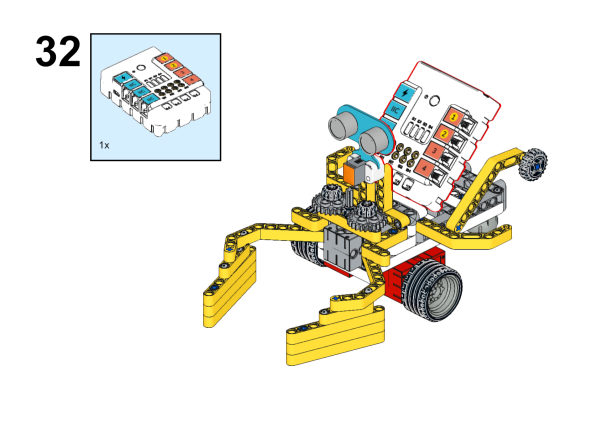

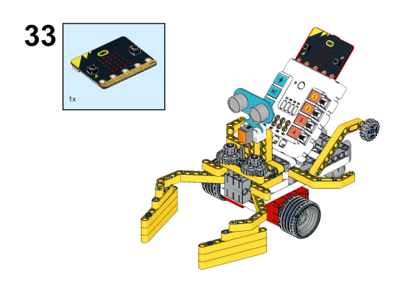

### Connection Diagram

Connect the [Ultrasonic Sensor](https://shop.elecfreaks.com/products/elecfreaks-planetx-ultrasonic-sensor?_pos=1&_sid=d432fa273&_ss=r) to J1, the [geekservo](https://shop.elecfreaks.com/products/elecfreaks-360-degrees-building-blocks-servo?_pos=2&_sid=bb30ff66c&_ss=r) to S1 and the two [motors](https://shop.elecfreaks.com/products/elecfreaks-high-speed-building-blocks-motor?_pos=4&_sid=bfad50d7f&_ss=r) to M1 and M4 on [Nezha Breakout Board](https://shop.elecfreaks.com/products/elecfreaks-nezha-breakout-board?_pos=1&_sid=c41e367c3&_ss=r).

## MakeCode Programming

### Step 1
Click "Advanced" in the MakeCode drawer to see more choices.

For programming the [Ultrasonic Sensor](https://www.elecfreaks.com/planetx-ultrasonic.html), we need to add a package. Search with "PlanetX" in the dialogue box and click to download it. 

For programming [Nezha Breakout Board](https://www.elecfreaks.com/nezha-breakout-board.html), we need to add a package. Search with "Nezha" in the dialogue box and click to download it. 

*Notice*: If you met a tip indicating that some codebases would be deleted due to incompatibility, you may continue as the tips say or create a new project in the menu. 

### Step 2
### Code as the picture suggests

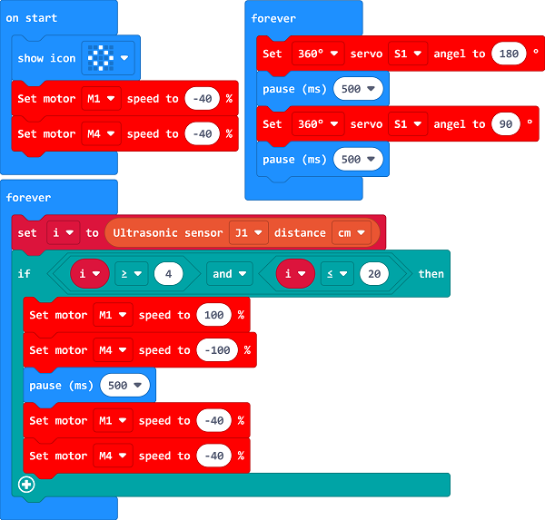

### Reference
Link: [https://makecode.microbit.org/_iscUF8CzzYMd](https://makecode.microbit.org/_iscUF8CzzYMd)

You may also download it directly: 

<iframe style="position:absolute;top:0;left:0;width:100%;height:100%;" src="https://makecode.microbit.org/#pub:_iscUF8CzzYMd" frameborder="0" sandbox="allow-popups allow-forms allow-scripts allow-same-origin"></iframe>
  

### Result

After powering on, the mechanical shrimp moves forward and waves the princers, it will turn the directions if there is obstacles  being detected. 

