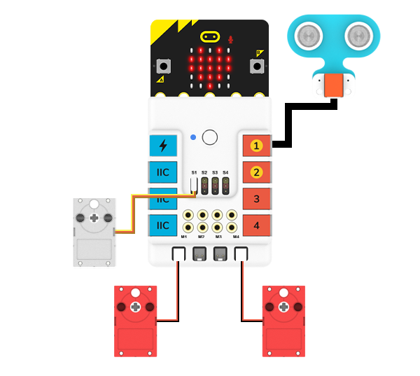

# 机械虾

## 简介
使用[哪吒科学套件](https://www.elecfreaks.com/nezha-inventor-s-kit-for-micro-bit-without-micro-bit-board.html)制作一只机械虾。

## 快速上手

### 所需器材

[哪吒科学套件](https://www.elecfreaks.com/nezha-inventor-s-kit-for-micro-bit-without-micro-bit-board.html)

### 结构搭建

零件清单

如图所示，进行结构搭建：

### 连接示意图

如下图所示，将[超声波传感器](https://www.elecfreaks.com/planetx-ultrasonic.html)连接到[哪吒扩展板](https://www.elecfreaks.com/nezha-breakout-board.html)的J1端口、[舵机](https://www.elecfreaks.com/geekservo-2kg-360-degrees-compatible-with-lego.html)连接到[哪吒扩展板](https://www.elecfreaks.com/nezha-breakout-board.html)的S1端口，两个[电机](https://www.elecfreaks.com/geekservo-motor-2kg-compatible-with-lego.html)分别连接到[哪吒扩展板](https://www.elecfreaks.com/nezha-breakout-board.html)的M1和M4端口。

## makecode编程

### 步骤 1
在MakeCode的代码抽屉中点击“扩展”。

为了对[超声波传感器](https://www.elecfreaks.com/planetx-ultrasonic.html)进行编程，我们需要添加一个扩展库。在对话框中输入”PlanetX“，并点击搜索，点击下载这个代码库。

为了对[哪吒扩展板](https://www.elecfreaks.com/nezha-breakout-board.html)进行编程，我们需要添加一个扩展库。在对话框中输入”Nezha“，并点击搜索，点击下载这个代码库。

*注意：*如果你得到一个提示说一些代码库因为不兼容的原因将被删除，你可以根据提示继续操作，或者在项目菜单栏里面新建一个项目。

### 步骤 2
### 如图所示编写程序

### 参考程序
请参考程序连接：[https://makecode.microbit.org/_iscUF8CzzYMd](https://makecode.microbit.org/_iscUF8CzzYMd)

你也可以通过以下网页直接下载程序，下载完成后即可开始运行程序。

<iframe style="position:absolute;top:0;left:0;width:100%;height:100%;" src="https://makecode.microbit.org/#pub:_iscUF8CzzYMd" frameborder="0" sandbox="allow-popups allow-forms allow-scripts allow-same-origin"></iframe>
  

### 结果

当电源接通后，机械虾向前移动并摆动大鳌，当遇到障碍物时，则自动转向。

