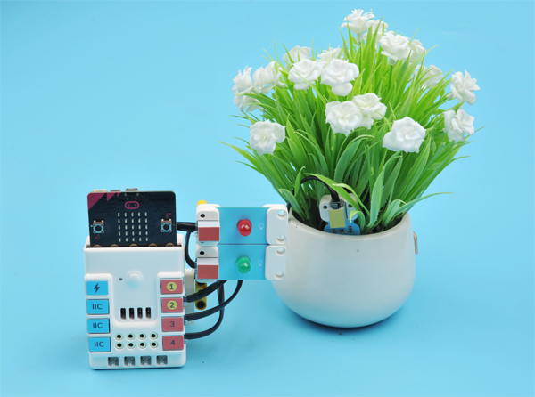
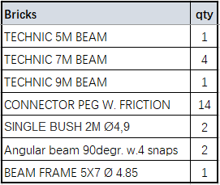
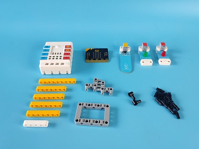
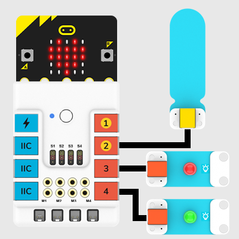
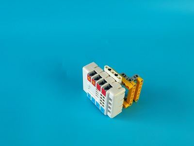
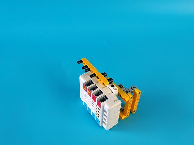
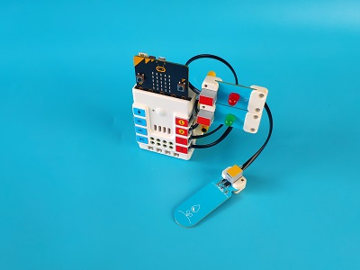
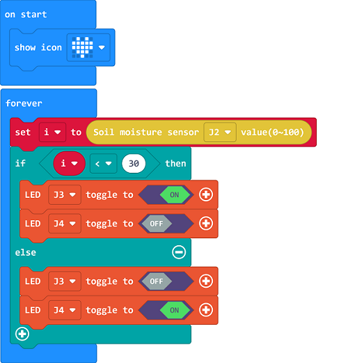

# Case 02: Flower-watering Prompter

## Introduction
To make a flower-watering prompter with a micro:bit. 

## Quick Start
---

### Materials Required 
---
Nezha expansion board × 1

micro:bit × 1

LED-red × 1

LED-green × 1

Soil moisture sensor × 1

RJ11 wires × 3

### Bricks details

### Connection Diagram 
---
- Connect the green LED to J4, red LED to J3 and soil moisture sensor to J2 on the Nezha expansion board as the picture shows.

### Assembly
---

Build a device as the picture shows:

Video reference:[https://youtu.be/YxEKEoDB6FQ](https://youtu.be/YxEKEoDB6FQ)

<iframe width="560" height="315" src="https://www.youtube.com/embed/YxEKEoDB6FQ" frameborder="0" allow="accelerometer; autoplay; clipboard-write; encrypted-media; gyroscope; picture-in-picture" allowfullscreen></iframe>

## MakeCode Programming
---

### Step 1
Click "Advanced" in the MakeCode to see more choices.

For programming, we need to add a package: click "Extensions" at the bottom of the MakeCode drawer and search with "PlanetX" in the dialogue box to download it. 

Notice: If you met a tip indicating that some codebases would be deleted due to incompatibility, you may continue as the tips say or create a new project in the menu. 

### Step 2

### Code as below:

### Reference
Link：[https://makecode.microbit.org/_2FgMYuLiUeE8](https://makecode.microbit.org/_2FgMYuLiUeE8)

You may also download it directly below:

<iframe style="position:absolute;top:0;left:0;width:100%;height:100%;" src="https://makecode.microbit.org/#pub:_2FgMYuLiUeE8" frameborder="0" sandbox="allow-popups allow-forms allow-scripts allow-same-origin"></iframe>
  
---

### Result
- The red LED lights on for reminding of watering if the soil moisture sensors gets a low value from the earth, or the green LED lights on. 

