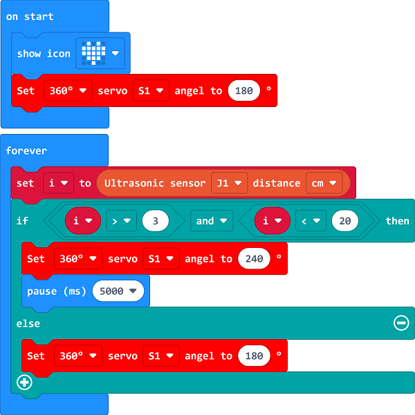

# Case 03: Automatic Gate

## Introduction
To make an automatic gate with the ultrasonic sound sensor controlled by the micro:bit. 

## Quick Start
---

### Materials Required
---
Nezha expansion board × 1

micro:bit × 1

360° servo × 1

Sonar:bit  × 1

RJ11 wire × 1

Bricks × n

### Connection Diagram
---
- Connect the 360° servo to S1 and the ultrasonic sound sensor to J1 on the Nezha expansion board as the picture shows.

### Assembly
---

Build a device as the picture shows:

Video reference: [https://youtu.be/nOh7YCmcotA](https://youtu.be/nOh7YCmcotA)

<iframe width="560" height="315" src="https://www.youtube.com/embed/nOh7YCmcotA" frameborder="0" allow="accelerometer; autoplay; clipboard-write; encrypted-media; gyroscope; picture-in-picture" allowfullscreen></iframe>

## MakeCode Programming
---

### Step 1
Click "Advanced" in the MakeCode to see more choices.

For programming, we need to add a package: click "Extensions" at the bottom of the MakeCode drawer and search with "PlanetX" in the dialogue box to download it. 

For programming, we need to add a package: click "Extensions" at the bottom of the MakeCode drawer and search with "nezha" in the dialogue box to download it. 

Notice: If you met a tip indicating that some codebases would be deleted due to incompatibility, you may continue as the tips say or create a new project in the menu. 

### Step 2

### Code as below:

### Reference
Link：[https://makecode.microbit.org/_VqieaTVyeUXx](https://makecode.microbit.org/_VqieaTVyeUXx)

You may also download it directly below:

<iframe style="position:absolute;top:0;left:0;width:100%;height:100%;" src="https://makecode.microbit.org/#pub:_VqieaTVyeUXx" frameborder="0" sandbox="allow-popups allow-forms allow-scripts allow-same-origin"></iframe>
  
---

### Result
- While the ultrasonic sound sensor detects any object, the gate opens automatically.

