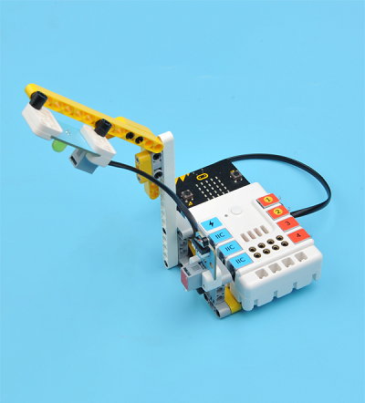
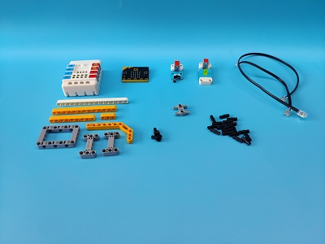
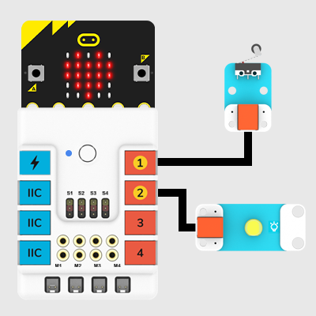
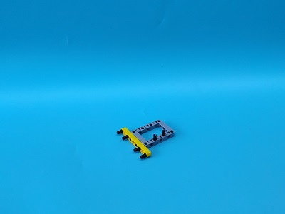
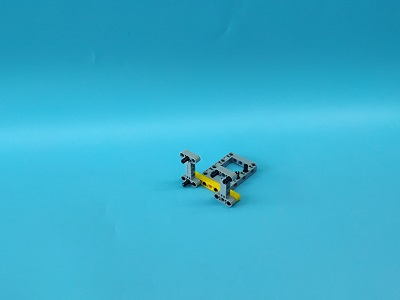
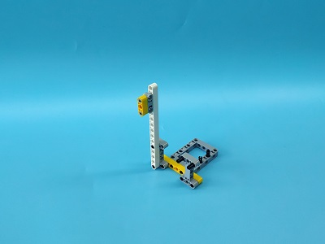
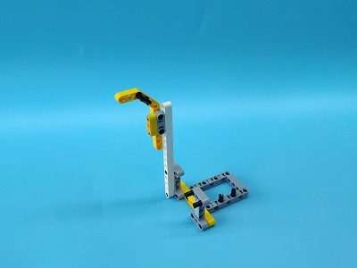
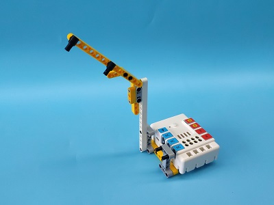
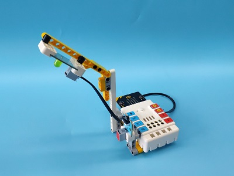
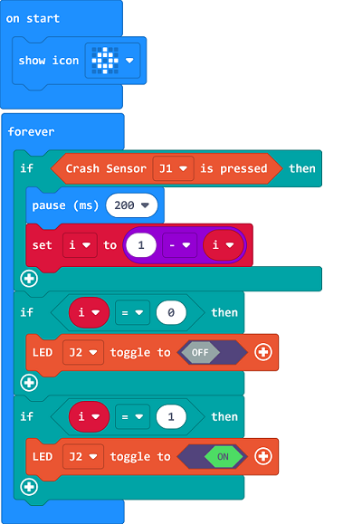

# Case 04: Mini Table Lamps

## Introduction
To make a mini table lamp with a micro:bit. 

## Quick Start
---

### Materials Reuqired
---
Nezha expansion board × 1

micro:bit × 1

LED-yellow × 1

Crash sensor × 1

RJ11 wires × 2

Bricks × n

### Connection Diagram 
---
- Connect the crash sensor to J1 and the yellow LED to J2 on the Nezha expansion board as the picture shows.

### Assembly

---

Build a device as the picture shows:

Video reference:[https://youtu.be/BBP1Nx6t090](https://youtu.be/BBP1Nx6t090)

<iframe width="560" height="315" src="https://www.youtube.com/embed/BBP1Nx6t090" frameborder="0" allow="accelerometer; autoplay; clipboard-write; encrypted-media; gyroscope; picture-in-picture" allowfullscreen></iframe>

## MakeCode Programming
---

### Step 1
Click "Advanced" in the MakeCode to see more choices.

For programming, we need to add a package: click "Extensions" at the bottom of the MakeCode drawer and search with "PlanetX" in the dialogue box to download it. 

Notice: If you met a tip indicating that some codebases would be deleted due to incompatibility, you may continue as the tips say or create a new project in the menu. 

### Step 2

### Code as below:

### Reference
Link：[https://makecode.microbit.org/_J9Lc271kpHiD](https://makecode.microbit.org/_J9Lc271kpHiD)

You may also download it directly below:

<iframe style="position:absolute;top:0;left:0;width:100%;height:100%;" src="https://makecode.microbit.org/#pub:_J9Lc271kpHiD" frameborder="0" sandbox="allow-popups allow-forms allow-scripts allow-same-origin"></iframe>
  
---

### Result
- The crash sensor controlls the on/off of the LED. 

