# Case 06: Temperature-controlled Fan

## Introduction
---
If staying in a room under a high temperature with dry air, our noses and throats are prone to dryness, congestion, pain, and sometimes nosebleeds. Also, people will become irritable, lack of concentration, poor accuracy and coordination, and slower reaction speed under such condition. What’s more, the body temperature regulation mechanism temporarily becomes obstructed, and heat accumulation in the body occurs, leading to heat stroke. Thus, we can make a smart temperature-controlled fan, when the temperature is high, the fan will be automatically turned on for heat dissipation and cooling, and when the temperature is low, the fan will be automatically turned off to save energy.

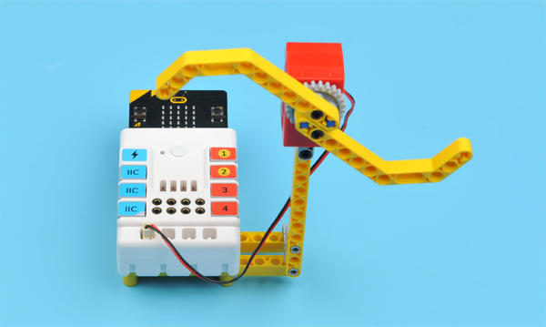

## Quick Start
---

### Materials Required

Nezha expansion board × 1

micro:bit × 1

Motor × 1

### Connection Diagram 

Connect the motor to M1 on the Nezha expansion board as the picture shows.

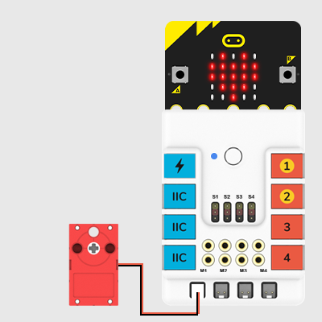

### Assembly Video

Video reference: [https://youtu.be/shI_D7j6M7o](https://youtu.be/shI_D7j6M7o)

<iframe width="560" height="315" src="https://www.youtube.com/embed/shI_D7j6M7o" frameborder="0" allow="accelerometer; autoplay; clipboard-write; encrypted-media; gyroscope; picture-in-picture" allowfullscreen></iframe>

### Assembly Steps

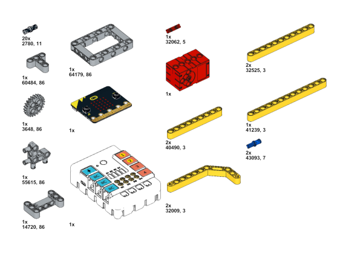

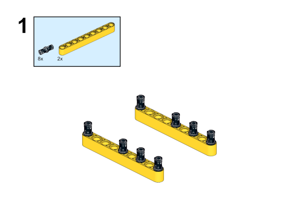

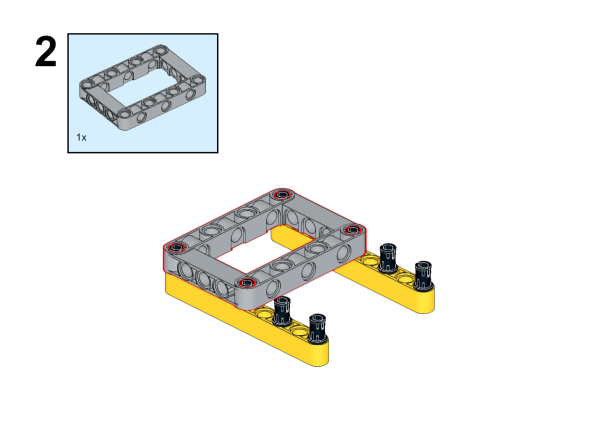

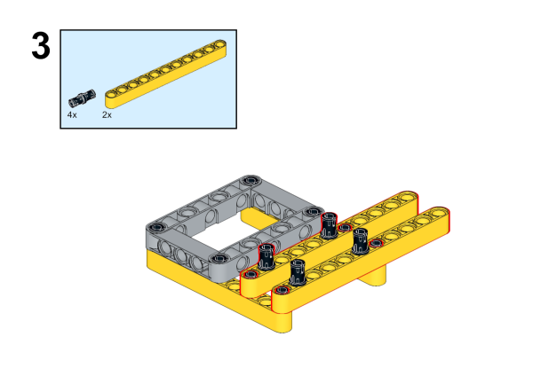

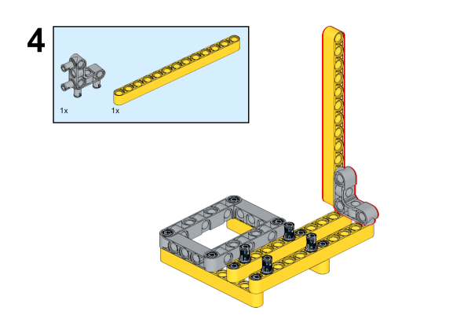

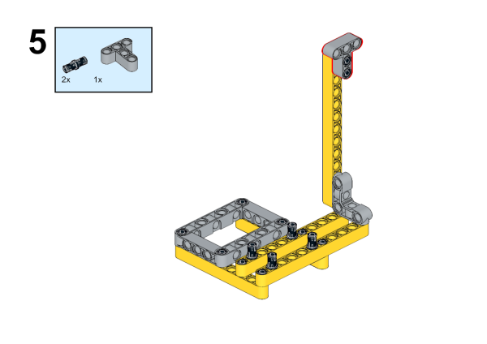

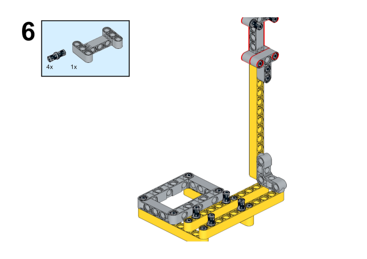

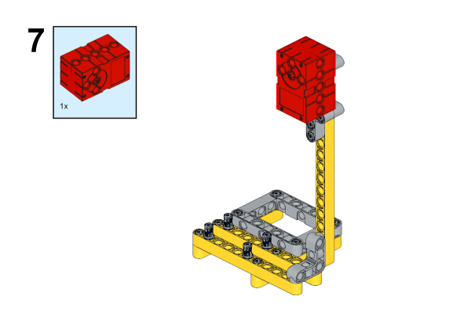

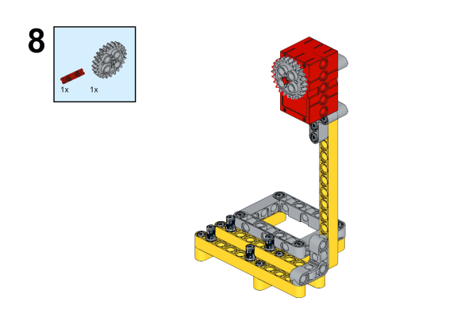

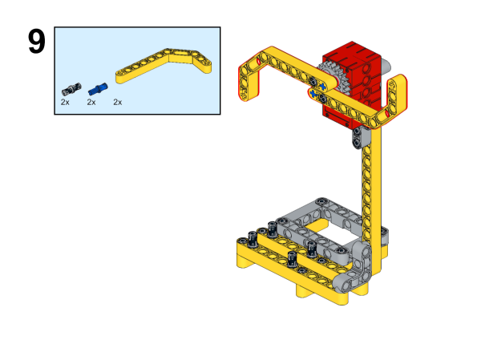

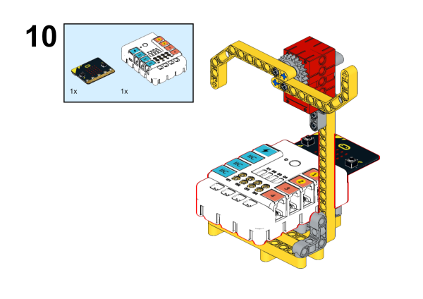

## MakeCode Programming
---

### Step 1

Click "Advanced" in the MakeCode to see more choices.

For programming, we need to add a package: click "Extensions" at the bottom of the MakeCode drawer and search with "nezha" in the dialogue box to download it. 

***Notice:*** If you met a tip indicating that some codebases would be deleted due to incompatibility, you may continue as the tips say or create a new project in the menu. 

### Step 2

### Code as below:

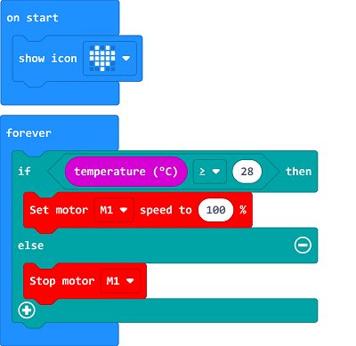

### Reference
Link：[https://makecode.microbit.org/_3gkW8U8Vk55v](https://makecode.microbit.org/_3gkW8U8Vk55v)

You may also download it directly below:

<iframe style="position:absolute;top:0;left:0;width:100%;height:100%;" src="https://makecode.microbit.org/#pub:_3gkW8U8Vk55v" frameborder="0" sandbox="allow-popups allow-forms allow-scripts allow-same-origin"></iframe>
  

### Result
The fan turns on/off automatically according to the temperature. 

