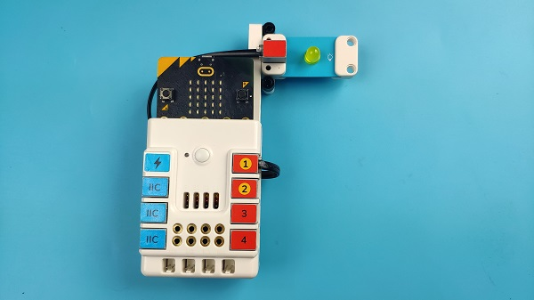
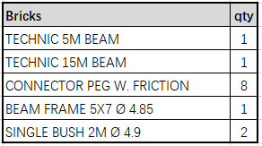
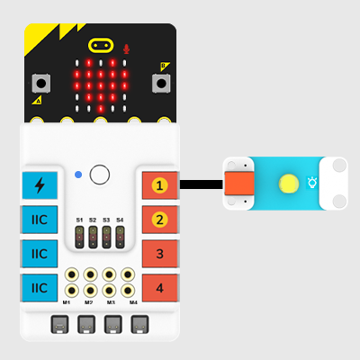
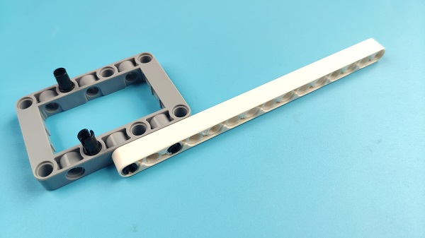
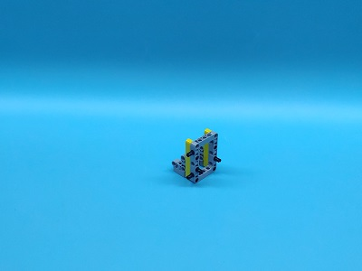
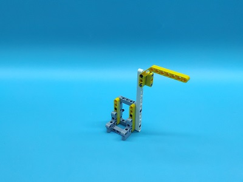
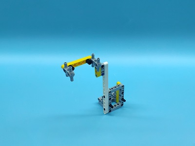
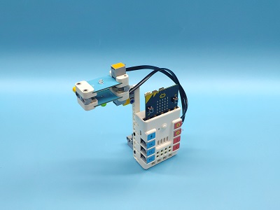
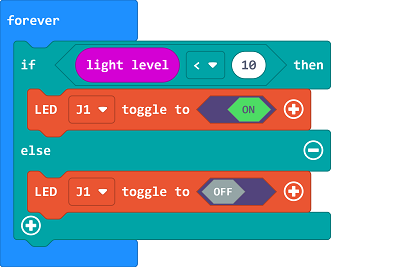

# Case 07: Smart Lamps

## Introduction
To make a smart lamp with the micro:bit. 

## Quick Start
---

### Materials Required
---
Nezha expansion board × 1

micro:bit × 1

LED-yellow × 1

Light sensor × 1

RJ11 wires × 2

### Bricks details

### Connection Diagram 
---
- Connect the light sensor to J1and yellow LED to J2 on the Nezha expansion board as the picture shows.

- ### Assembly

  Build a device as the picture shows:

Video reference: [https://youtu.be/8_1d_F33y_4](v)

<iframe width="560" height="315" src="https://www.youtube.com/embed/8_1d_F33y_4" frameborder="0" allow="accelerometer; autoplay; clipboard-write; encrypted-media; gyroscope; picture-in-picture" allowfullscreen></iframe>

## MakeCode Programming

---

### Step 1

Click "Advanced" in the MakeCode to see more choices.

For programming, we need to add a package: click "Extensions" at the bottom of the MakeCode drawer and search with "PlanetX" in the dialogue box to download it. 

Notice: If you met a tip indicating that some codebases would be deleted due to incompatibility, you may continue as the tips say or create a new project in the menu. 

### Step 2

### Code as below:

### Reference
Link：[https://makecode.microbit.org/_Uoic5Ti2fT4y](https://makecode.microbit.org/_Uoic5Ti2fT4y)

You may also download it directly below:

<iframe style="position:absolute;top:0;left:0;width:100%;height:100%;" src="https://makecode.microbit.org/#pub:_Uoic5Ti2fT4y" frameborder="0" sandbox="allow-popups allow-forms allow-scripts allow-same-origin"></iframe>
  
---

### Result
- The LED lamps light on/off according to the light intensity. 

