# Case 08: Speed Adjustable Fans

## Introduction
---
Use the potentiometer and the motor to make a knob to control the fan, and you can use the knob to control the speed of the fan.

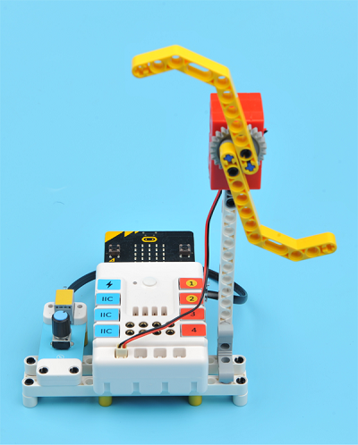

## Quick Start
---

### Materials Required

Nezha expansion board × 1

micro:bit × 1

Potentiometer × 1

Motor × 1

RJ11 wire × 1

### Connection Diagram 

Connect the potentiometer to J1 and motor to M1 on the Nezha expansion board as the picture shows.

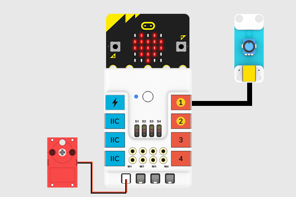

### Assembly Video

Video reference: [https://youtu.be/1-FaQU7Yj0k](https://youtu.be/1-FaQU7Yj0k)

<iframe width="560" height="315" src="https://www.youtube.com/embed/1-FaQU7Yj0k" frameborder="0" allow="accelerometer; autoplay; clipboard-write; encrypted-media; gyroscope; picture-in-picture" allowfullscreen></iframe>

### Assembly Steps

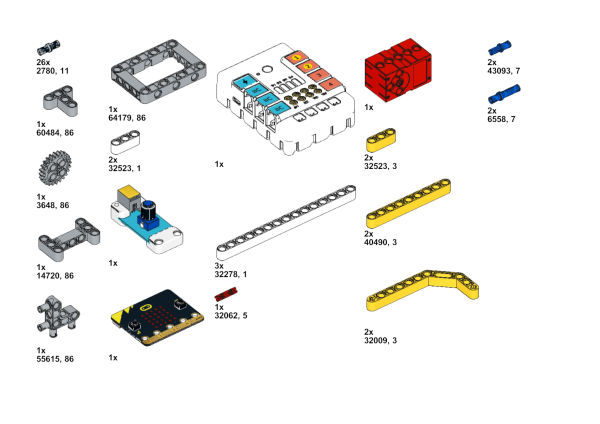

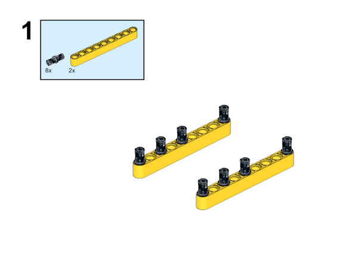

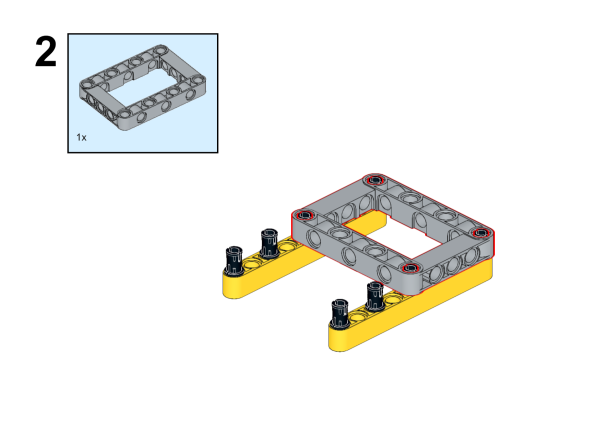

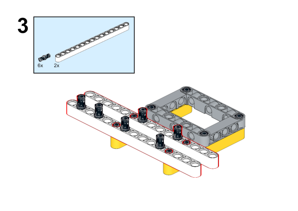

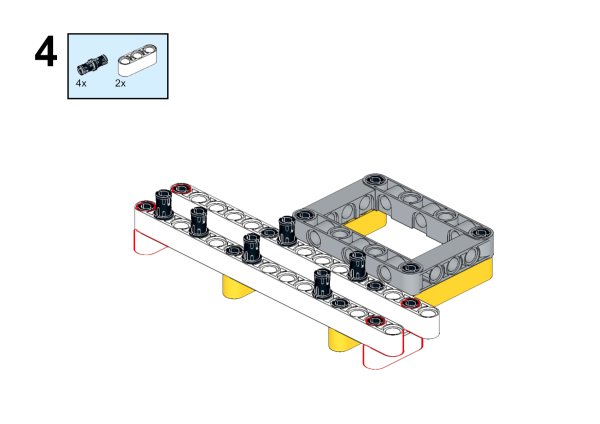

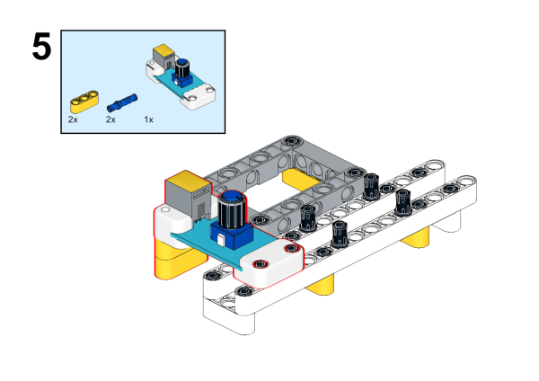

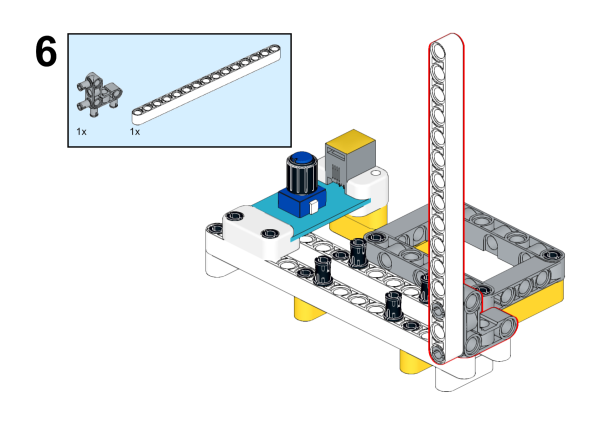

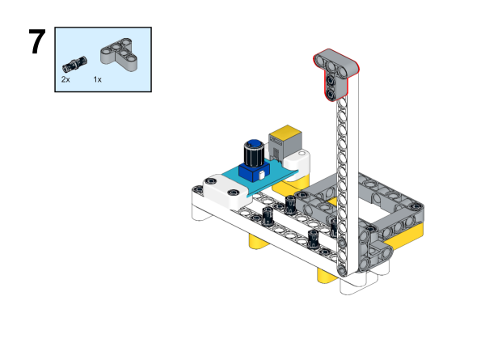

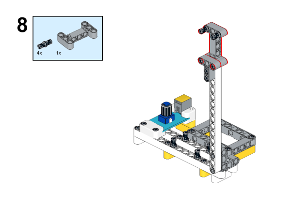

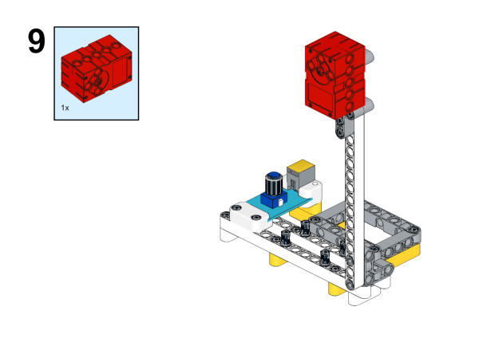

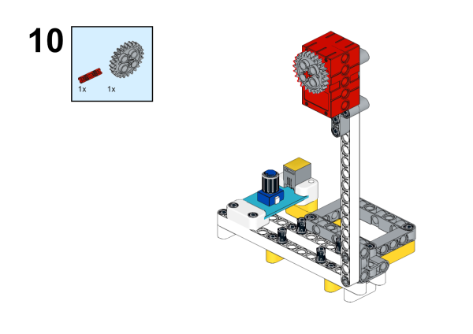

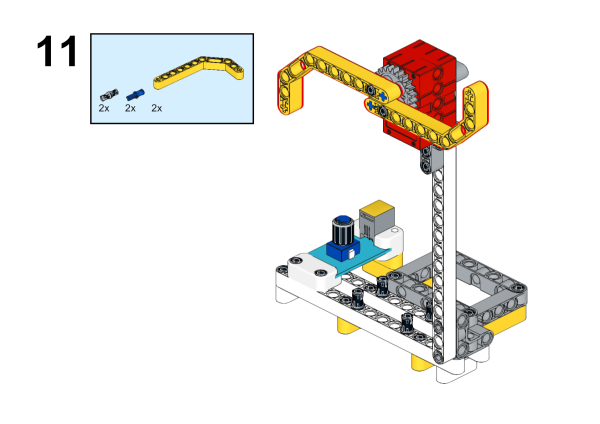

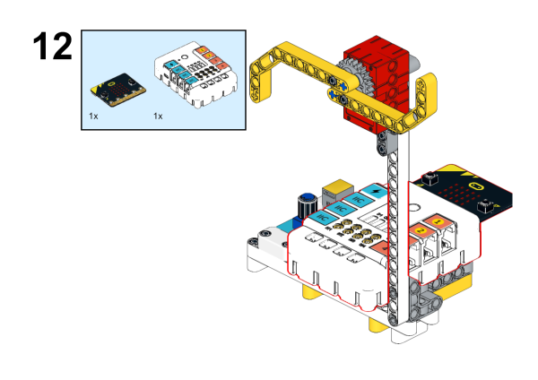

## MakeCode Programming
---

### Step 1

Click "Advanced" in the MakeCode to see more choices.

For programming, we need to add a package: click "Extensions" at the bottom of the MakeCode drawer and search with "PlanetX" in the dialogue box to download it. 

For programming, we need to add a package: click "Extensions" at the bottom of the MakeCode drawer and search with "nezha" in the dialogue box to download it. 

***Notice:*** If you met a tip indicating that some codebases would be deleted due to incompatibility, you may continue as the tips say or create a new project in the menu. 

### Step 2

### Code as below:

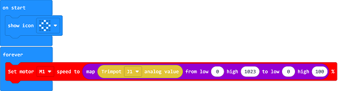

### Reference
Link：[https://makecode.microbit.org/_RK1WTKEMyfit](https://makecode.microbit.org/_RK1WTKEMyfit)

You may also download it directly below:

<iframe style="position:absolute;top:0;left:0;width:100%;height:100%;" src="https://makecode.microbit.org/#pub:_RK1WTKEMyfit" frameborder="0" sandbox="allow-popups allow-forms allow-scripts allow-same-origin"></iframe>
  

### Result
Adjust the speed of the fan via the potentiometer. 

