# Case 09: Invading Detection Device

## Introduction

This is an intrusion detection device. When the ultrasonic sensor detects that someone is approaching, it will automatically turn on a red light and alarm through the buzzer on the micro:bit. If the ultrasonic sensor does not detect anyone, it will automatically turn on green light.

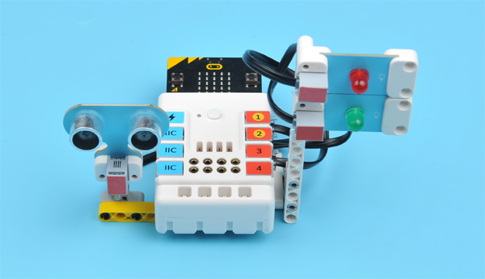

## Quick Start

### Materials Required

Nezha expansion board × 1

micro:bit × 1

LED-green × 1

LED-red × 1

Sonar:bit × 1

RJ11 wires × 3

### Connection Diagram 

Connect the sonar:bit to J1, red LED to J2 and green LED to J3 on the Nezha expansion board as the picture shows.

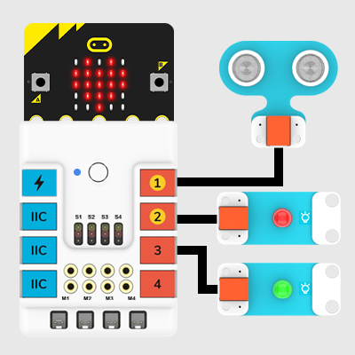

### Assembly Video

Video Reference: [https://youtu.be/jw9_wlNIiHw](https://youtu.be/jw9_wlNIiHw)

<iframe width="560" height="315" src="https://www.youtube.com/embed/jw9_wlNIiHw" frameborder="0" allow="accelerometer; autoplay; clipboard-write; encrypted-media; gyroscope; picture-in-picture" allowfullscreen></iframe>

### Assembly Steps

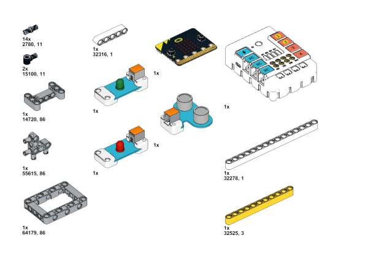

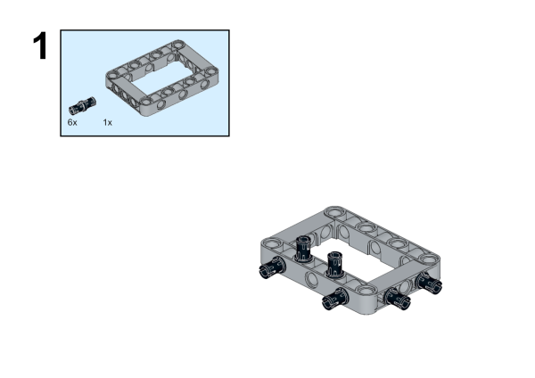

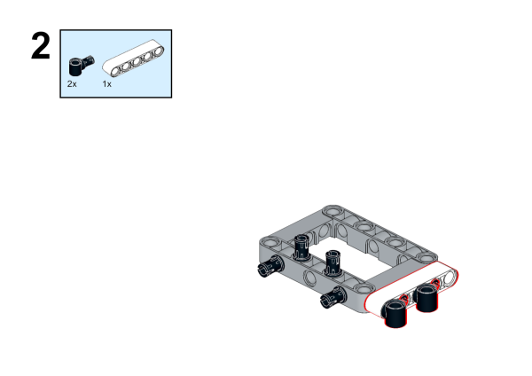

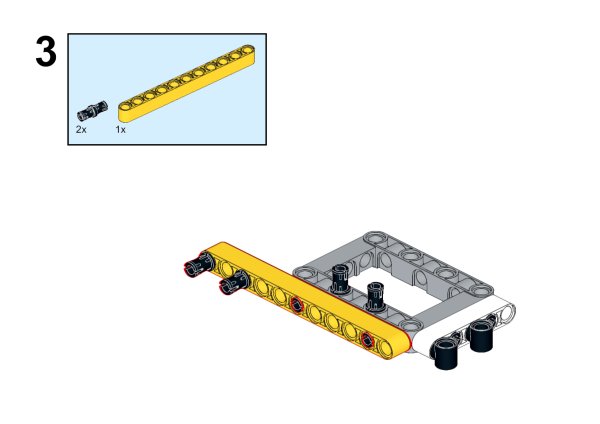

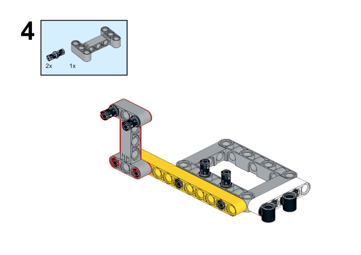

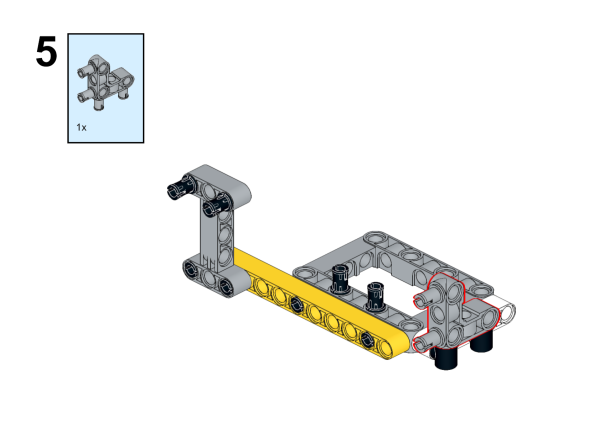

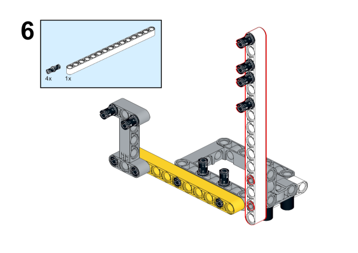

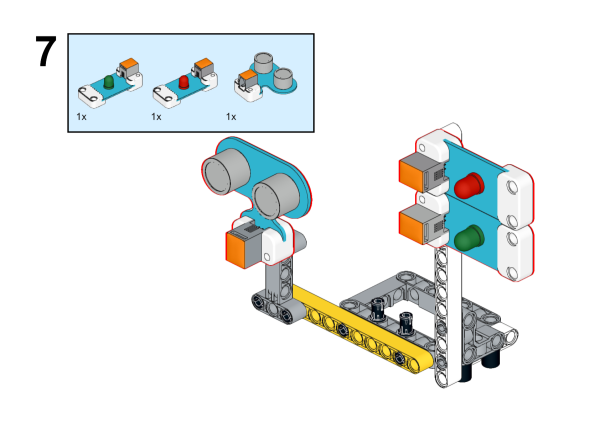

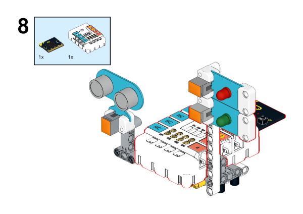

## MakeCode Programming

### Step 1

Click "Advanced" in the MakeCode to see more choices.

For programming, we need to add a package: click "Extensions" at the bottom of the MakeCode drawer and search with "PlanetX" in the dialogue box to download it. 

Notice: If you met a tip indicating that some codebases would be deleted due to incompatibility, you may continue as the tips say or create a new project in the menu. 

### Step 2

### Code as below:

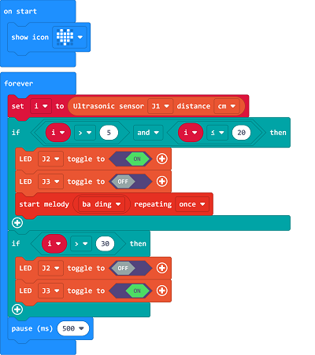

### Reference
Link：[https://makecode.microbit.org/_2zrE6AKRHbqW](https://makecode.microbit.org/_2zrE6AKRHbqW)

You may also download it directly below:

<iframe style="position:absolute;top:0;left:0;width:100%;height:100%;" src="https://makecode.microbit.org/#pub:_2zrE6AKRHbqW" frameborder="0" sandbox="allow-popups allow-forms allow-scripts allow-same-origin"></iframe>
  
---

### Result
While the sonar:bit detects the object, the red LED lights up and the buzzer alarms. 

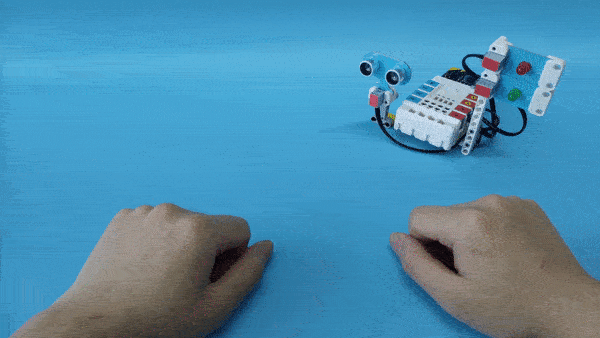
