# Case 10: Speed Adjustable Car

## Introduction

This is an adjustable speed car, we can control the speed of the it through the potentiometer installed at the back side.

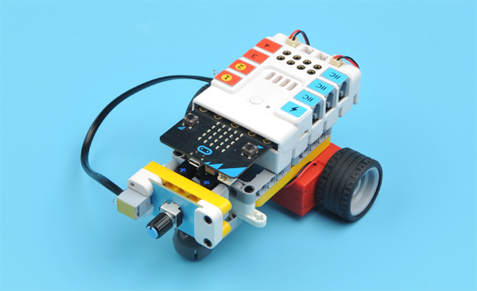

## Quick Start

### Materials Required

Nezha expansion board × 1

micro:bit × 1

Potentiometer × 1

Motors × 2

RJ11 wires × 1

***Tips: You may need to purchase [Nezha Inventor's Kit](https://shop.elecfreaks.com/products/elecfreaks-micro-bit-nezha-48-in-1-inventors-kit-without-micro-bit-board?_pos=2&_sid=ed1b6fbd2&_ss=r) if you want all the above compoents.***

### Connection Diagram 
Connect the potentiometer to J1, the two motors to M1&M4 on the Nezha expansion board as the picture shows.

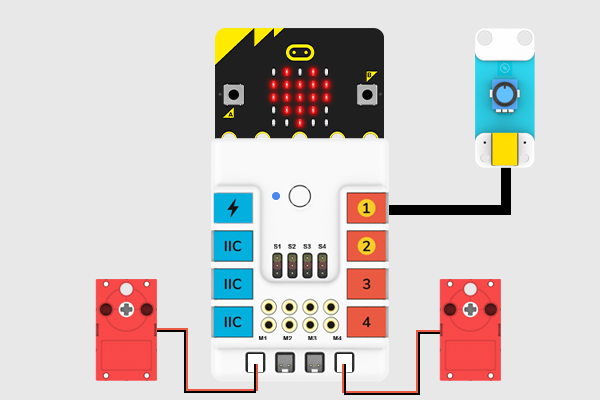

### Assembly Video

Video reference: [https://youtu.be/bVa5-wrcoeA](https://youtu.be/bVa5-wrcoeA)

<iframe width="560" height="315" src="https://www.youtube.com/embed/bVa5-wrcoeA" frameborder="0" allow="accelerometer; autoplay; clipboard-write; encrypted-media; gyroscope; picture-in-picture" allowfullscreen></iframe>

### Assembly Steps

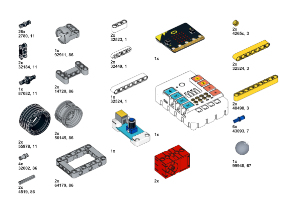

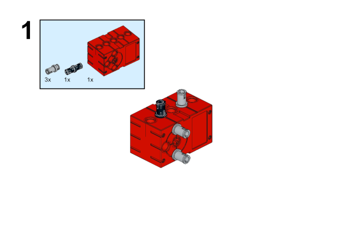

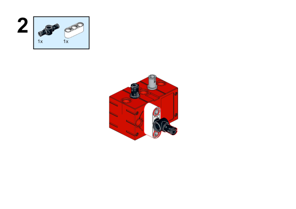

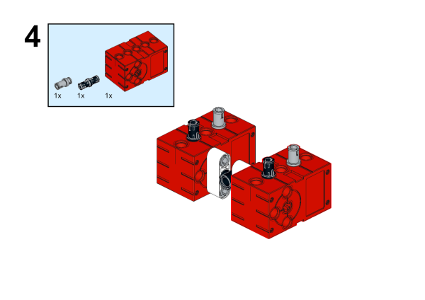

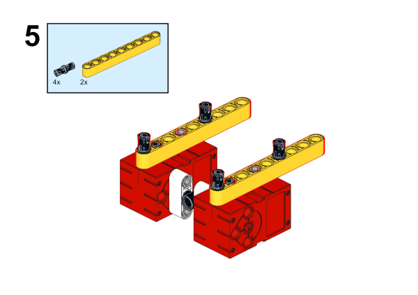

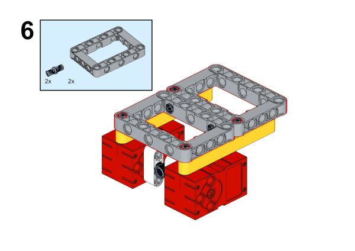

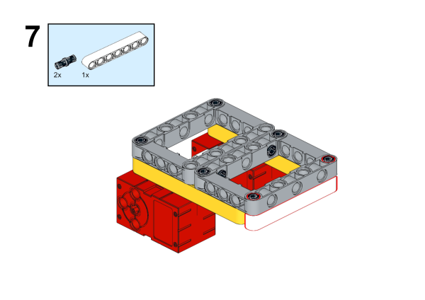

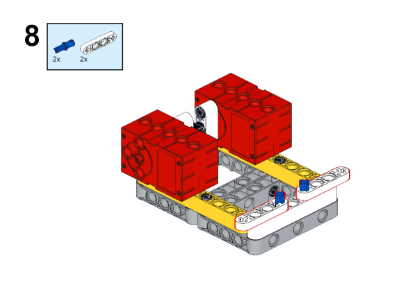

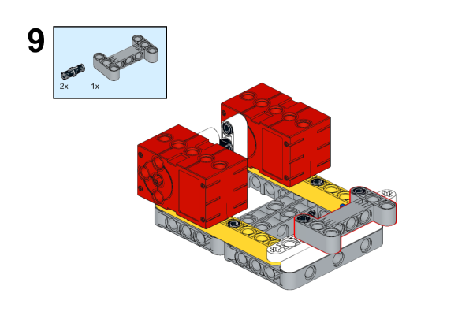

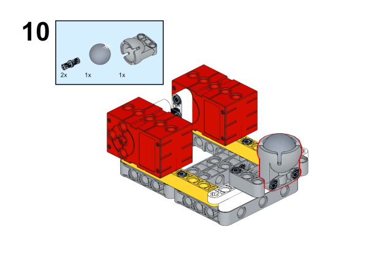

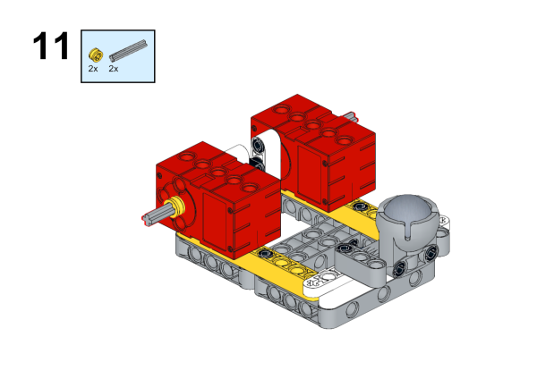

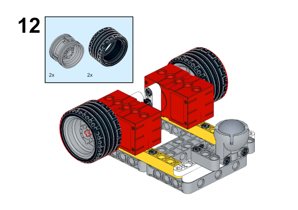

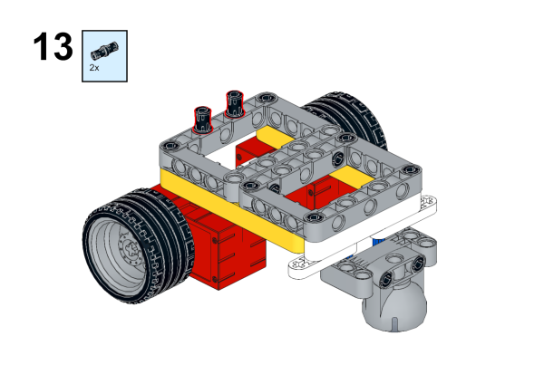

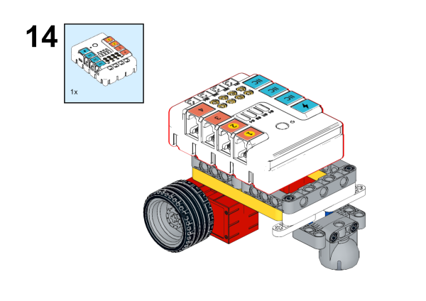

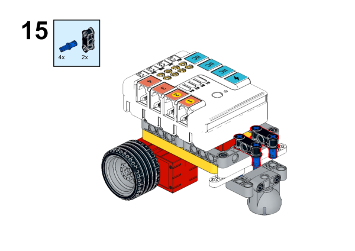

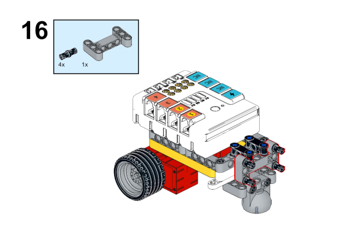

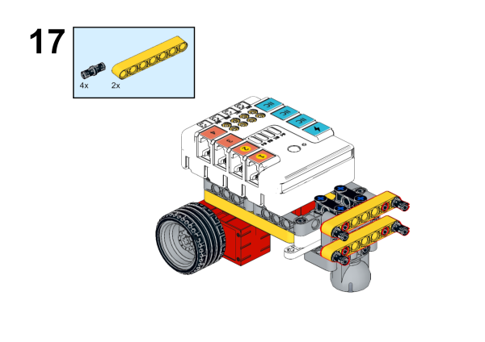

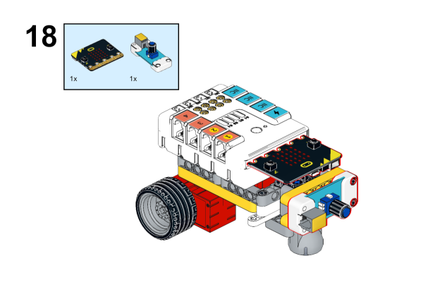

## MakeCode Programming

### Step 1

Click "Advanced" in the MakeCode to see more choices.

For programming, we need to add a package: click "Extensions" at the bottom of the MakeCode drawer and search with "PlanetX" in the dialogue box to download it. 

For programming, we need to add a package: click "Extensions" at the bottom of the MakeCode drawer and search with "nezha" in the dialogue box to download it. 

***Notice:*** If you met a tip indicating that some codebases would be deleted due to incompatibility, you may continue as the tips say or create a new project in the menu. 

### Step 2

### Code as below:

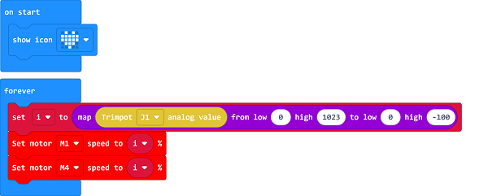

### Reference
Link：[https://makecode.microbit.org/_cTDgmegXA5ip](https://makecode.microbit.org/_cTDgmegXA5ip)

You may also download it directly below:

<iframe style="position:absolute;top:0;left:0;width:100%;height:100%;" src="https://makecode.microbit.org/#pub:_cTDgmegXA5ip" frameborder="0" sandbox="allow-popups allow-forms allow-scripts allow-same-origin"></iframe>
  

### Result
The speed of the car could be adjusted by the potentiometer.

