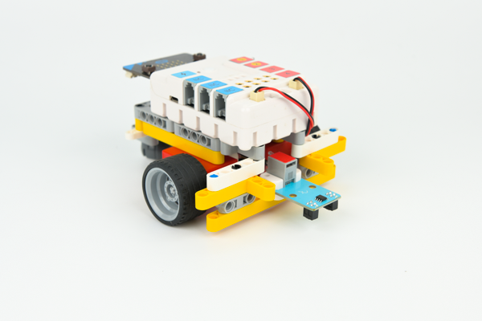

# Case 11: Line-tracking Car

## Introduction
To build a car that could drive along with the black line with a micro:bit. 

## Quick Start

---

### Materials Required

---
Nezha expansion board × 1
micro:bit × 1
Line-tracking sensor × 1
Motors × 2
RJ11 wires × 1
Bricks × n

### Connection Diagram 
---
- Connect the line-tracking sensor to J1, the two motors to M1&M4 on the Nezha expansion board as the picture shows.

### Assembly

- Build a device as the picture shows:

Video reference: [https://youtu.be/N2w01pGaj30](https://youtu.be/N2w01pGaj30)

<iframe width="560" height="315" src="https://www.youtube.com/embed/N2w01pGaj30" frameborder="0" allow="accelerometer; autoplay; clipboard-write; encrypted-media; gyroscope; picture-in-picture" allowfullscreen></iframe>

## MakeCode Programming

---

### Step 1

Click "Advanced" in the MakeCode to see more choices.

For programming, we need to add a package: click "Extensions" at the bottom of the MakeCode drawer and search with "PlanetX" in the dialogue box to download it. 

For programming, we need to add a package: click "Extensions" at the bottom of the MakeCode drawer and search with "nezha" in the dialogue box to download it. 

Notice: If you met a tip indicating that some codebases would be deleted due to incompatibility, you may continue as the tips say or create a new project in the menu. 

### Step 2

### Code as below:

### Reference
Link：[https://makecode.microbit.org/_MbaX4mTEmHmf](https://makecode.microbit.org/_MbaX4mTEmHmf)

You may also download it directly below:

<iframe style="position:absolute;top:0;left:0;width:100%;height:100%;" src="https://makecode.microbit.org/#pub:_MbaX4mTEmHmf" frameborder="0" sandbox="allow-popups allow-forms allow-scripts allow-same-origin"></iframe>
  
---

### Result
- The car drives along with the black line. 

