# Case 12: Obstacles Avoidance Car

## Introduction

This is an obstacle avoidance car. It detects whether there are obstacles in front of it through the ultrasonic sensor on the front of the car, the car automatically turns when it detects obstacles to avoid collisions.

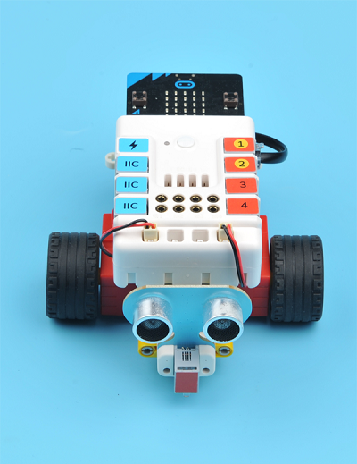

## Quick Start

### Materials Required

Nezha expansion board × 1

micro:bit × 1

Sonar:bit × 1

Motors × 2

RJ11 wires × 1

***Tips: You may need to purchase [Nezha Inventor's Kit](https://shop.elecfreaks.com/products/elecfreaks-micro-bit-nezha-48-in-1-inventors-kit-without-micro-bit-board?_pos=2&_sid=ed1b6fbd2&_ss=r) if you want all the above compoents.***

### Connection Diagram 

Connect the sonar:bit to J1, the two motors to M1&M4 on the Nezha expansion board as the picture shows.

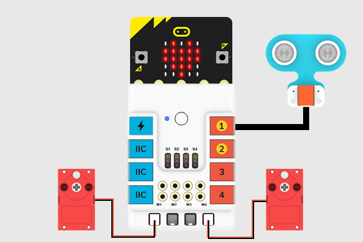

### Assembly Video

Video reference: [https://youtu.be/k8eaTQSVsfk](https://youtu.be/k8eaTQSVsfk)

<iframe width="560" height="315" src="https://www.youtube.com/embed/k8eaTQSVsfk" frameborder="0" allow="accelerometer; autoplay; clipboard-write; encrypted-media; gyroscope; picture-in-picture" allowfullscreen></iframe>

### Assembly Steps

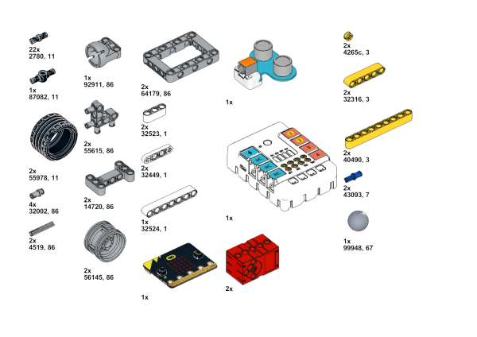

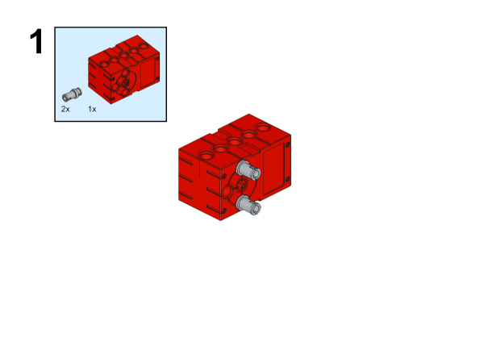

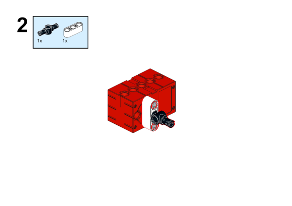

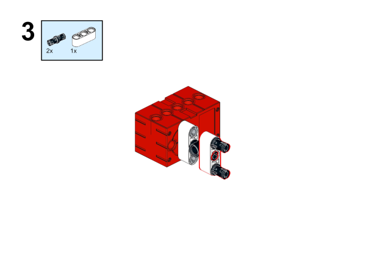

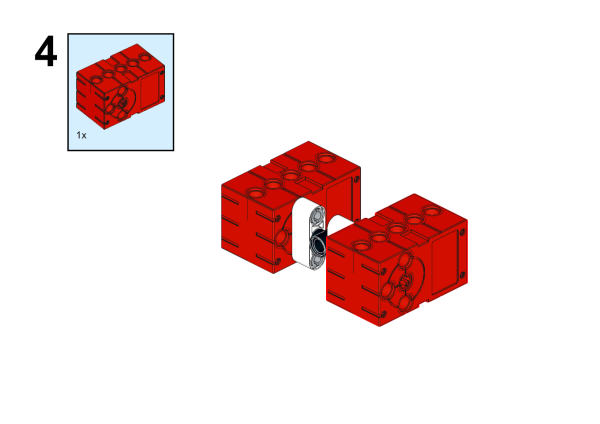

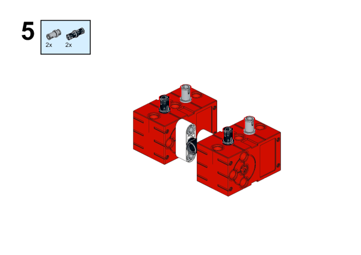

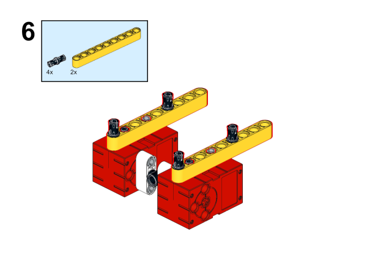

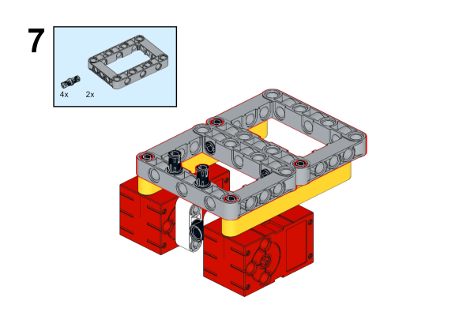

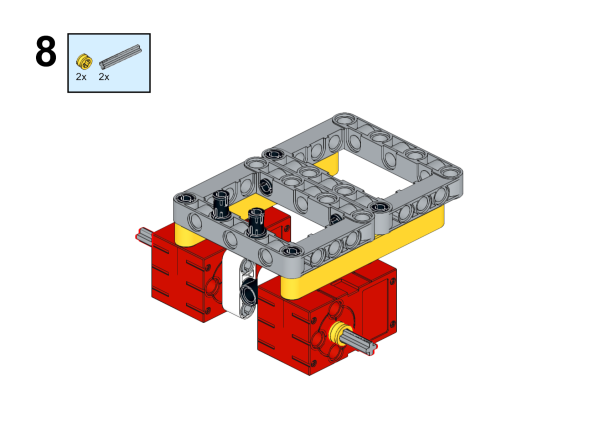

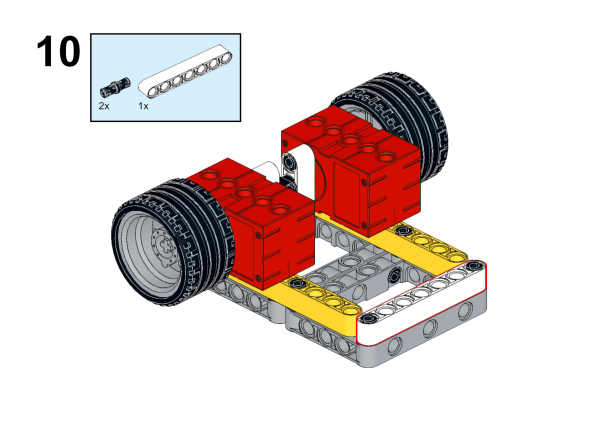

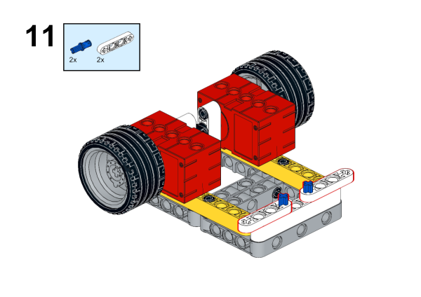

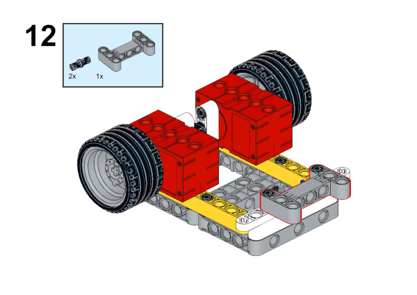

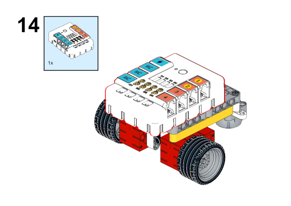

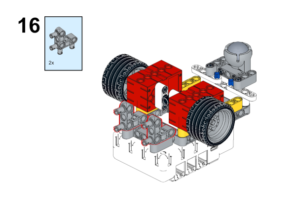

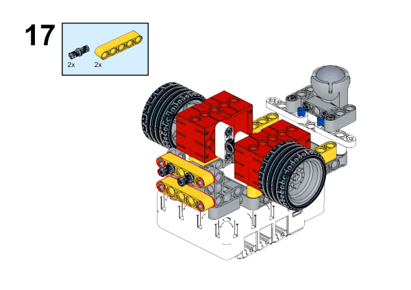

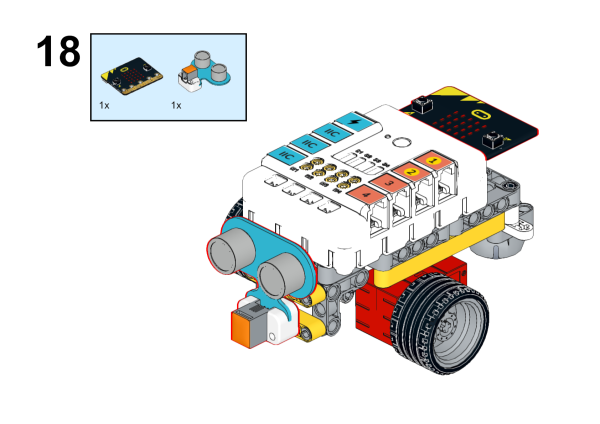

## MakeCode Programming

### Step 1

Click "Advanced" in the MakeCode to see more choices.

For programming, we need to add a package: click "Extensions" at the bottom of the MakeCode drawer and search with "PlanetX" in the dialogue box to download it. 

For programming, we need to add a package: click "Extensions" at the bottom of the MakeCode drawer and search with "nezha" in the dialogue box to download it. 

***Notice:*** If you met a tip indicating that some codebases would be deleted due to incompatibility, you may continue as the tips say or create a new project in the menu. 

### Step 2

### Code as below:

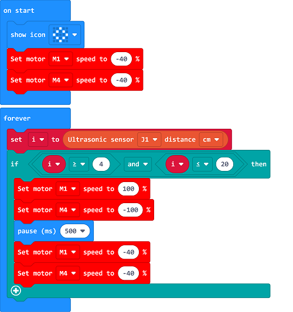

### Reference
Link：[https://makecode.microbit.org/_MyUJpP6L9YPo](https://makecode.microbit.org/_MyUJpP6L9YPo)

You may also download it directly below:

<iframe style="position:absolute;top:0;left:0;width:100%;height:100%;" src="https://makecode.microbit.org/#pub:_MyUJpP6L9YPo" frameborder="0" sandbox="allow-popups allow-forms allow-scripts allow-same-origin"></iframe>
  

### Result
The car drives and avoids the obstacles automatically. 

