# Case 13: Lively Music 

## Introduction 

We can adjust the frequency of the buzzer sound through the potentiometer. Try to create unique music by turning the potentiometer!

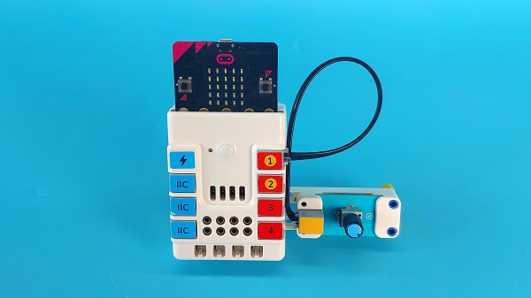

## Quick to Start 

### Mterials 

Nezha expansion board × 1

micro:bit × 1

Trimpot  × 1

RJ11 wires × 1

Bricks × n

***Tips: You may need to purchase [Nezha Inventor's Kit](https://shop.elecfreaks.com/products/elecfreaks-micro-bit-nezha-48-in-1-inventors-kit-without-micro-bit-board?_pos=2&_sid=ed1b6fbd2&_ss=r) if you want all the above compoents.***

### Connection Diagram 

Connect the trimpot to J1 port on the Nezha expansion board. 

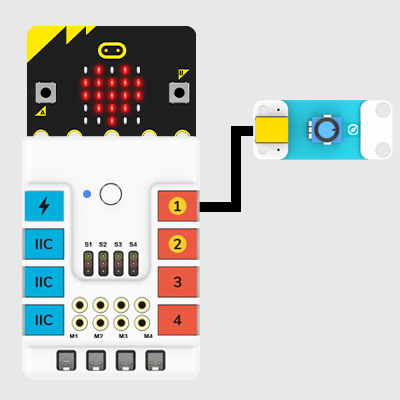

### Assembly Video

Video reference for building:[https://youtu.be/G0hycQ2rxCk](https://youtu.be/G0hycQ2rxCk)

<iframe width="560" height="315" src="https://www.youtube.com/embed/G0hycQ2rxCk" frameborder="0" allow="accelerometer; autoplay; clipboard-write; encrypted-media; gyroscope; picture-in-picture" allowfullscreen></iframe>

### Assembly Steps

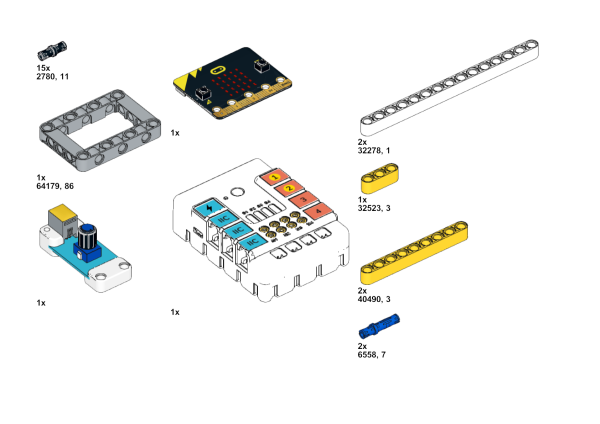

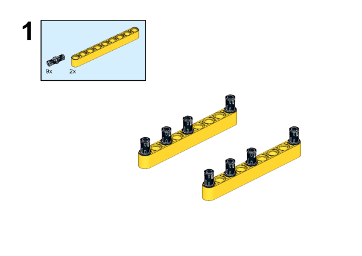

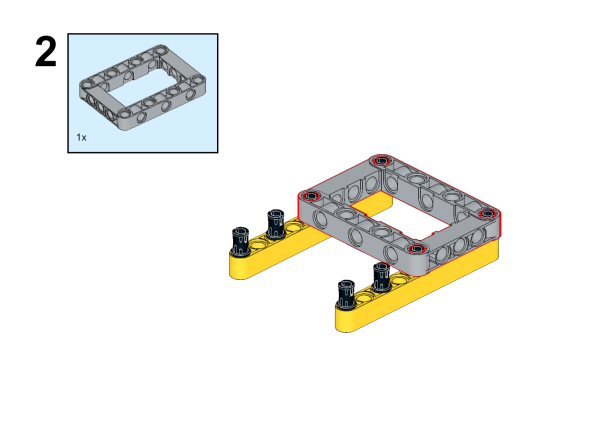

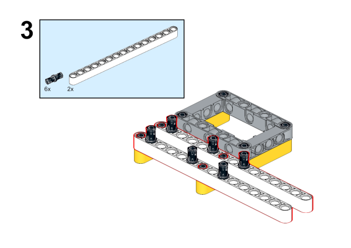

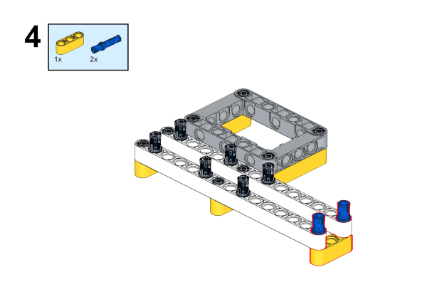

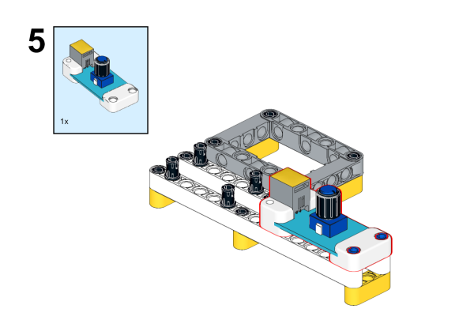

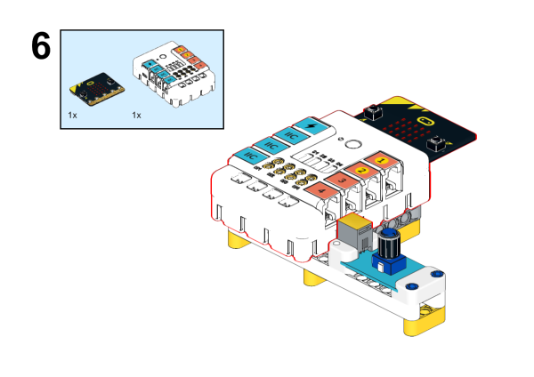

## MakeCode Programming. 

### Step 1

Click  "Advanced" in the makecode drawer to see more choices. 

We need add a package for programming. Click "Extensions" in the bottom of the makecode drawer and search with "Planet X" to have the package downloaded. 

***Note:*** If you met a tip indicating it might be deleted due to incompatibility, you may continue as it indicates or create a new project in the menu. 

### Step 2

### Programme 

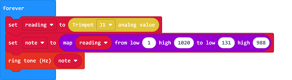

### Link
Link: [https://makecode.microbit.org/_Fp5c7g7XjRMg](https://makecode.microbit.org/_Fp5c7g7XjRMg)

You may download it directly below: 

<iframe style="position:absolute;top:0;left:0;width:100%;height:100%;" src="https://makecode.microbit.org/#pub:_Fp5c7g7XjRMg" frameborder="0" sandbox="allow-popups allow-forms allow-scripts allow-same-origin"></iframe>
  

### Result
The tones could be adjusted via the trimpot. 

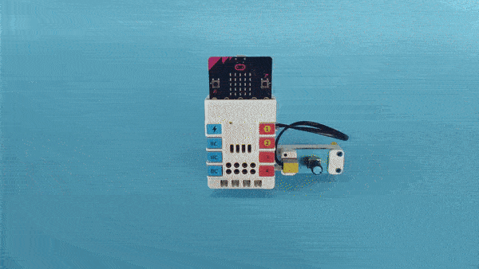
