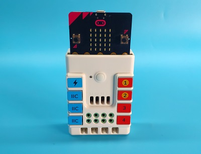
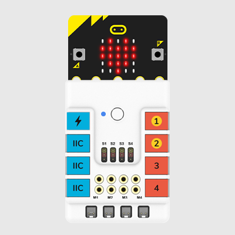
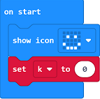
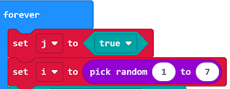
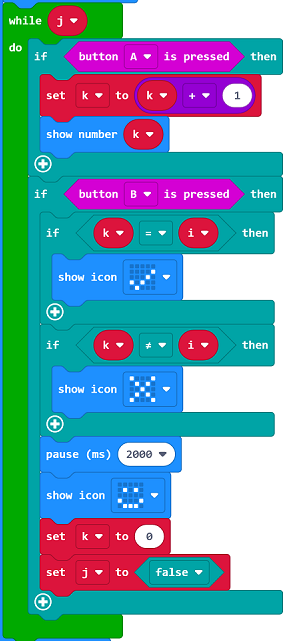
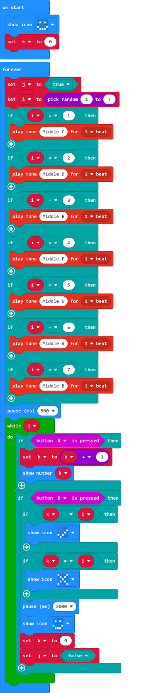

# Case 14:  Guess the tones

## Introduction 
Make a micro:bit device that is able to recognize the tones. 

## Quick to Start 
---

### Materials 
---
Nezha expansion board × 1

micro:bit × 1

### Connection Diagram
---
- Connect the micro:bit to Nezha expansion board as the picture shows. 

## MakeCode Programming 
---

### Step 1
---
Program to show icon in the on start brick and set the variable K as 0. 

In forever brick, set the variable j as true and the value of i as a random number among 1~7. 

If i=1, programme to play the tone of C; if i=2, set to play the tone of D, and set the following 5 tones accordingly in the same way. 

While the variable j is true, set k=k+1 after button A being pressed and display the value of K; while button B being pressed, if k=1, set to display √; if k≠i, set to display ×, and pause for 2000ms, then display the smile face; if k=0, set the variable of j as false. 

### Full Code: 

### Link

link: [https://makecode.microbit.org/_DK41ckRkTb4o](https://makecode.microbit.org/_DK41ckRkTb4o)

You may also download it directly below: 

<iframe style="position:absolute;top:0;left:0;width:100%;height:100%;" src="https://makecode.microbit.org/#pub:_DK41ckRkTb4o" frameborder="0" sandbox="allow-popups allow-forms allow-scripts allow-same-origin"></iframe>
  
### Result
- After powering on, it displays a smile face and plays a tone. Choose the equivalent numbers by pressing button A and confirm it by pressing button B. If the confirmed number and the tone are the same one,  the micro:bit displays √; if not, it displays ×. 

