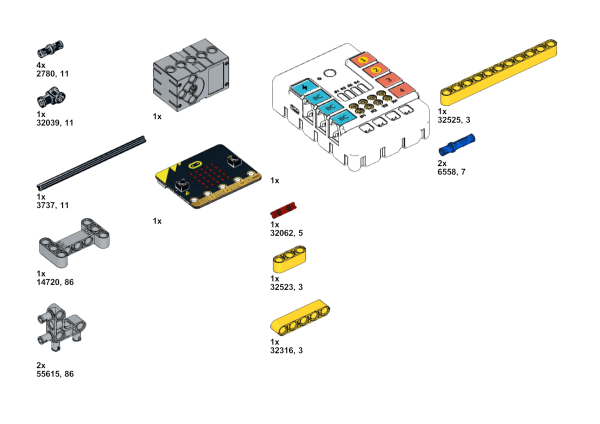
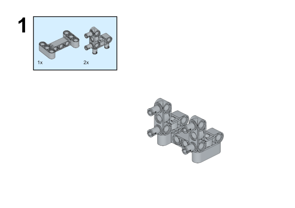
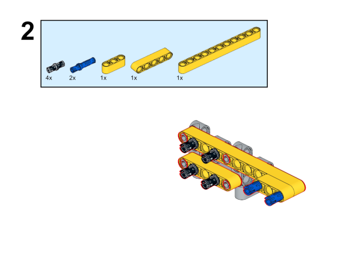
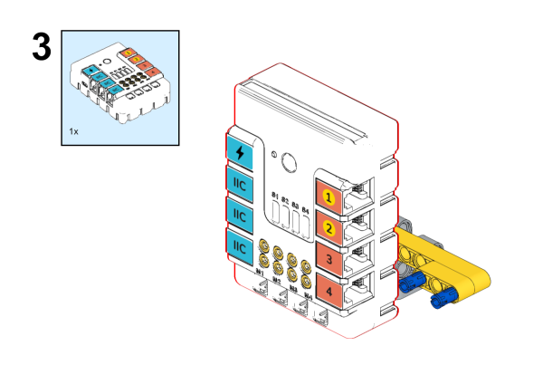
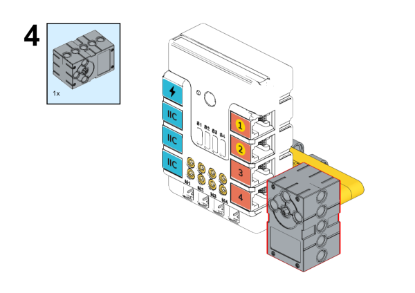
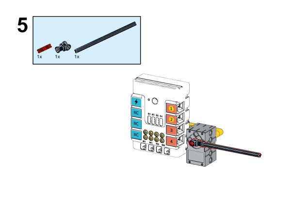
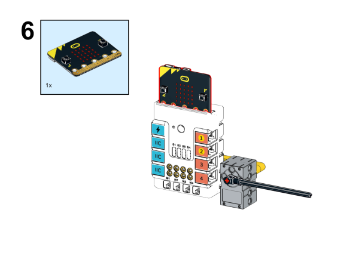
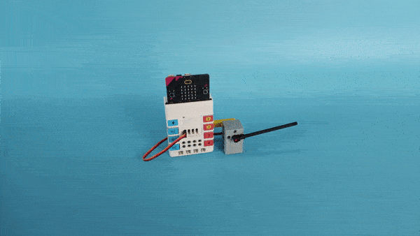

# Case 15: Volume Reminder 

## Introduction 
---
This device uses the sound intensity detection on the micro:bit V2 to control the servo to rotate to the corresponding position by detecting the surrounding sound level, so that the pointer connected to the servo fluctuates with the volume.

## Quick to Start
---

### Materials 

Nezha expansion board × 1

micro:bit × 1

servo  × 1

RJ11 wires × 1

Bricks × n

### Connection Diagram 

Connect the 360 degrees servo to S1 port on the Nezha expansion board. 

### Assembly Video

Video link:[https://youtu.be/sq4fq4W51Ck](https://youtu.be/sq4fq4W51Ck)

<iframe width="560" height="315" src="https://www.youtube.com/embed/sq4fq4W51Ck" frameborder="0" allow="accelerometer; autoplay; clipboard-write; encrypted-media; gyroscope; picture-in-picture" allowfullscreen></iframe>

### Assembly Steps

## MakeCode Programming 
---

### Step 1

Click "Advanced" in the MakeCode drawer to see more choices. 

We need to add a package for programming. Click "Extensions" in the bottom of the drawer and search with "PlanetX" to download it. 

We need to add a package for programming. Click "Extensions" in the bottom of the drawer and search with "Nezha" to download it. 

***Note:*** If you met a tip indicating the codebase might be deleted due to incompatibility, you may continue as the tips say or create a new project in the menu. 

### Step 2

### Programme as the pictures indicate

### Link
Link: [https://makecode.microbit.org/_JfDgxzJkc72X](https://makecode.microbit.org/_JfDgxzJkc72X)

You may download it directly below: 

<iframe style="position:absolute;top:0;left:0;width:100%;height:100%;" src="https://makecode.microbit.org/#pub:_JfDgxzJkc72X" frameborder="0" sandbox="allow-popups allow-forms allow-scripts allow-same-origin"></iframe>
  

### Result
The servos drive in accordance with the change of the volume. 

