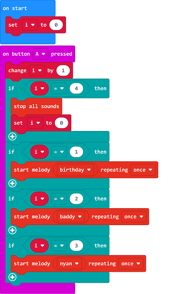

#Music Box

## Introduction
Build a music box with the micro:bit. 

## Quick to Start
---

### Materials 
---
Nezha expansion board × 1

micro:bit × 1

### Connection Diagram
---
- Insert the micro:bit to Nezha expansion board. 

## MakeCode Programming
---

### Programme as the picture shows: 

### Link
Link: [https://makecode.microbit.org/_gRoDU7R96LTf](https://makecode.microbit.org/_gRoDU7R96LTf)

You may also downoad it directly below: 

<iframe style="position:absolute;top:0;left:0;width:100%;height:100%;" src="https://makecode.microbit.org/#pub:_gRoDU7R96LTf" frameborder="0" sandbox="allow-popups allow-forms allow-scripts allow-same-origin"></iframe>
  
---

### Result 
- Press button A to switch the music.

