# case 19：The Automatic Laundry Rack

## Introduction

This is a music box. We can control the buzzer on the micro:bit to emit different melody by pressing the button A on the micro:bit.

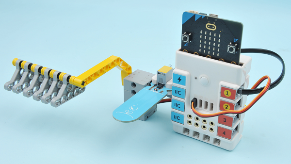

## Quick to Start

### Materials 

Nezha expansion board × 1

micro:bit × 1

360°servo × 1

Bricks × n

### Connections Diagram

Connect the micro:bit with the Nezha expansion board, connect the servo to S1 port and the soil moisture sensor to J1 port on Nezha expansion board.

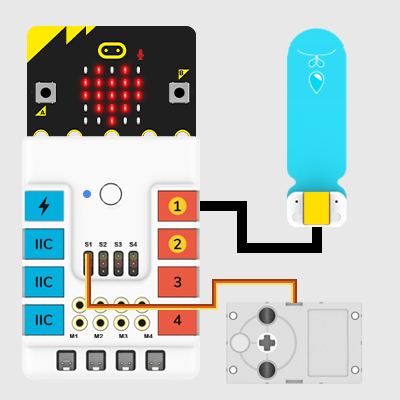

### Assembly Video

Video reference: [https://youtu.be/t2mYccra8Vw](https://youtu.be/t2mYccra8Vw)

<iframe width="560" height="315" src="https://www.youtube.com/embed/t2mYccra8Vw" frameborder="0" allow="accelerometer; autoplay; clipboard-write; encrypted-media; gyroscope; picture-in-picture" allowfullscreen></iframe>

### Assembly Steps

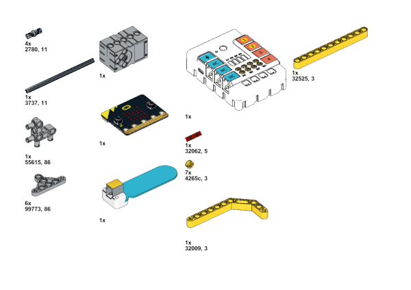

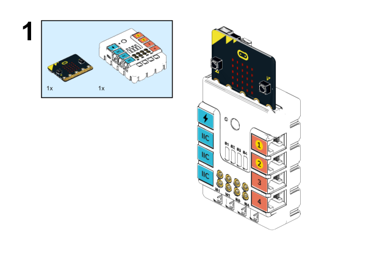

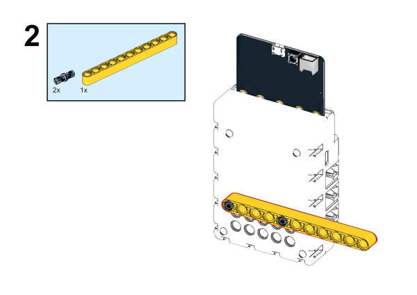

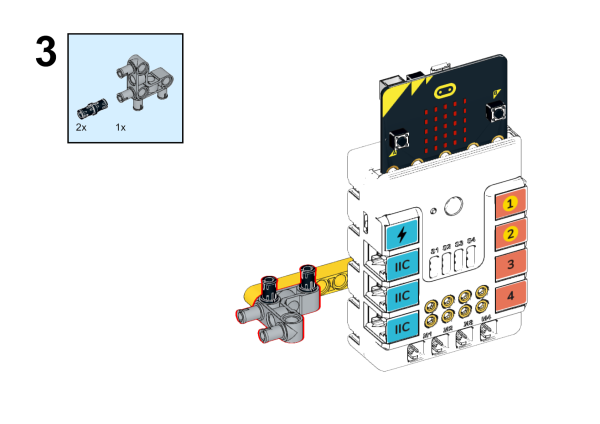

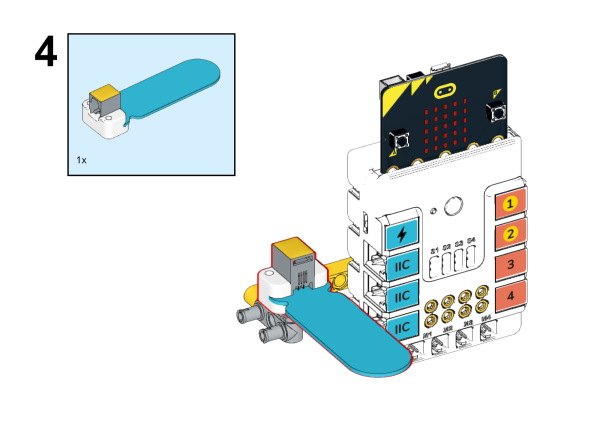

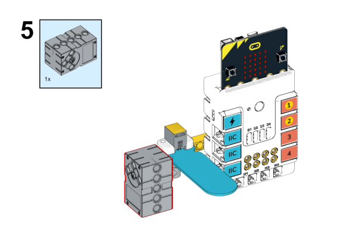

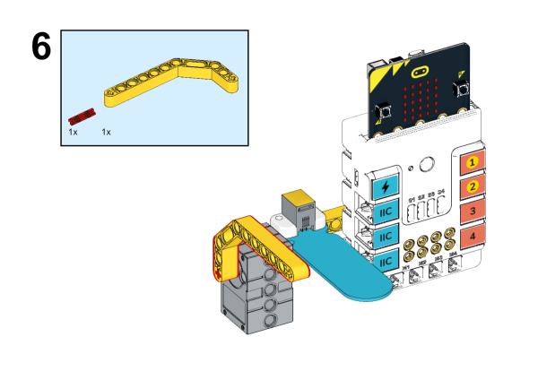

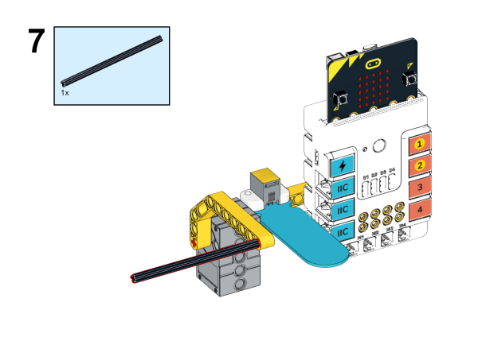

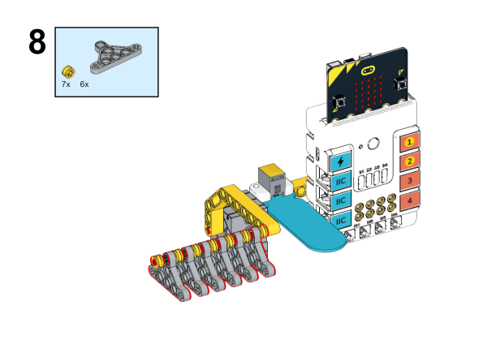

## MakeCode Programming

### Step 1
Click "Advanced" in the MakeCode drawer to see more choices. 

We need to add a package for programming. Click "Extensions" in the bottom of the drawer and search with "PlanetX" in the dialogue box to download it. 

We need to add a package for programming. Click "Extensions" in the bottom of the drawer and search with "Nezha" in the dialogue box to download it. 

Note: If you met a tip indicating that the codebase will be deleted due to incompatibility, you may continue as the tips say or build a new project in the menu. 

### Step 2

### Programme as the picture shows: 

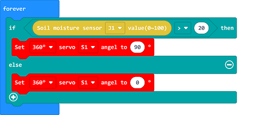

### Link
Link：[https://makecode.microbit.org/_2Ub6zkdT8RbY](https://makecode.microbit.org/_2Ub6zkdT8RbY)

You may also downoad it directly below: 

<iframe style="position:absolute;top:0;left:0;width:100%;height:100%;" src="https://makecode.microbit.org/#pub:_2Ub6zkdT8RbY" frameborder="0" sandbox="allow-popups allow-forms allow-scripts allow-same-origin"></iframe>
  
---

### Result
While rainning, the detected value from the soil moisture sensor is over the setting point, the laundry rack folds back in case of the clothes getting wet; while the sun comes out, the the detected value from the soil moisture sensor is below the setting point, and the the laundry rack stretches out to dry the clothes. 

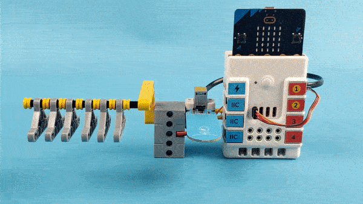
