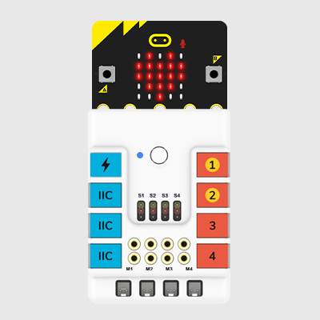
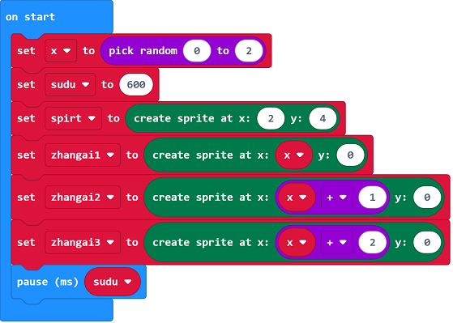
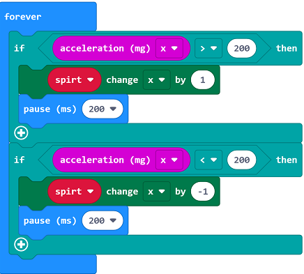
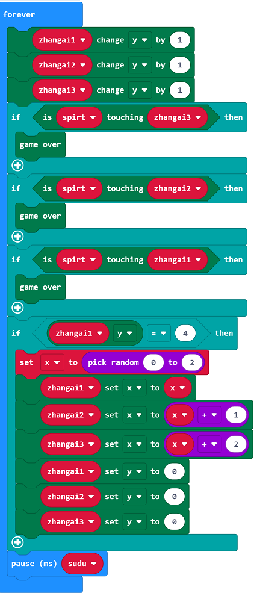
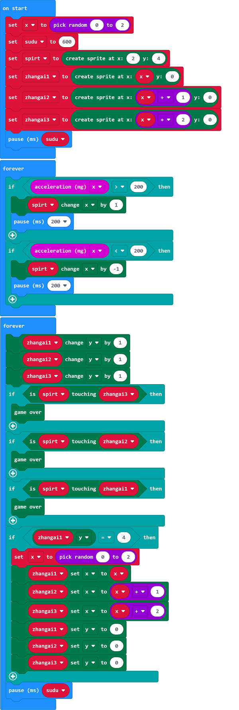
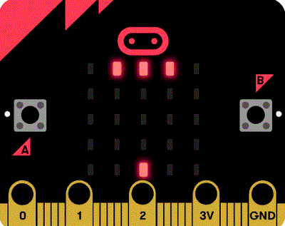

#Micro:bit Avoiding Bricks

## Introduction

Let’s use micro:bit to make a game of avoiding bricks. It can control the spots by gravity to avoid the falling bricks. Once it touches the bricks, the game ends. Let's see how it works。

## Quick to Start
---

### Materials 
---
Nezha expansion board × 1

micro:bit × 1

### Connections Diagram
---
- 将micro:bit插入哪吒扩展板。

##  MakeCode Programming
---

## Principle:

The implementation logic is roughly divided into two parts, the small highlight part controlled by the player and the randomly generated obstacle part. For simplicity, here we set:

1.The small bright spot can only move left and right at the bottom of the screen

2.The length of the obstacle is fixed as three

3.The descending speed of obstacles remains unchanged

4.The game ends when the small bright spot hits an obstacle

5.Due to the small size of the screen, only one obstacle will appear at the same time. When one obstacle drops to the bottom, another obstacle will be generated again.

## Implementation

Next is the implementation part. We need to use two infinite loops to implement the logic of the small bright spot and the logic of the obstacle respectively. 4 sprites (actually a variable representing the sprite) will be generated, one for the small bright spot, and 3 Obstacle sprites also need 2 variables, x and sudu, x is used to accept the generated random number and set the abscissas of 3 obstacle sprites, sudu is used to control the descending speed of obstacles, open the micro:bit online programming website (https://makecode.microbit.org/)

## Start programming.

On start

1.Under the variable classification, use the variable module to set 6 variables, namely x, sudu, spirt (representing small bright spots), zhangai1 (representing the leftmost obstacle wizard), zhangai2 (representing the middle obstacle wizard), zhangai3 (representing the rightmost obstacle) Elf)

2.Set the value of x to the random number module to generate a random number from 0 to 2

3.Set the value of sudu to 600

4.Set spirt to the Create Wizard module under the game category, fill in the variable 2 for the x coordinate and 4 for the y coordinate to ensure that the initial state of the small bright spot is in the bottom middle of the screen

5.Set zhangai1 to create a wizard module, fill the x coordinate with the variable x, and fill the y coordinate with 0

6.Set zhangai2 to create a wizard module, fill the x coordinate with the variable x + 1, and fill the y coordinate with 0

7.Set zhangai3 to create a wizard module, fill the x coordinate with the variable x + 2, and fill the y coordinate with 0

## The bright spot part

1.Judge the acceleration in the x direction, if it is over 200, add 1 to the spirt x coordinate and pause for 200ms

2.Judge the acceleration in the x direction, if it is less than -200, subtract 1 from the spirt x coordinate, and pause for 200ms

## Obstacles part

1.The 3 obstacle sprites y coordinate minus 1 each time

2.Judge If spirt touches zhangai1 or spirt touches zhangai2 or spirt touches zhangai3, the game is over when it touches any one among them.

3.If the y coordinate of zhangai1 (or zhangai2 or zhangai3) is 4, regenerate a random number from 0 to 2 and set it to the variable x

4.Use the variable x to set the coordinate x of zhangai1 to the variable x and the y coordinate to 0

5.Set the coordinate of zhangai2 with variable x. The x coordinate is variable x + 1, and the y coordinate is 0

6.Set the coordinate of zhangai3 with variable x. The x coordinate is variable x + 2, and the y coordinate is 0

7.Pause variable sudu time

### Programme as the picture shows:

### Link
请参考程序连接：[https : //makecode.microbit.org/_AF1g8HYYeTjH](https://makecode.microbit.org/_AF1g8HYYeTjH)

你也可以通过以下网页直接下载程序，下载完成后即可开始运行程序。

<iframe style="position:absolute;top:0;left:0;width:100%;height:100%;" src="https://makecode.microbit.org/#pub:_AF1g8HYYeTjH" frameborder="0" sandbox="allow-popups allow-forms allow-scripts allow-same-origin"></iframe>
  
---

### Result
- It can control the spots by gravity to avoid the falling bricks. Once it touches the bricks, the game ends. 

