# case 21 An Oscillating Fan

## Introduction

Combine the motor and the servo to make a common head-shaking fan in daily life, and control the fan head-shaking function and turn it on and off by pressing the button.

## Quick Start

### Materials Required

Nezha expansion board × 1

micro:bit × 1

360°servo × 1

Motor × 1

Bricks × n

***Tips: You may need to purchase [Nezha Inventor's Kit](https://www.elecfreaks.com/nezha-inventor-s-kit-for-micro-bit-without-micro-bit-board.html) if you want all the above compoents.***

### Connection Diagram

Connect the servo to S1, motor to M1 and the micro:bit to Nezha expansion board. 

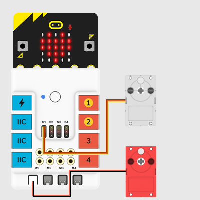

### Assembly Video

Video:[https://youtu.be/Ysg-t4QNmo8](https://youtu.be/Ysg-t4QNmo8)

<iframe width="560" height="315" src="https://www.youtube.com/embed/Ysg-t4QNmo8" title="YouTube video player" frameborder="0" allow="accelerometer; autoplay; clipboard-write; encrypted-media; gyroscope; picture-in-picture" allowfullscreen></iframe>

### Assembly Video

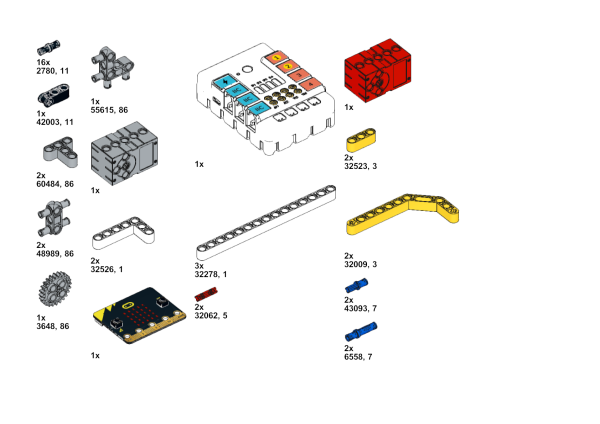

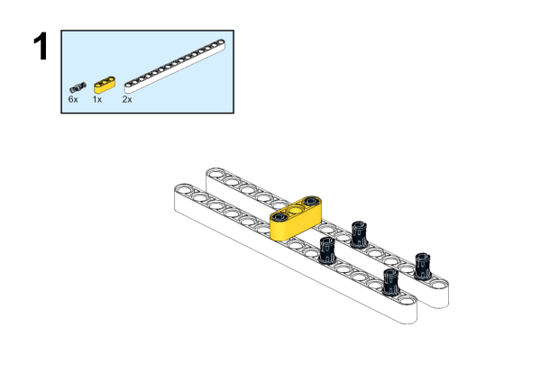

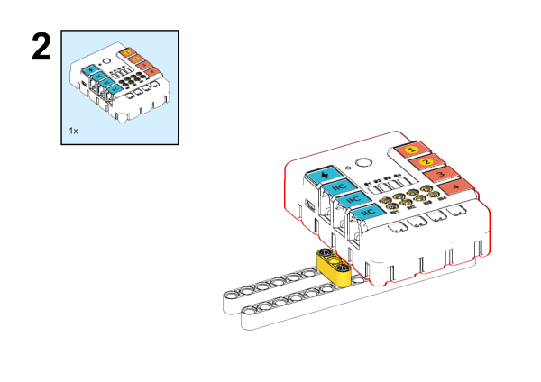

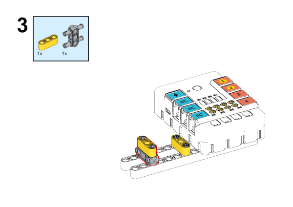

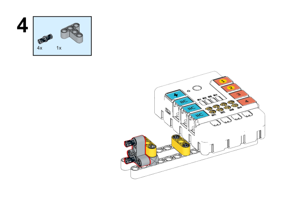

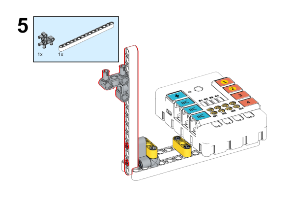

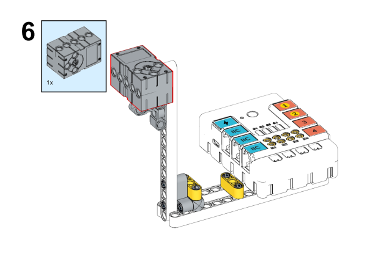

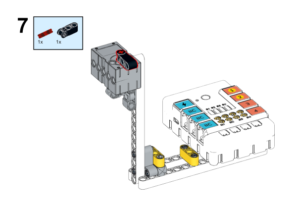

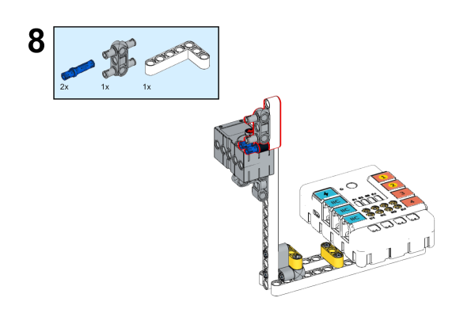

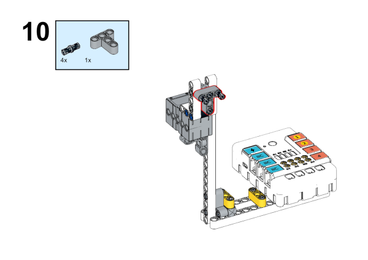

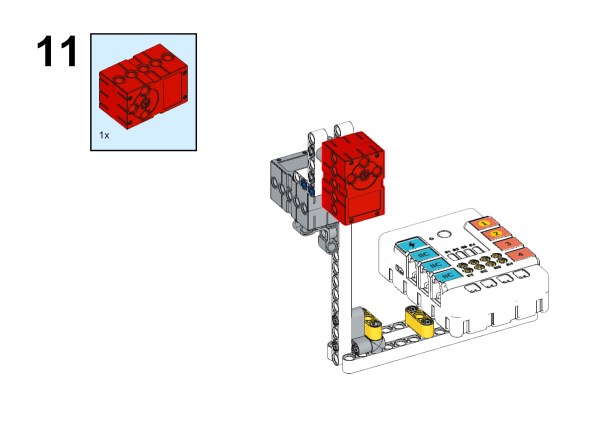

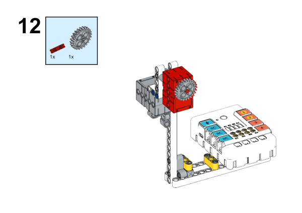

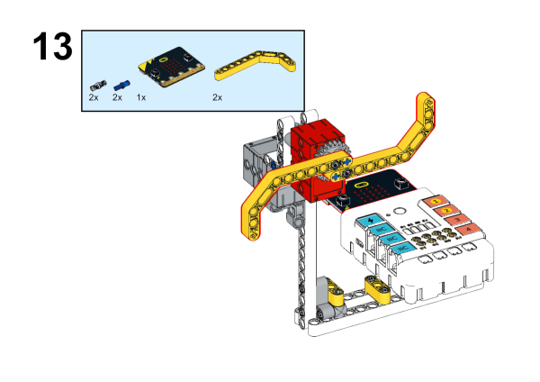

## MakeCode Programming

### Step 1
Click “Advanced” in the MakeCode drawer to see more choices.

We need to add a package for programming. Click “Extensions” in the bottom of the drawer and search with “nezha” in the dialogue box to download it.

***Note:*** If you met a tip indicating that the codebase will be deleted due to incompatibility, you may continue as the tips say or build a new project in the menu.

### Programme as the picture shows:

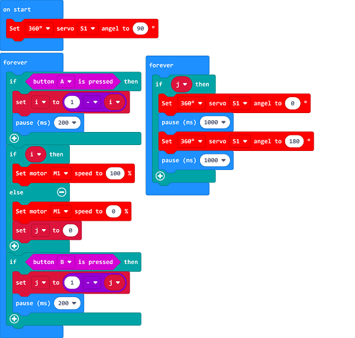

### Link
Link：[https://makecode.microbit.org/_hWzUHCY0yioM](https://makecode.microbit.org/_hWzUHCY0yioM)

You may also downoad it directly below:

<iframe style="position:absolute;top:0;left:0;width:100%;height:100%;" src="https://makecode.microbit.org/#pub:_hWzUHCY0yioM" frameborder="0" sandbox="allow-popups allow-forms allow-scripts allow-same-origin"></iframe>
  

### Result
Turn on/off the fan by pressing button A/B.

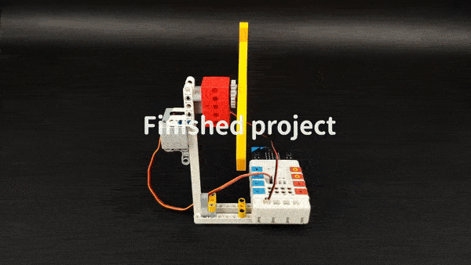
