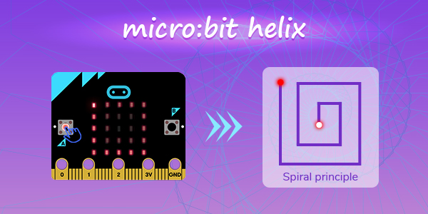
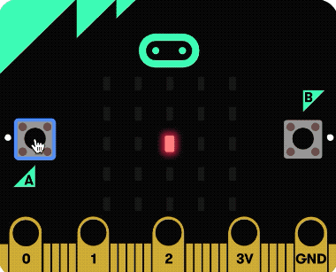
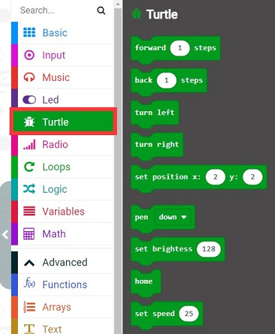
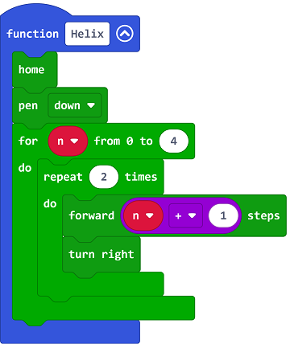
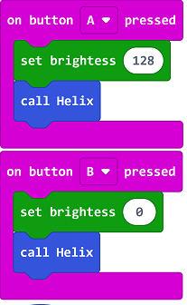
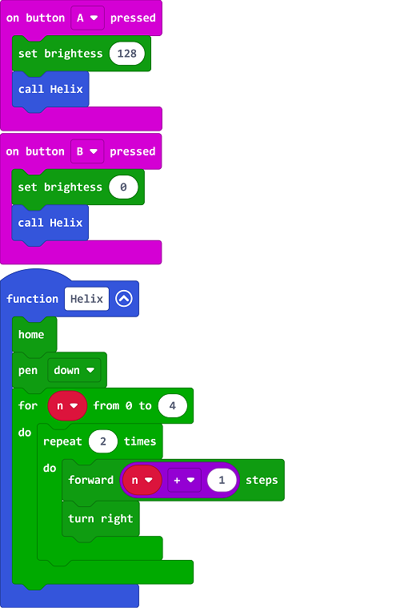

# case 22 Micro:bit Helix

## Introduction

 In this article, let’s learn how to draw a helix with micro:bit. Press the button A to draw a helix on the LED screen, and press button B to eliminate the helix as the same way:

## Principle

1. Draw a line of n units and turn left with 90 degrees.

2.  Draw a line of n units and turn left with 90 degrees.

3. Again with the first step.

Add 1 to n

Steps 1 and 2 here can be controlled by a loop block in twice, then use a loop in the outermost to increase the value of n. The more the number of outer loops, the larger the graph will be.

In addition, we also need to draw and clear graphics. The principle is also very simple. We only need to adjust the brightness of the brush. When drawing, the brightness is 128. When clearing the graphics, set the brightness to 0, and then the brush follows the same route. Go again and the graphics will be cleared.

## Add the extensions:

1.Go to MakeCode editor:[ https://makecode.microbit.org/ ]( https://makecode.microbit.org/ )to create a new project.

2.Click “Advanced” to see more choices and click “Extensions”.

3.Click microturtle to add it in the new project we just created.

4.You can see a new item-turtle in the drawer now.

## Code

Draw a Helix function

1.Create a function and name it as Helix

2.Choose the home brick in the turtle drawer and set it in the middle of the screen.

3.Choose the pen down brick and set it down each time when the function is executed.

4.Create a variable and name it in n to indicate the length of the line segment.

5.Drag in a module for the value from 0 to x from the loop category, and change it to n from 0 to 4, which means looping 5 times. Each loop assigns one of the 5 values from 0 to 4 to the variable n.

6.Drag in a loop x times module and change to loop twice to draw two line segments with length n + 1.

7.Drag in a forward x steps module from the turtle category and change it to forward n + 1 steps, which means to move forward n+1 steps, that is, draw a line of length n+1, because n starts from 0, you need to +1 here to make it start at 1.

8.Drag a turn right module from the turtle category, which means to rotate 90 degrees to the right. Here you can also select turn left, the direction is opposite.

Button response event

1.Add response events to buttons A and B respectively

2.When button A is pressed, drag in a set brightness module from the turtle category and change it to set brightness 128, and then use the luoxuanxian function.

3.When button B is pressed, drag in a set brightness module from the turtle category, change it to set brightness 0, and then use the luoxuanxian function, so that the effect of clearing the graphics can be achieved.

## Code

Link:[https://makecode.microbit.org/_0z4Xuh0rshP1](https://makecode.microbit.org/_0z4Xuh0rshP1) 

You may download it directly below:

<iframe style="position:absolute;top:0;left:0;width:100%;height:100%;" src="https://makecode.microbit.org/#pub:_0z4Xuh0rshP1" frameborder="0" sandbox="allow-popups allow-forms allow-scripts allow-same-origin"></iframe>
  

***Note:***

You may have noticed a strange movement of the final spiral in the result. This is because of the LED dot matrix screen. If it exceeds the LED dot matrix, it will be processed in a loop, that is, if it has reached the edge of the screen, go upward movement will be processed as the cursor moves to the bottom of the screen, and then moves up, and at the same time we add a right turn, so when the cursor moves to the bottom, it moves to the right by n steps.

