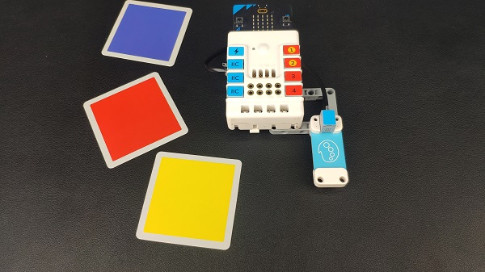
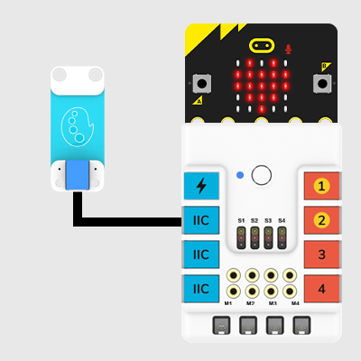
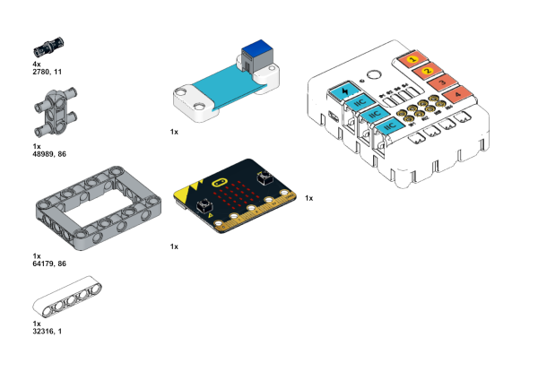
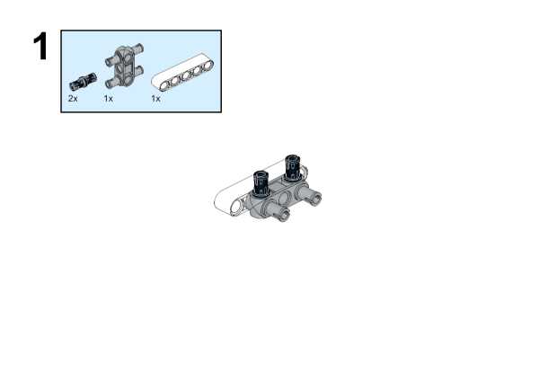
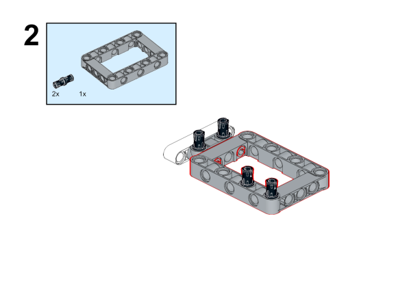
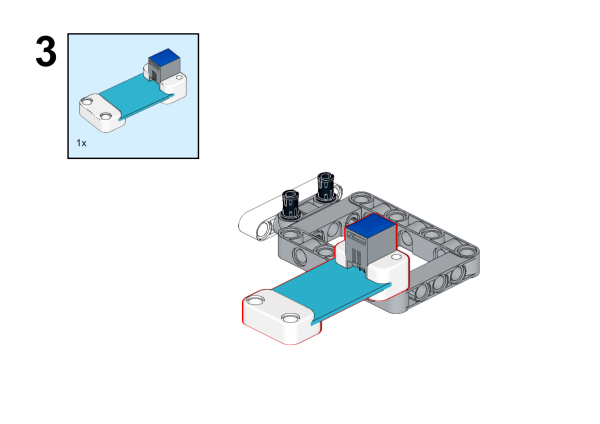
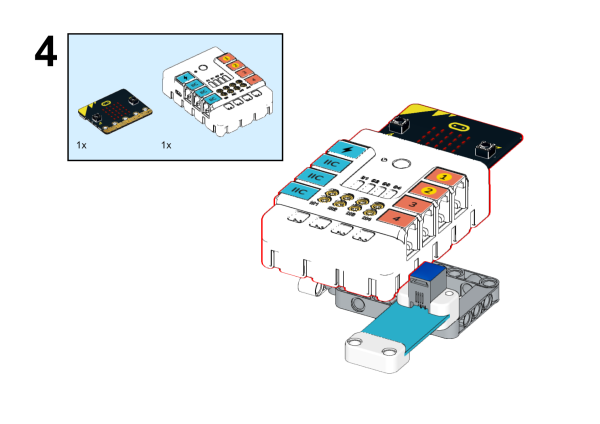
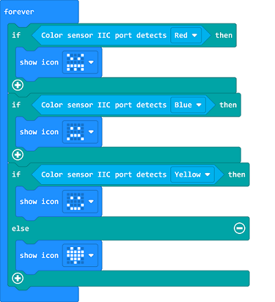
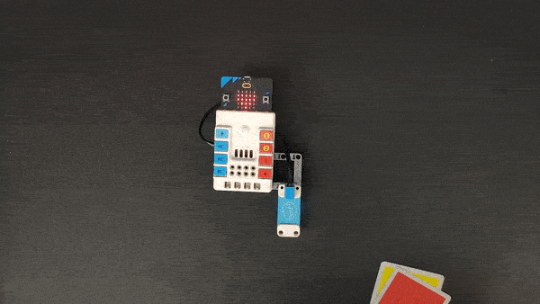

# Case 25: Colors of the Emotions

## Introduction

This is an emotional micro:bit. It will show a smile to the color that it likes, and it will also express sadness or anger at the color it doesn't like. Let’s find out the favorite color of the small micro:bit.

## Quick Start 

### Materials Required

Nezha expansion board × 1

micro:bit V2 × 1

Color sensor  × 1

Bricks × n

***Tips: You may need to purchase [Nezha Inventor's Kit](https://www.elecfreaks.com/nezha-inventor-s-kit-for-micro-bit-without-micro-bit-board.html) and [Purchase Interactive coding accessories pack here.](https://www.elecfreaks.com/interactive-coding-accessories-pack.html) if you want all the above components.***

### Connection Diagram 

Inset the micro:bit, and connect the color sensor to IIC port on Nezha expansion board. 

### Assembly Video

Video link: [https://youtu.be/5xkxc6J6AnI](https://youtu.be/5xkxc6J6AnI)

<iframe width="560" height="315" src="https://www.youtube.com/embed/5xkxc6J6AnI" title="YouTube video player" frameborder="0" allow="accelerometer; autoplay; clipboard-write; encrypted-media; gyroscope; picture-in-picture" allowfullscreen></iframe>

### Assembly Steps

## MakeCode Programming 

### Step 1

Click "Advanced" in the MakeCode drawer to see more choices. 

We need to add a package for programming. Click "Extensions" in the bottom of the drawer and search with "nezha" to download it. 

***Note:*** If you met a tip indicating the codebase might be deleted due to incompatibility, you may continue as the tips say or create a new project in the menu. 

### Step 2

### Programme as the pictures indicate

### Reference
Link: [https://makecode.microbit.org/_KMwAWW7dh84P](https://makecode.microbit.org/_KMwAWW7dh84P)

You may download it directly below: 

<iframe style="position:absolute;top:0;left:0;width:100%;height:100%;" src="https://makecode.microbit.org/#pub:_KMwAWW7dh84P" frameborder="0" sandbox="allow-popups allow-forms allow-scripts allow-same-origin"></iframe>
  

### Result
After powering on, the micro:bit displays different emotions in accordance with the colors detected by the sensor. 

